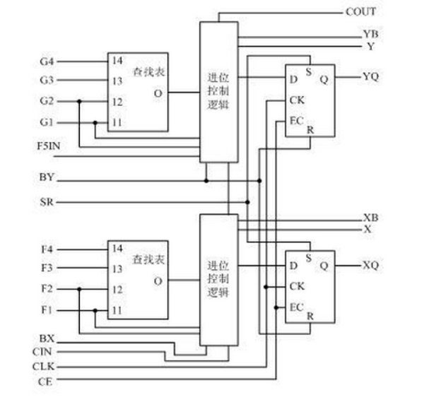

## FPGA的资源

1. 可编程逻辑功能块（CLB）——类比电路板的各种元器件

   

   1. CLB是FPGA内的基本逻辑单元。CLB的实际数量和特性会依器件的不同而不同
   2. 每个CLB都包含一个可配置开关矩阵，此矩阵由4或6个输入、一些 选型电路（多路复用器等）和触发器组成。开关矩阵是高度灵活的，可以对其进行配置以便处理组合逻辑、移位寄存器或RAM。
   3. 每个CLB模块不仅可以用于实现组合逻辑、时序逻辑，还可以配置为分布式RAM和分布式ROM。
   4. Slice是Xilinx公司定义的基本逻辑单位，在Xilinx公司的FPGA器件中，CLB由多个（一般为4个或2个） 相同的Slice和附加逻辑构成，内部结构如图所示一个Slice由两个4输入的函数、进位 逻辑、算术逻辑、存储逻辑和函数复用器组成。算术逻辑包括一个异或门（XORG）和一个专用与门（MULTAND），一个异或门可以使一个Slice实现 2bit全加操作，专用与门用于提高乘法器的效率；进位逻辑由专用进位信号和函数复用器（MUXC）组成，用于实现快速的算术加减法操作；4输入函数发生 器用于实现4输入LUT、分布式RAM或16比特移位寄存器（Virtex-5系列芯片的Slice中的两个输入函数为6输入，可以实现6输入LUT或64比特移位寄存器）；进位逻辑包括两条快速进位链，用于提高CLB模块的处理速度。

2. 可编程I/O口（IOB）——类比电路板的输入输出

   1. 可编程输入/输出单元简称I/O单元，是芯片与外界电路的接口部分，完成不同电气特性下对输入/输出信号的驱动与匹配要求
   2. 为了便于管理和适应多种电器标准，FPGA的IOB被划分为若干个组（bank），每组都能够独立地支持不同的I/O标准。每个bank的接口标准由其接口电压VCCO决定，一个bank只能有 一种VCCO，但不同bank的VCCO可以不同。只有相同电气标准的端口才能连接在一起，VCCO电压相同是接口标准的基本条件。 通过软件的灵活配置，可适配不同的电气标准与I/O物理特性，可以调整驱动电流的大 小，可以改变上、下拉电阻。
   3. I/O口的频率也越来越高，一些高端的FPGA通过DDR寄存器技术可以支持高达2Gbps的数据速率。
   4. 外部输入信号可以通过IOB模块的存储单元输入到FPGA的内部，也可以直接输入FPGA 内部。当外部输入信号经过IOB模块的存储单元输入到FPGA内部时，其保持时间（Hold Time）的要求可以降低，通常默认为0。 

3. 可编程内部互联资源——元器件之间的通信总线

   1. 布线资源连通FPGA内部的所有单元，而连线的长度和工艺决定着信号在连线上的驱动能力和传输速度。
   2. FPGA芯片内部有着丰富的布线资源，根据工艺、长 度、宽度和分布位置的不同而划分为４类不同的类别。
      - 第一类是全局布线资源，用于芯片内部全局时钟和全局复位/置位的布线；
      - 第二类是长线资源，用以完成芯片 Bank间的高速信号和第二全局时钟信号的布线；
      - 第三类是短线资源，用于完成基本逻辑单元之间的逻辑互连和布线；
      - 第四类是分布式的布线资源，用于专有时 钟、复位等控制信号线。 
   3. 在实际中设计者不需要直接选择布线资源，布局布线器可自动地根据输入逻辑网表的拓扑结构和约束条件选择布线资源来连通各个模块单元。从本质上讲，布线资源的使用方法和设计的结果有密切、直接的关系。  

4. 数字时钟管理模块

   1. 业内大多数FPGA均提供数字时钟管理（Xilinx的全部FPGA均具有这种特性）。
   2. Xilinx推出最先进的FPGA提供数字时钟管理和相位环路锁定。
   3. 相位环路锁定能够提供精确的时钟综合，且能够降低抖动，并实现过滤功能。

5. 底层内嵌功能

   1. 内嵌功能模块主要指DLL（Delay Locked Loop）、PLL（Phase Locked Loop）、DSP和CPU等软处理核（Soft Core）。
   2. 现在越来越丰富的内嵌功能单元，使得单片FPGA成为了系统级的设计工具，使其具备了软硬件联合设计的能力，逐步向SOC平台过渡。 
   3. DLL和PLL具有类似的功能，可以完成时钟高精度、低抖动的倍频和分频，以及占空比调整和移相等功能。
   4. PLL 和DLL可以通过IP核生成的工具方便地进行管理和配置。
   5. Xilinx公司生产的芯片上集成了 DLL，Altera公司的芯片集成了PLL，Lattice公司的新型芯片上同时集成了PLL和DLL。

6. 内嵌专用硬核

   ​	内嵌专用硬核是相对底层嵌入的软核而言的，指FPGA处理能力强大的硬核（Hard Core），等效于ASIC电路。为了提高FPGA性能，芯片生产商在芯片内部集成了一些专用的硬核。例如：为了提高FPGA的乘法速度，主流的FPGA 中都集成了专用乘法器；为了适用通信总线与接口标准，很多高端的FPGA内部都集成了串并收发器（SERDES），可以达到数十Gbps的收发速度。 Xilinx公司的高端产品不仅集成了Power PC系列CPU，还内嵌了DSP Core模块，其相应的系统级设计工具是EDK和Platform Studio，并依此提出了片上系统（System on Chip）的概念。通过PowerPC、Miroblaze、Picoblaze等平台，能够开发标准的DSP处理器及其相关应用，达到SOC的开发目的。

   **（1） 软核** 

     软核在EDA设计领域指的是综合之前的寄存器传输级（RTL）模型；具体在FPGA设计中指的是对电路的硬件语言描述，包括逻辑描述、网表和帮助文档等。软核只经过功能仿真，需要经过综合以及布局布线才能使用。其优点是灵活性高、可移植性强，允许用户自配置；缺点是对模块的预测性较低，在后续设计中存在发生错误的可能性，有一定的设计风险。软核是IP核应用最广泛的形式。 

   **（2）固核**  

     固核在EDA设计领域指的是带有平面规划信息的网表；具体在FPGA设计中可以看做带有布局规划的软核，通常以RTL代码和对应具体工艺网表的混合形式提 供。将RTL描述结合具体标准单元库进行综合优化设计，形成门级网表，再通过布局布线工具即可使用。和软核相比，固核的设计灵活性稍差，但在可靠性上有较 大提高。目前，固核也是IP核的主流形式之一。 

   **（3）硬核** 

     硬核在EDA设计领域指经过验证的设计版图；具体在FPGA设计中指布局和工艺固定、经过前端和后端验证的设计，设计人员不能对其修改。不能修改的原因有 两个：首先是系统设计对各个模块的时序要求很严格，不允许打乱已有的物理版图；其次是保护知识产权的要求，不允许设计人员对其有任何改动。IP硬核的不许 修改特点使其复用有一定的困难，因此只能用于某些特定应用，使用范围较窄。