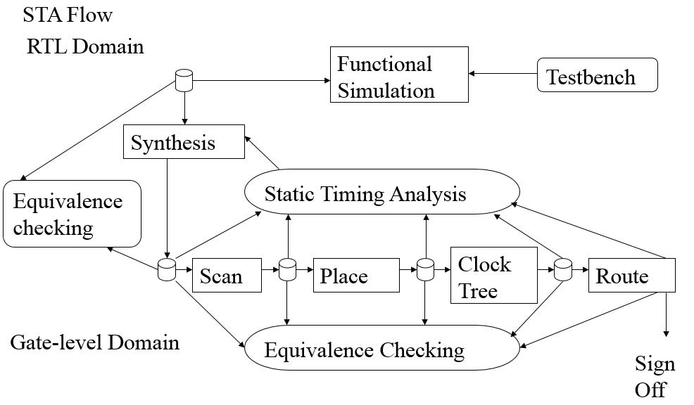
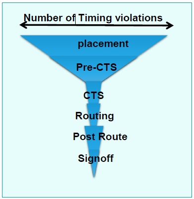
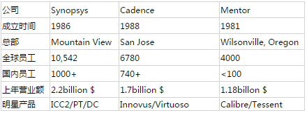

## FPGA设计流程

1. 设计定义
2. 模块划分，接口定义
3. 设计输入（verilog vhdl，sv）
4. 分析和综合（quartus，vivado，ise）
5. 功能仿真（modelsim）
6. IO分配，布局布线
7. 时序仿真
8. 配置文件的生成，配置（烧写）fpga
9. 在线调试（嵌入式逻辑分析仪）

## 数字前端设计流程

1. 算法或者硬件架构设计与分析
2. RTL实现（HDL编码）
3. Coding Style Check
4. 功能验证（前仿真）
5. 逻辑综合
6. 静态时序分析
7. 一致性验证
8. 时序仿真（后仿真）

1. 算法或硬件架构设计与分析

   1. 目的：完成芯片中数字部分的高层次算法或架构的分析与建模，为硬件提供一个正确的软件功能模型，更为重要的是，通过大量的高层次仿真和调试，为RTL实现提供总体性的设计指导。数字部分越复杂，这一点越重要。
   2. 工具：MATLAB、C++、C、System C、System Verilog等。不同类型的芯片都不同的选择，如数字信号处理类芯片，偏好MATLAB。
   3. 特点：这部分工作至关重要，基本上奠定了整个芯片的性能和功耗的基础。这部分工作主要由具有通信、信号处理、计算机、软件专业背景的工程师完成，也有很多微电子专业背景的工程师参与。

2. RTL实现

   1. 目的：依据第一步的结果，完成由高层次描述到Verilog HDL实现的过程。
   2. 工具：Vim、Emac（二者不分前后顺序哦）
   3. 特点：这一步能明显区别中训练有素的工程师和初学者。前者在写代码的过程中，具有极强的大局观，能够在书写Verilog HDL、描述逻辑功能的同时，还能够兼顾逻辑综合、STA、P&R、DFX、功耗分析等多方面因素，最终提供一份另其他环节的工程师都赏心悦目的代码。初学者则处处留地雷，一不小心就引爆。

3. Coding Style Check

   1. 目的：排除RTL代码中Clock Domain Cross、Lint等问题。
   2. 工具：Syglass、LEDA、0inCDC
   3. 特点：目前大部分芯片中的数字部分基本上都采用局部同步和全局异步的设计策略，因此，在设计中需要小心注意跨时钟域的数据同步问题

4. 功能验证

   1. 目的：在无延迟的理想情况在，通过大量的仿真，发现电路设计过程中的人为或者非人为引起的bug。主要指标是功能覆盖率。
   2. 工具：Modelsim、VCS、NC-Verilog
   3. 语言：C++、C、System C、System Verilog，基于UVM的方法学等。主要是System Verilog，一般哪个方便用哪个。
   4. 特点：验证工程师近年来已经成为IC设计中需求量最大的岗位。这个阶段会占用大量的时间，数以月计

5. 逻辑综合

   1. 目的：将RTL代码映射为与工艺库相关的网表。

   2. 工具：DesignCompiler、RTL Compiler。DesignCompiler在市场中占有垄断性地位，几乎成为逻辑综合的标准。

   3. 特点：

      1. 从芯片生产的角度来看，在该步骤之前，所有的工作都可近似看做一个虚拟性的，与现实无关。而从逻辑综合起，后续所有的工作都将与工艺的物理特性、电特性等息息相关。
      2. 逻辑综合工具的功能主要是将VerilogHDL格式的文本映射为网表格式的文本，因此，它的功能等同于文本编译器。
      3. 逻辑综合过程中，整个文本格式的编译过程是在给定的人为约束条件下进行的，通过这些约束和设定的目标来指导工具完成Compiler的工作。所以，逻辑综合过程可以看成一个多目标（频率、面积、功耗）多约束的工程优化问题。
      4. 该步骤中，通常会插入DFT、clock gating、Memory、各种IP等。为了在各种工艺库以及FPGA原型验证平台之间有一个更方便的移植，注意适当处理这些Memory、IP等的接口。该步骤中也可加入I/O、PLL等。

   4. 输入文件：

      - RTL代码：由ASIC design engineers团队提供；交接前，必须保证在第3步的check中没有任何问题；
      - 工艺库（.db）：由晶圆厂提供；

      - 约束（SDC）：由逻辑综合工程师和ASIC design engineers共同商定。

   5. 输出文件：

      - 网表：包含了RTL中的所有的逻辑信息，除此以外，可能还会有DFT、clock gating、I/O等；网表主要用于P&R等流程；
      - 标准延迟文件SDF：主要包含了网表中所有器件的延迟信息，用于时序仿真；通常情况下，在仿真过程中会使用由PT报出的sdf，因为PT会结合后端工具，生成延迟更为精确的sdf文件。
      - Project文件：.ddc；
      - 各种报告：timing report、area report、constrain report、clock report、violation report等等，以及工具的log文件。（此处最好能够熟悉各种脚本语言，将各种report处理为友好易读形式）

6. 静态时序分析

   1. 目的：相对动态仿真的类穷举式验证方法而言，从静态分析的角度，保证设计中所有的路径，满足内部时序单元对建立时间和保持时间的要求。即无论起点是什么，信号都可以被及时地传递到该路径的终点，并且在电路正常工作所必需的时间段内保持恒定。
   2. 工具：PrimeTime、Tempus。PrimeTime在市场中占有垄断性地位，几乎成为STA的标准。
   3. 特点：
      - 从逻辑综合开始，基本上每做一步大的调整，都会完成一次STA分析，以保证每步都能实现时序收敛。鉴于该特性非常重要，PrimeTime成为了Signoff的重要工具。
      - 所用到的SDC同逻辑综合；
      - 通常设计中会存在大量的违例路径，STA要修大量的setup、hold等，如何修这些违例，可以体现工作经验的重要性。此外，如果是前端修timing违例，一般会修的很快，但是会带来一个重大的问题，代码被前端修改后是否存在新的bug，还需重新仿真确认，仿真会消耗掉数以月计的时间，所以除非万不得已，不会找前端修timing。

7. 一致性验证

   1. 目的：RTL代码和逻辑综合后的网表都可以抽象为两幅由节点和边构成的图，一致性验证阶段采用了类似于直接比较两幅图是否一致的方法，来确定逻辑综合生成的网表是否正确。
   2. 工具：Formality、Conformal
   3. 输入文件：RTL代码、netlist（逻辑综合输出）、约束
   4. 输出文件：match（两张图节点是否一致）和verify（计算得出两张图功能是否一致）的报告。

8. 时序仿真

   1. 同功能仿真，只是将RTL代码替换为网表，然后需要加载SDF文件和工艺库模型。该步骤的目的在于，在延迟等近似实际工作的条件下，观察功能是否还能保持正确。

## 数字后段设计流程

> 数字后端设计又称物理设计，将网标格式的文本转化成一个个有物理大小和位置的单元、连线。并且在实现过程中要满足面积、功耗、性能等要求。业界主流的后端工具来自synopsys、cadence两家公司，虽然两家公司工具不同但是基本流程相似。数字后端流程如下图。

1. sythesis
2. Data prepare
3. Floor plan
4. placement
5. prects
6. clock tree synthesis
7. postcts
8. routing
9. post routing
10. ECO
11. finish
12. signoff
13. tapeout

1. Date prepare，在后端设计之前我们需要以下文件。
   1. Technology file
      - 数据格式：Synopsys .tf Cadence .lef
      - 来源：由foundry提供。
      - 功能：定义unit大小。规定每一层Metal的基本属性，例如最小最大宽度，最小间距，最大密度等。定义VIA的基本属性，例如size enclosure等。
   2. RC file
      - 数据格式：Synopsys tluplus Cadence qrcfile
      - 来源：由foundry提供
      - 功能：后端工具会根据它来抽取design中的RC值计算delay。
   3. SDC
      - 来源：由综合工程师提供
      - 功能：包括clock generate_clock定义，input delay output delay等时序约束信息。在后端timing检查时完全依靠此文件。
   4. Netlist
      - 来源：由综合工程师提供
      - 功能：规定了整个Design的设计逻辑信息。
   5. Timing Library
      - 数据格式：Synopsys .db Cadence .lib
      - 来源：std cell由单元库提供者foundry arm synopsys等提供。IP由IP owner提供。
      - 功能：规定了标准单元和宏单元以及IO的逻辑功能、时序要求、CELL delay等信息。一般有一下几种模型，NLDM CCS ECSM。NLDM过于悲观，一般建议用CCS或者ECSM库，可以得到时钟周期的5%到10%的timing margin。
   6. Physical Library
      - 数据格式：Synopsys .mky Cadence .lef
      - 来源：std cell由单元库提供者foundry arm synopsys等提供。IP由IP owner提供。
      - 功能：每个标准单元、宏单元以及IO的物理信息。包括cell大小，出Pin的位置金属层次以及Pin的形状。
   7. Low power flow
      - 数据格式： Synopsys upf Cadence cpf
      - 来源：由综合工程师提供
      - 功能：定义Power Domain，以及不同power domain之间的isolation cell level shift 等。在low power design中需要用到。
2. Floor Plan，将Design导入后端工具后，检查输入文件是否缺少或者有错误。确保Design 正常initial后就可以进行调整Floor Plan。Floor Plan主要目的是要确定design的形状大小，出Pin的位置已经所有macro的摆放。
   1. die_area/core_area
      - 如果是block一般形状由top规定的。
      - 如果是top需要根据instants count和Macro大小进行预估。
   2. 摆放Macro和PAD
      - 一般模拟IP可能有特殊摆放要求，需要与IP owner一起商讨确定
      - Memory根据不同的hierarchy分类摆放，并且根据时序要求和memory形状大小进行调整，具体情况不同摆放也不同。一般需要多尝试几次得到一个满意的结果。
      - PAD摆放位置会影响到package，需要与package工程师一起商讨。对于数字设计一般数字的Power/Ground PAD由后端工程师加，加的时候需要注意电源要分布均匀并且要满足ESD要求。
   3. P/G
      - 对于顶层金属来说，在不超过最大密度的提前下尽量多打，因为top metal不做绕线不会占用绕线资源。
      - 对于底层金属来说，既要考虑到power要求又要考虑到不能占用过多绕线资源。一般对于不同工艺代各家design house都有自己的一套标准。
   4. Add tab，endcap，tcd cell
      - Tab cell将nwell接power， psub接ground。整个core区域内每隔一定距离加一列。
      - Endcap cell，在Macro四周和core边界围一圈。主要是从DFM上考虑，不能让poly和OD周围太空旷，不对称，密度太低。
      - TCD cell，technology critical dimension unit，指foundry拿来做工艺校准用的，在28nm一般要求2000*2000放一下。
   5. Trail place
      - 检查place后congestion和timing结果，并根据此结果对floor plan进行调整。进行多次iteration后可以得到一个最终的floor plan。至此floor plan确定。
3. Placement，目的是将所有std cell放入core area中，并且满足congestion和timing的要求。
   1. 最简单的说可以分为两步： global 和 detail place。
      - global不考虑cell放的位置是否legal；
      - detail place的时候会将cell放到附近legal的位置。
   2. 在place过程中为了得到更好timing结果会对关键路径进行逻辑重组，删除buffer trees。随着工具的不断发展，目前place的引擎已经十分强大。例如C家的giga place，它采用新的算法slack-driven，通过计算真正timing而不是预估的timing来进行place， 在place的同时进行优化。
4. Prects
   在Place之后CTS之前，我们会对进行一次setup timing优化。只优化setup，原因是clock tree还没做，所有clock都是ideal的。
5. CTS，芯片中的时钟网络要驱动电路中所有的时序单元，所以时钟源端门单元带载很多，其负载延时很大并且不平衡，需要插入缓冲器减小负载和平衡延时。时钟网络及其上的缓冲器构成了时钟树。
   1. 传统的时钟树
      - 传统的时钟树综合为了得到一个尽量balance的clock tree。一般要设定三个约束，两个目标
      - 三个约束max transition, max cap, max fanout。工具在做cts时一定会满足这三个约束，不然会报violation。
      - 两个目标minmum insetdelay, maxmium skew。工具在做cts时尽量达到这两个目标，但是不一定要完全满足，就算有没有达到的情况也不会报violation。
   2. Useful skew
      - 在新一代的后端工具中提供了一个新的feature, useful skew,就是说并不一定要将所有的clock tree做balance，可以适当利用useful skew来达到更好的性能，更快时序收敛和更低的IR drop。
6. Postcts，CTS完成后，需要进一步的优化，主要解决一下几个问题。
   - 修复剩余的DRV(design rule violation)
   - 将ideal clock改成 propagate clock
   - 优化setup timing
   - 优化hold timing（由于此时clock tree已经生成）
7. RoutingCTS之后整个芯片的大体结构已定。要将信号线通过金属连接起来。绕线过程主要完成一下几个目标
   1. 绕线过程中会考虑DRC和LVS，绕完后不会有DRC/LVS violations
   2. 绕线过程中不会导致timing变差，也不会引入新的SI问题。
   3. 考虑DFM，例如multi-cut via，线宽和线间距。
8. PostRouting，routing之后timing会跟preRoute的结果有区别，主要由于以下两个原因。
   - timing跟preRoute的结果有区别，主要有两个原因。congestion导致具体的绕线有detour。寄生电容
   - 所以我们还要优化一下setup/hold timing。最后需要打开SI 模式后再优化一次setup/hold timing。由上可知在PNR过程中会有多次的timing优化。但是要注意每次timing优化可达到的程度是逐渐递减的，越到最后阶段可优化的范围越小。
9. ECO，进入这一阶段后，当前的数据就不能再回去用PNR工具来进行优。只能通过脚本进行局部改动。一般分为两大类。
   - Function ECO：局部的改动逻辑功能，例如将cell的连接关系改掉，或者增加删除inverter等。
   - Timing ECO：PT/Tempus优化分析后吐出的timing优化脚本。
10. FINISH
    - ADD FILLER：Filler cell填充core内空缺的地方，为了确保所有的Nwell的连接在一起的，也为了防止DRC。 
    - DCAP CELL：Dcap cell是去耦电容，防止IPdrop。但是由于Dcap本身有leakage，所以加的时候稍微注意一下不能大面积的加。
      Generate OD/Metal FILLER：为了满足 OD metal density的要求，会在空白处插入一下od filler和metal filler。由foundry提供脚本。
    - Sealring：为了保护芯片在切割时避免误切，会在芯片周围加入一圈Sealring，有时也可以连接芯片中数字Ground。
    - Merge GDS：将PNR gds和IP,Memory，OD/Metal filler,Sealring集成到一起。至此芯片已完成。
11. SIGNOFF
    - 检查项目工具内容时序检查PT/Tempus检查是否有时序违例功耗检查Redhawk/Voltus检查静态、动态功耗、IR drop物理验证Calibre/ICV/PVS检查DRC、LVS、ANT、ERC、DFM形式验证LEC/formality 检查postlayout 网标的逻辑功能是否与综合后网标一致

> verilog HDL 描述的Register-transfer Level级文件，经过逻辑综合器转化为netlist描述的gatelavel文件
>
> - RTL（Register-transfer Level，寄存器传输级），它的综合级别（或说抽象程度）比 gate-level 要高。在这个级别描述电路，涉及的基本元素通常是寄存器和组合逻辑。RTL是接近高级语言的一种较为抽象的描述，这样可以提高电路设计的工作效率。
> - 网表（netlist）是用于描述电路元件相互之间连接关系的，一般来说是一个遵循某种比较简单的标记语法的文本文件。
> - 门级（gate-level），指的是网表描述的电路综合级别。门级网表中，描述的电路元件基本是门（gate）或与此同级别的元件。硅片里就是各种门结构（gate-level）的位置信息和连接信息。
>
> 芯片在tapeout时需将电路结构映射到硅片上，所以，在tapeout之前，需要将较为抽象的、跟工艺以及process无关的RTL code转化为gate-level数据。那么，DC实现的就是这个功能。或者说，DC就是一个数据格式编译器+电路优化算法，其目的在于：（1）将RTL数据格式，按照语义进行分析，最后转化为gate-level的数据格式。这个功能从DC的名字就可以看得出来，DC中的C指的是compiler（编译器），所以synopsys当初给这个工具取的名字是非常准确的，而不是泛泛地叫什么综合器之类的。所以，在书写RTLcode的时候，尽量不要太抽象，尽量要接近门级描述，这样DC对RTL数据格式就会编译的更准确，编译速度更快，综合结果也性能也会更好。否则，抽象的语义和词会使得编译器解释和转化速度较慢。（2）对电路进行优化，主要满足DC的各种约束（SDC）。事实上，RTL 中的寄存器和组合逻辑，其物理实现还是对应到具体门电路。由于基本的寄存器或组合逻辑，对应的电路结构已经很稳定，电学特性也很明确，故而在综合级别较高的 EDA 工具中，一般不需要再亲自去描述它们的实现方法，而是调用现成的库信息。EDA 工具会根据 RTL 描述自动编译出门级的电路描述。——这个编译过程就是问题说明里提到的「RTL 文件转换至门级网表」

