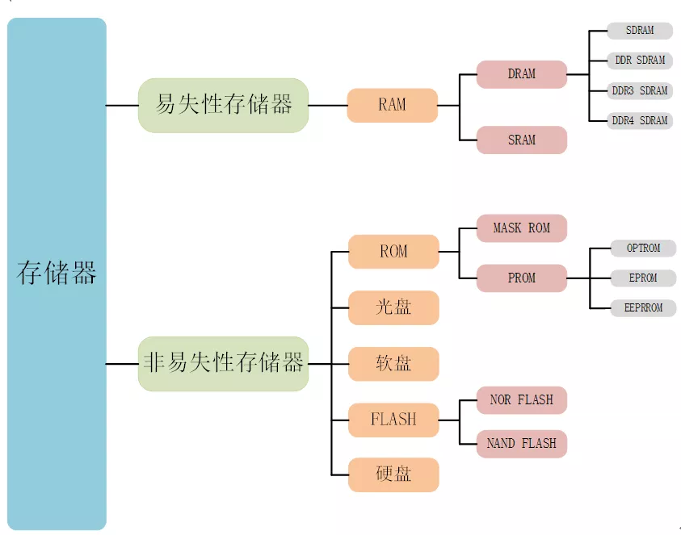

## 一、 基本概念​	

很多人分不清楚SDRAM与SRAM的，这里从百度上找的资料先对比一下

1. SDRAM——同步动态随机存储器——synchronous dynamic random access memory
   - 同步是指其时钟频率与对应控制器（CPU/FPGA）的系统时钟频率相同，并且内部命令的发送与数据传输都是以该时钟为基准；
   - 动态是指存储阵列需要不断的刷新来保证数据不丢失；
   - 随机指数据的读取和写入是指可以随机指定地址，而不是必须按照严格的线性次序变化。 
   
2. SRAM——异步静态随机存储器——Asynchronous Static RAM
   - 常应用于 FPGA 和 DSP 系统中，包括现在的 MCU 系统
   - 该存储器不存在的动态刷新特征。
   - 
   -  SRAM 的 S 也不是代表同步的意思。是静态的意思
   - 相反， SRAM 属于异步器件，在工作时是不需要外部提供时钟的
   
3. 在存储数据的物理结构方面

   - SRAM保存数据是通过晶体管进行锁存的，其工艺复杂，生产成本高，所以价格相对较贵，不易做大容量，但是速度更快。

   - DRAM保存数据靠电容充电来维持容量，生产成本较SRAM低，所以价格相对便宜，容量可以做到很大，速度虽然不如SRAM快但是随着工艺技术的提升，速度也很可观，所以较为常用。

   - SDRAM 使用电容的电荷存储特性存储数据，而 SRAM使用 CMOS 晶体管存储数据，因此，从这个结构方面也就决定了 SDRAM 的运行功耗要远远低于 SRAM。

   - 使用晶体管存储数据，正确的存储一位数据需要最少 6个晶体管。因此，从芯片面积上来说，单片 SRAM 芯片的容量不可能做到很高。

     > 目前常见的SRAM有 512K 字节和 1024K 字节容量的，而 SDRAM 则可以最多做到 64M 字节（512Mbit）。所以，在需要大量存储数据的场合， SDRAM 就成为了首选。 

   - DRAM和SRAM都是异步通信的，速率没有SDRAM(同步动态随机存储器)和SSRAM(同步静态随机存储器)快。所以现在大容量RAM存储器是选用SDRAM的。

   - SDRAM和DDR SDRAM的区别在于DDR(Double Data Rate)是双倍速率。SDRAM只在时钟的上升沿表示一个数据，而DDR SDRAM能在上升沿和下降沿都表示一个数据。

   - DDR也一步步经过改良出现了一代、二代、三代、四代，以及低功耗版本，现在也有五代。

4. ROM(Read Only Memory)在以前就是只读存储器，就是说这种存储器只能读取它里面的数据无法向里面写数据。实际是以前向存储器写数据不容易，所以这种存储器就是厂家造好了写入数据，后面不能再次修改。现在技术成熟了，ROM也可以写数据，但是名字保留了下来。

   - ROM分为MASK ROM、OTPROM、EPROM、EEPROM。
   - MASK ROM是掩膜ROM这种ROM是一旦厂家生产出来，使用者无法再更改里面的数据。
   - OTPROM(One TimeProgramable ROM)一次可变成存储器，出厂后用户只能写一次数据，然后再也不能修改了，一般做存储密钥。
   - EPROM(Easerable Programable ROM)这种存储器就可以多次擦除然后多次写入了。但是要在特定环境紫外线下擦除，所以这种存储器也不方便写入。
   - EEPROM(Eelectrically Easerable Programable ROM)电可擦除ROM，现在使用的比较多因为只要有电就可擦除数据，就可以写入数据。
     - FLASH是一种可以写入和读取的存储器，叫闪存，FLASH也叫FLASH ROM，有人把FLASH当做ROM。FLASH和EEPROM相比，FLASH的存储容量大。FLASH的速度比现在的机械硬盘速度快，现在的U盘和SSD固态硬盘都是Nandflash。FLASH又分为Norflash和Nandflash。

## 二、SDRAM的存取原理

1. 打开行地址线与列地址线，存储在电容中的数据就会输出

   

   1. 打开行列地址是需要时间的，这个时间间隔就叫做 t_RCD（active-to-read or write delay）
      - 对于某个型号的sdram器件，其最大运行频率为133M的器件（一个时钟周期为7.52ns），该值为15ns，也就是说需要两个时钟周期才能打开行列地址，而对于t_RCD为20ns的器件，就需要三个时钟周期
   2. 行列地址打开，数据并不是立即出现在总线上，这个延迟就叫列选通潜伏期（CL，CAS READ latency）
      - cl是指从读命令被寄存到数据总线上的第一个有效数据的时钟间隔，这个潜伏期可以被设置成两个时钟或者三个时钟
   3. 类似于矩阵开关吧我感觉
   4. 刷新放大器的作用
      1. 只要是电容就有自行放电的特性，电容的电压并不能一直保持
      2. 所以就有一个刷新放大器， 刷新放大器根据数据重新给电容充电跟新

SDRAM的引脚

SDRAM特性

1. 通常情况下，SDRAM是拥有四个BANK的动态刷新存储器，存储器工作在3.3V的电压下，DDR SDRAM工作电压是2.5V，DDR2 SDRAM的工作电压是1.8V，工作电压越低，信号速率越快
2. 对于256Mbit的SDRAM，每个BANK存储64Mbit，8192行 * 2048列 * 4bit，或者8192行 * 1024列 * 8bit 或者8192行 * 512列 * 16bit，行列地址位宽与输出位宽的关系
3.  对于128Mbit的sdram，4个bank，每个32Mbits，4096*512个存储单元，每个存储单元16Mbit，也就是数据位宽为16Mbit
4. 对于sdram的读写是以突发的方式进行的，对sdram的读写是从一个指定的位置开始的，并按照指定的长度读出或写入长度，以编程好的数据进行顺序读写数据
   1. 激活命令，（A0--A12上是行地址，ba0，ba1是bank地址）
      - 激活命令是用来为后续的操作打开一个特定的bank和行，该行会一直保持激活状态，并可以进行读写，只有执行一个预充电命令，该行才会关闭，同一个bank中一次只能激活一行，在某行已经激活的状态下，必须先进行预充电，才能激活该bank中的另一行，
   2. 读写命令，（A0-A8上是列地址）
      - 该命令用来启动对一个已经激活行的突发读取操作
      - ba0 ba1 指定需要读取的bank
      - A0到A9为行地址
      - A10表示突发读取完成后，立即进行预充电，即关闭该行，高电平有效
5. 对于sdram的操作，是通过对应的命令来实现的，是由芯片控制引脚组合成不同的状态以表示
   1. 命令禁止，禁止直行新的命令，已执行的命令不受影响
   2. 空命令，给sdram传递一个无需操作的信息，防止sdram处于空闲或者等待状态时，其他命令被写入，此命令对正在执行的操作没有影响
   3. 加载模式寄存器，通过地址线写入sdram，该命令只有在所有bank都处于空闲状态才能进行，必须等待对应的响应周期（tMED）才能执行新的命令
      1. 模式寄存器总共有13位，12位和11位以及10位保留
      2. burst length（A0,A1,A2），
         - 突发类型，burst type 分为两种类型，顺序（sequential）和隔行（interleaved），按照burst length将行每一行截成几段，每一段截成环，比如burst length是3，将每行16bit数据分成四个环，读出顺序按照设置的突发类型来输出
      3. 写突发模式—第九位
   4. 控制信号组成 = {cs_n,ras_n,cas_n,we} = 4‘b0100 写入命令，写入命令不存在潜伏期，直接写入，写突发可以被写突发打断
   5. 预充电/关闭行
      - 可以将所有bank中相同的行全部关闭掉，预充电命令执行后，需要经过t_RP时间后，才能对bank重新操作
   6. 自动预充电
      - 不增加额外执行命令的前提下，达到使用预充电指令一样的效果，也就是A10
   7. 突发中断
      - 突发命令并不会对对应行进行预充电，也就是执行了突发中断操作后，该行仍然处于被激活状态
   8. 自动刷新
      - 执行自动刷新命令之前，所有bank都必须关闭，对于商业或工业是哪个的器件，256m的sdram在每64毫秒内需要执行8192次自动率性操作，对于汽车行业，每16毫秒执行8192次操作 
      - 可以将时间间隔设置成均匀分布在64ms内，也可以几种一段时间尽心刷新
6. 要刷新就要打开行地址线，预充电，也是要保持数据

## 三、SDRAM 操作时序

1. SDRAM上电初始化
   - 在sdram进行正常的操作之前，sdram必须被初始化，
   - sdram首先需要延时等待100us，在这个等待期间，sdram只能赋给禁止命令或者空命令
   - 100us之后需要进行预充电命令，所有bank都必须被预充电，以使器件进入空闲状态
   - 进入空闲状态，至少需要执行两个周期的自动刷新命令，
   - 自动刷新命令之后可以对sdram进行加载模式寄存器了（原因：模式寄存器上电后是未知状态的）
   - 加载模式寄存器后，需要的话，可以执行两次自动刷新命令
2. 初始化步骤
   1. 加载电源（VDD和VDDQ）
   2. CKE设置为低（LVTTL逻辑电平）
   3. 加载稳定的时钟信号
   4.  等待至少100us此时的命令保持为INHIBIT或者NOP
   5. 在步骤4的100us中的某个时刻，将CKE设置为高，命令仍然保持为INHIBIT或者NOP
   6. 在步骤4的100us结束后，即刻发出一个全部bank预充电命令（precharge all）
   7. 等待至少tRP（行预充电最小周期），此时命令仅允许是DESELECT或者NOP
   8. 发出一个自动刷新命令（AUTO REFFRESH）
   9. 等待至少tRFC（自动预充电周期），此时的命令仅允许是INHIBIT或者NOP
   10. 再发出一个自动刷新命令（AUTO REFFRESH）
   11. 再等待至少tRFC（自动预充电周期），此时的命令仅允许是INHIBIT或者NOP
   12. 使用LMR命令设置模式寄存器，寄存器模式的值由A0-A11传输
   13. 等待至少tMRD（LMR命令至激活或刷新命令的最小间隔），此时的命令仅允许是DESELECT或者NOP
3. 自动刷新与自刷新的区别
   1. 自刷新是内部产生时钟刷新，不适用外部时钟信号
   2. 自动刷新对每一行的刷新是自动切换的，在64ms内自动刷新，进入自动刷新之前使用precharge关闭所有bank的行
4. 自刷新时序
   - 用的比较少
5. 自动刷新时序
   - 保证关闭所有bank的行也不一定需要预充电
   - 64ms内完成8192次刷新，可以64ms等分的进行刷新，即每7.5us内进行一次刷新，也可以集中刷新
6. 不带自动预充电单一位置的读操作时序
   - 激活某一行，地址线上输入行地址，ba上给出bank地址，延迟tRCD（active to read or write）
   - 接着进行read命令，地址线上输入列地址，等待CL（模式寄存器中设置CL），BL = 1
   - 进行预充电的命令等待tRP
   - 然后可以进行下一次的读写
7. 带自动预充电的单一位置读操作时序
   - 激活，经过二/三个周期的nop命令 
   - read
8. 跨bank随机读操作
9. 页读取操作
10. 带屏蔽的读操作
11. 自动预充电的写操作
12. ….还有很多操作可以从官网的手册上查询

sdr，ddr， ddr2 的原理相同

1. dqs 随路时钟
   - 为了保证数据从发送方到达接收方时能与时钟信号对齐
   - 在电路板布线是要保证dq与dqs走线等长
2. 预读概念
   - 货位相当于ddr2 中的存储单元，每个
   - 搬运工预读取总线，每个搬运工相当于一个通道的预读取总线
   - 运输汽车，接口时钟，每运输一个相当于一个接口时钟周期传输一次数据
3. sdr ddr， ddr2 之间的区别
   - sdr相当于只有一个搬运工，一个只能运输一个单位的汽车
   - ddr相当于两个搬运工，一个能装两个单位的汽车
   - ddr2 相当于四个搬运工，一个能装两个单位的汽车
4. sdr ddr ddr2的突发长度（burst length）
   1. sdr 1,2,4,8，page
   2. ddr 2,3,8
   3. ddr2 4，8，
5. 对于读操作
   1. dqs有ddr2存储器发出
   2. 控制信号地址型号与失踪上升沿采用中心对齐方式
   3. Dq与dqs采取边沿对齐方式
6. 对于读操作
   1. dqs有主控制器发出
   2. 控制信号地址型号与失踪上升沿采用中心对齐方式
   3. Dq与dqs采取中心对齐方式
7. ddr2 总结
   1. cmd(含odt,dm)均在时钟上升沿被采样
   2. cmd(含odt,dm)有效宽度为半个clk周期（sdram为一个clk周期）
   3. dqs与dq共同走线，构成随路时钟，dq与dqs一样，是双向走线
   4. 在写操作是数据有ddr2控制器发出，由于ddr2控制器工作时钟域PHY时钟的相位差，

## tips

1. 关于命令在什么时候被读取

   - 通过pll产生两个相同频率的时钟，这两路时钟信号之间的相位差为-90/-180（时钟延迟不同）度，第一路时钟产生command命令，第二个命令输出送入sdram芯片中，作为芯片的控制时钟
2. 预充电命令

   - 发出read命令后的BL个时钟周期后sdram内部自动产生预充电命令
3. 类似sdram的芯片仿真程序是从芯片生产公司网站直接下载仿真模型
4. 差分时钟

   - 相位相差180度的同频时钟
5. fpga如何实现双数据速率
   - 为了实现ddr接口，altera cyclone E FPGA的部分管教支持双数据速率传输，在quartus II软件中可以调用altddio ip核来进行实现，双数据速率io包括 altddio bidir（双向双速率IO），altddio in（双速率输入IO），altddio out（双速率输出IO），通过调用双速率IO，就能够实现双数据速率传输了

SDRAM操作命令{ CS_N, RAS_N, CAS_N, WE }

- 禁止命令（1xxx）
- 空命令（0111）
- 加载模式寄存器命令（0000）
  - 运行模式
  - 写突发模式
  - 突发类型
  - 列选通潜伏期
- 激活命令（0011）
- 读命令（0101）
- 写命令（0100）
- 预充电命令（0010）
- 自动预充电命令（xxxx）
- 突发终止命令（0110）
- 自动刷新命令（0001）

SDRAM操作时序

- SDRAM上电初始化时序
- 自刷新时序
- 自动刷新时序
- 不带自动预充电的写操作

SDRAM中的时间常数

- tRCD，激活行地址的时间
- CL，列选通潜伏期
- tRP，precharge command period
- tRFC，auto refresh period
- tRAS，active to precharge period
- tMRD，load mode register command to active or refresh command
- tRCD，RAS to CAS Delay，行选通周期

SDRAM的存储结构

- SDRAM是分bank存储数据的，一个sdram有几个bank主要看其BA地址，有两位就是4个bank，有三位就是8个bank

- sdram的存储容量平均分在每个bank之中，从数据位宽中可以看出一共有多少个存储单元，从地址位宽中可以产出地址有多少行，知道存储单元和行数可以算出列数

  > 比如256Mbit的SDRAM，4个bank，数据位宽是4bit，那么每个bank中有16M个存储单元，地址位宽为13，那么每个bank中有8192行，2048列

SDRAM的读写方式

- 对SDRAM的读写方式是以突发的方式进行的，从一个指定的地址开始，顺序读写指定的长度

通过命令指示SDRAM进行工作

- ​	{ CS_N, RAS_N, CAS_N, WE }

tRCD 决定了行寻址（有效）至列寻址（读/写命令）之间的间隔

CL   决定了列寻址到数据进行真正被读取所花费的时间

tRP  决定了相同L-Bank中不同工作行转换的速度。（分析写入操作时不用考虑CL即可）：

1、要寻址的行与L-Bank是空闲的。也就是说该L-Bank的所有行是关闭的，此时可直接发送行有效命令，数据读取前的总耗时为tRCD+CL，这种情况我们称之为页命中（PH，Page Hit）

2、要寻址的行正好是前一个操作的工作行，也就是说要寻址的行已经处于选通有效状态，此时可直接发送列寻址命令，数据读取前的总耗时仅为CL，这就是所谓的背靠背（Back to Back）寻址，我们称之为页快速命中（PFH，Page Fast Hit 或页直接命中（PDH，Page Direct Hit）。

3、要寻址的行所在的L-Bank中已经有一个行处于活动状态（未关闭），这种现象就被称作寻址冲突，此时就必须要进行预充电来关闭工作行，再对新行发送行有效命令。结果，总耗时就是tRP+tRCD+CL，这种情况我们称之为页错失（PM，Page Miss）。

显然，PFH是最理想的寻址情况，PM则是最糟糕的寻址情况。上述三种情况发生的机率各自简称为PHR—-PH Rate、PFHR—-PFH Rate、PMR—- PM Rate。因此，系统设计人员（包括内存与北桥芯片）都尽量想提高PHR与PFHR，同时减少PMR，以达到提高内存工作效率的目的。