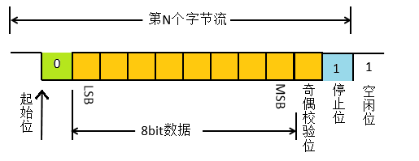
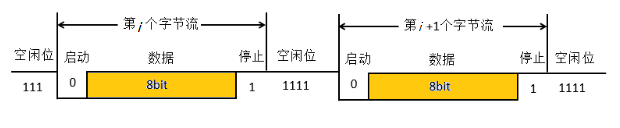
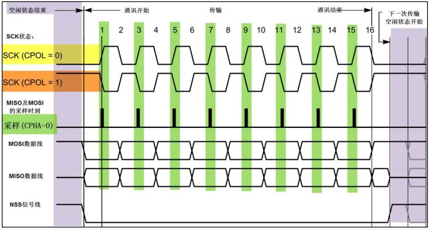
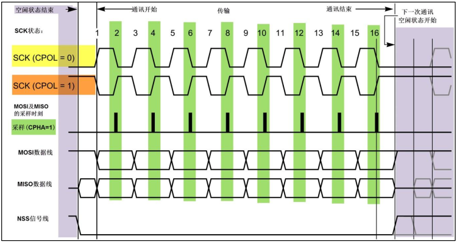
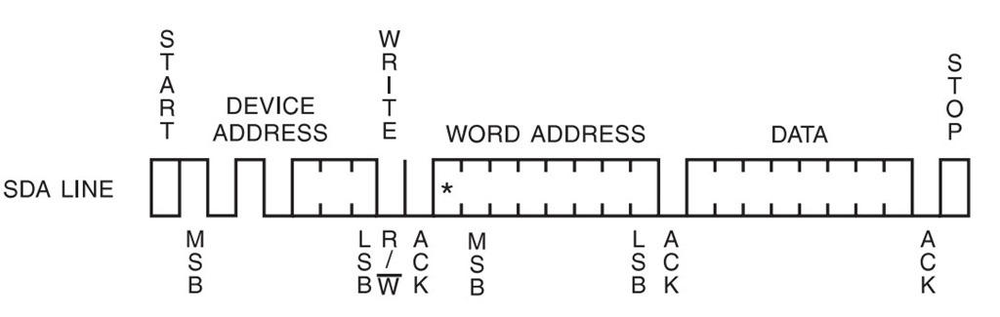
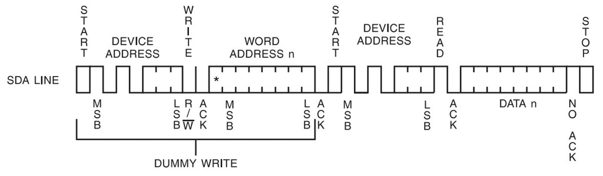
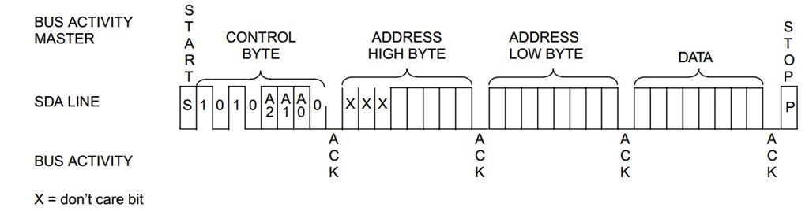
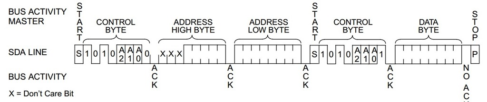
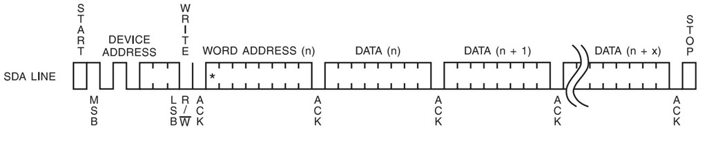
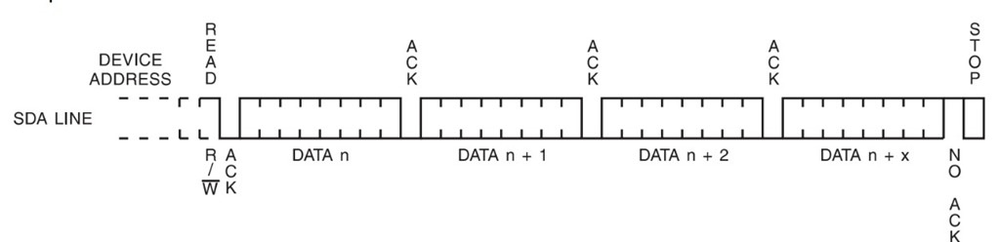

　总线、接口和协议，这三个词常常被联系在一起，但是我们心里要明白他们的区别。总线是一组传输通道，是各种逻辑器件构成的传输数据的通道，一般由由数据线、地址线、控制线等构成。接口是一种连接标准，又常常被称之为物理接口。协议就是传输数据的规则。

 UART（Universal Asynchronous Receiver/Transmitter通用异步接收发送器）：也叫串口，常用于调试。

- UART是一种串行异步收发协议。UART工作原理是将数据的二进制位一位一位的进行传输。两个设备使用UART串口通讯时，必须先约定好传输速率和一些数据位。主机和从机主要用两根线来通信，TX用于发送数据，RX用于接受数据（收发不是一根线，所以是全双工方式）。
- 数据协议：不发送数据时tx保持高电平，检测到tx的下降沿装备开始接受数据，设置串口波特率，然后就开始发数据，通常一次是5位，6位，7位，8位，每发送完一帧数据tx拉高。如果还有数据，就再给个0然后重复上一步。如果双方约定由校验位，还要在发停止位1之前发送个校验位，不过现在一般都不需要校验位了，因为出错的概率太小了，而且一般用于调试。

SPI——Serial Peripheral Interface，同步外设接口

- SPI是一种高速的，全双工，同步的通信总线。常用于微控制器与外设之间的连接比如SD卡，液晶屏等外设。SPI的连接一般有四根：时钟，发送，接收和片选。，SPI有四种工作模式，规定了通信方式

- SPI是单主设备（ single-master ）通信协议，这意味着总线中的只有一支中心设备能发起通信。需要与那个芯片通信，拉低该芯片的片选。当SPI主设备想读/写从设备时，它首先拉低从设备对应的SS线（SS是低电平有效），接着开始发送工作脉冲到时钟线上，在相应的脉冲时间上，主设备把信号发到MOSI实现“写”，同时可对MISO采样而实现“读”

IIC——Inter Integrated Circuit

- IIC总线（Inter-Integrated Circuit）即集成电路总线，是PHILIPS公司设计出来的一种半双工、二线制、同步串行总线。与那个芯片进行通信，先把地址打入到总线上的芯片中，检测到地址芯片从sda发回应答信号
- IIC总线是一个多向控制总线，包含两根信号线，一根是双向的数据线SDA，另一根是时钟线SCL。多个器件（从机）可以同时挂载到一个主机控制的一条总线上。每个连接在总线上的设备都是通过唯一的地址和其他器件通信，主机和从机的角色可互换，

## UART

通用异步收发传输器（Universal Asynchronous Receiver/Transmitter，通常称作UART） 是一种串行异步收发协议。UART工作原理是将数据的二进制位一位一位的进行传输。两个设备使用UART串口通讯时，必须先约定好传输速率和一些数据位。

硬件连接比较简单，仅需要3条线，注意连接时两个设备UART电平，如电平范围不一致请做电平转换后再连接

- TX：发送数据端，要接对面设备的RX
- RX：接收数据端，要接对面设备的TX
- GND：保证两设备共地，有统一的参考平面

UART协议格式

信号线上空闲的时候为高电平，当出现下跳到低电平的时候表示数据的起始位，接着是先发送低位（LSB）后发送高位（MSB）的数据流，尾部可加奇偶校验位，最后加停止位，停止位长度可以定义。本例实现无奇偶校验位，1bit停止位，波特率9600~115200可改变。

- 空闲位：
  - UART协议规定，当总线处于空闲状态时信号线的状态为‘1’即高电平
- 起始位：
  - 开始进行数据传输时发送方要先发出一个低电平’0’来表示传输字符的开始。因为空闲位一直是高电平所以开始第一次通讯时先发送一个明显区别于空闲状态的信号即为低电平。
- 数据位：
  - 起始位之后就是要传输的数据，数据可以是5，6，7，8，9位，构成一个字符，一般都是8位。先发送`最低位`最后发送`最高位`
- 奇偶校验位：
  - 数据位传送完成后，要进行奇偶校验，校验位其实是调整个数，串口校验分几种方式：
    1. 无校验（no parity）
    2. 奇校验（odd parity）：如果数据位中’1’的数目是偶数，则校验位为’1’，如果’1’的数目是奇数，校验位为’0’。
    3. 偶校验（even parity）：如果数据为中’1’的数目是偶数，则校验位为’0’，如果为奇数，校验位为’1’。
    4. mark parity：校验位始终为1
    5. space parity：校验位始终为0
- 停止位：
  - 数据结束标志，可以是1位，1.5位，2位的高电平。
- 波特率：
  - 数据传输速率使用波特率来表示，单位bps（bits per second）
  - 常见的波特率9600bps，115200bps等等，其他标准的波特率是1200，2400，4800，19200，38400，57600。
  - 举个例子，如果串口波特率设置为9600bps，那么传输一个比特需要的时间是1/9600≈104.2us。

## SPI

SPI是串行外设接口(Seria Peripheral Interface)的缩写。是 Motorola 公司推出的一种同步串行接口技术，是一种高速的，全双工，同步的通信总线。常用于微控制器与外设之间的连接比如SD卡，液晶屏等外设。SPI没有统一的协议规范，但由于其广泛的使用，根据实际使用中大家通用的习惯形成了一个类似行规的标准,具体的应用需要实际参考特定器件手册。

SPI用于在单个主控制器和一个或多个从设备之间交换数据。提供时钟的为主设备（Master），接收时钟的设备为从设备（Slave），对于单从设备连接使用四条信号线：

- SCLK:Serial Clock (output from master);串行时钟信号
- MOSI:Master Output Slave Input (output from master);主发送从接收信号
- MISO:Master Input Slave Output t(output from slave);主接收从发送信号 —方向由从设备到主设备
- SS:Slave Select  (active low, outputfrom master).片选信号 一般低电平有效

SPI是单主设备（ single-master ）通信协议，这意味着总线中的只有一支中心设备能发起通信。当SPI主设备想读/写从设备时，它首先拉低从设备对应的SS线（SS是低电平有效），接着开始发送工作脉冲到时钟线上，在相应的脉冲时间上，主设备把信号发到MOSI实现“写”，同时可对MISO采样而实现“读”

SPI优缺点

- 支持全双工通信，通信简单，数据传输速率块
- 没有指定的流控制，没有应答机制确认是否接收到数据，所以跟IIC总线协议比较在数据可靠性上有一定的缺陷。

SPI通信中，主机可以选择时钟极性和时钟相位，可以将工作模式分为4种。

- CPOL:Clock Polarity 决定时钟空闲状态电平是高电平还是低电平
  1=时钟空闲时为高，时钟低电平有效
  0=时钟空闲时为低，时钟高电平有效

- CPHA:Clock Phase 决定数据传输采样和移位方式
  1=数据采样发生在时钟偶数（2,4,6,…,16）边沿（包括上下边沿）
  0=数据采样发生在时钟奇数（1,3,5,…,15）边沿（包括上下边沿）

- | {CPOL，CPHA} | 空闲状态时钟极性 | 采样/移位时钟相位    |
  | ------------ | ---------------- | -------------------- |
  | 00           | 低电平           | 上升沿采样下降沿移位 |
  | 01           | 低电平           | 上升沿移位下降沿采样 |
  | 10           | 高电平           | 上升沿采样下降沿移位 |
  | 11           | 高电平           | 上升沿移位下降沿采样 |

- 

- 

## IIC

　IIC总线（Inter-Integrated Circuit）即集成电路总线，是PHILIPS公司设计出来的一种半双工、二线制、同步串行总线。IIC总线是一个多向控制总线，多个器件（从机）可以同时挂载到一个主机控制的一条总线上。每个连接在总线上的设备都是通过唯一的地址和其他器件通信，主机和从机的角色可互换，包含两根信号线，一根是双向的数据线SDA，另一根是时钟线SCL。

IIC总线特征

- IIC 数据传输速率有标准模式（100 kbps）、快速模式（400 kbps）和高速模式（3.4 Mbps），另外一些变种实现了低速模式（10 kbps）和快速+模式（1 Mbps）。
- I2C总线上的主设备与从设备之间以字节(8位)为单位进行双向的数据传输。数据帧大小为8位的字节，数据帧中的某些数据位用于控制通信的开始、停止、方向（读写）和应答机制。
- I2C总线上可挂接的设备数量受总线的最大电容400pF 限制，如果所挂接的是相同型号的器件，则还受器件地址位的限制。
- I2C总线数据传输速率在标准模式下可达100kbit/s，快速模式下可达400kbit/s，高速模式下可达3.4Mbit/s。一般通过I2C总线接口可编程时钟来实现传输速率的调整，同时也跟所接的上拉电阻的阻值有关。
- IIC器件地址：每一个IIC器件都有一个器件地址，有的器件地址在出厂时地址就设定好了，通常情况下器件地址是确定的，完全设定好或者固定几位主从器件的角色也是确定的，用户不可以更改，如OV7670的地址为0x42。有的器件例如EEPROM，前四个地址已经确定为1010，后三个地址是由硬件链接确定的，所以一个IIC总线最多能连8个EEPROM芯片
- 当scl为高电平的时候，sda为出现下降沿为start位， sda出现上升沿为stop位，所以在scl为高电平的时候sda应该保持稳定不能随意乱动。这就又回到了数据传输有效的条件，只有在scl为低电平期间，才允许数据变化，在高电平期间，不允许数据变化，否则就会出现起始位或结束位。
- 时钟拉伸，在 IIC 通信中，主设备决定了时钟速度。因为时钟脉冲信号是由主设备显式发出的。但是，当从设备没办法跟上主设备的速度时，从设备需要一种机制来请求主设备慢一点。这种机制称为时钟拉伸，而基于I²C结构的特殊性，这种机制得到实现。当从设备需要降低传输的速度的时候，它可以按下时钟线，逼迫主设备进入等待状态，直到从设备释放时钟线，通信才继续。
- 高速模式，原理上讲，使用上拉电阻来设置逻辑1会限制总线的最大传输速度。而速度是限制总线应用的因素之一。这也说明为什么要引入高速模式（3.4 Mbps）。在发起一次高速模式传输前，主设备必须先在低速的模式下（例如快速模式）发出特定的“High Speed Master”信号。为缩短信号的周期和提高总线速度，高速模式必须使用额外的I/O缓冲区。另外，总线仲裁在高速模式下可屏蔽掉。

10位设备地址

任何IIC设备都有一个7位地址，理论上，现实中只能有127种不同的IIC设备。实际上，已有IIC的设备种类远远多于这个限制，在一条总线上出现相同的地址的IIC设备的概率相当高。为了突破这个限制，很多设备使用了双重地址——7位地址加引脚地址（external configuration pins）。IIC 标准也预知了这种限制，提出10位的地址方案。

- 10位的地址方案对 IIC协议的影响有两点：
  - 第一，地址帧为两个字节长，原来的是一个字节；
  - 第二，第一个字节前五位最高有效位用作10位地址标识，约定是“11110”。

IIC接口

1. 总线状态
   1. 总线空闲状态 sda为高点平，SCL为低电平
   2. I2C协议起始位 scl位高点平，sda出现下降沿，产生一个起始位
   3. I2C协议结束位，scl为高点平，sda出现上升沿，产生一个结束位
   4. 在scl的低电平，sda线上的数据变化
   5. 在scl的高点平器件，sda线上的数据被读取
2. 应答位
   1. 每当数据接收方正确接收一个字节的指令或者数据，都会产生一个应答位
   2. 每当数据发送方发送完成一个字节的数据或指令后，应该讲sda信号线设置为三态数据，由于sda总线上拉电阻的存在，此时sda信号线为高点平，数据接收方控制sda信号线，如果正确接收数据，则将sda信号线拉为低电平
3. 读写控制位 0 ：写操作，1：读操作

IIC通信过程

- 首先，主设备发一个START信号，这个信号就像对所有其它设备喊：请大家注意！然后其它设备开始监听总线以准备接收数据。接着，主设备发送一个7位设备地址加一位的读写操作的数据帧。当所设备接收数据后，比对地址自己是否目标设备。如果比对不符，设备进入等待状态，等待STOP信号的来临；如果比对相符，设备会发送一个应答信号——ACKNOWLEDGE作回应。
- 当主设备收到应答后便开始传送或接收数据。数据帧大小为8位，尾随一位的应答信号。主设备发送数据，从设备应答；相反主设备接数据，主设备应答。当数据传送完毕，主设备发送一个STOP信号，向其它设备宣告释放总线，其它设备回到初始状态。
- 应答（ACK，Acknowledgement）。即确认字符，在数据通信中，接收站发给发送站的一种传输类控制字符。主机每向从机发送完一个字节的数据，主机总是需要等待从机给出一个应答信号，来确认从机是否成功接收到了数据，从机应答主机所需要的时钟也是由主机提供的，应答出现在每一次主机完成8个数据位传输后紧跟着的时钟周期，低电平0表示应答，1表示非应答。，需要应答时，数据发出方将SDA总线设置为3态输入，由于IIC总线上有上拉电阻，因此此时总线默认高电平，若数据接收方正确接收到数据，则数据接收方将SDA总线拉低，以示正确应答。
- 应答：当IIC主机（不一定是发送端还是接受端）将8位数据或命令传出后，会将SDA信号设置为输入，等待从机应答（等待SDA由高电平拉为低电平）。若从机正确应答，表明数据或者命令传输成功，否则传输失败，注意，应答信号是数据接收方发送给数据发送方的。

IIC读写时序

- IIC单字节地址单字节写时序

- IIC单字节地址单字节读时序

- IIC双字节地址单字节写时序

- IIC双字节地址单字节读时序

- IIC单字节地址多字节写时序

- IIC单字节地址多字节读时序（read位之前与单字节地址单字节读时序相同）

-----------------------------------

## 比较UART、SPI、IIC

IIC vs SPI
现今，在低端数字通信应用领域，我们随处可见IIC (Inter-Integrated Circuit) 和 SPI (Serial Peripheral Interface)的身影。原因是这两种通信协议非常适合近距离低速芯片间通信。Philips（for IIC）和Motorola（for SPI） 出于不同背景和市场需求制定了这两种标准通信协议。

IIC 开发于1982年，当时是为了给电视机内的CPU和外围芯片提供更简易的互联方式。电视机是最早的嵌入式系统之一，而最初的嵌入系统是使用内存映射（memory-mapped I/O）的方式来互联微控制器和外围设备的。要实现内存映射，设备必须并联入微控制器的数据线和地址线，这种方式在连接多个外设时需大量线路和额外地址解码芯片，很不方便并且成本高。

SPI总线首次推出是在1979年，Motorola公司将SPI总线集成在他们第一支改自68000微处理器的微控制器芯片上。SPI总线是微控制器四线的外部总线（相对于内部总线）。与IIC不同，SPI没有明文标准，只是一种事实标准，对通信操作的实现只作一般的抽象描述，芯片厂商与驱动开发者通过data sheets和application notes沟通实现上的细节。

IIC vs SPI

**第一，总线拓扑结构/信号路由/硬件资源耗费**
IIC 只需两根信号线，而标准SPI至少四根信号，如果有多个从设备，信号需要更多。一些SPI变种虽然只使用三根线——SCLK, SS和双向的MISO/MOSI，但SS线还是要和从设备一对一根。另外，如果SPI要实现多主设备结构，总线系统需额外的逻辑和线路。用IIC 构建系统总线唯一的问题是有限的7位地址空间，但这个问题新标准已经解决——使用10位地址。从第一点上看，IIC是明显的大赢家。

**第二，数据吞吐/传输速度**
如果应用中必须使用高速数据传输，那么SPI是必然的选择。因为SPI是全双工，IIC 的不是。SPI没有定义速度限制，一般的实现通常能达到甚至超过10 Mbps。IIC 最高的速度也就快速+模式（1 Mbps）和高速模式（3.4 Mbps），后面的模式还需要额外的I/O缓冲区，还并不是总是容易实现的。

**第三，优雅性**
IIC 常被称更优雅于SPI。公正的说，我们更倾向于认为两者同等优雅和健壮。IIC的优雅在于它的特色——用很轻盈的架构实现了多主设备仲裁和设备路由。但是对使用的工程师来讲，理解总线结构更费劲，而且总线的性能不高。

SPI的优点在于它的结构相当的直观简单，容易实现，并且有很好扩展性。SPI的简单性不足称其优雅，因为要用SPI搭建一个有用的通信平台，还需要在SPI之上构建特定的通信协议软件。也就是说要想获得SPI特有而IIC没有的特性——高速性能，工程师们需要付出更多的劳动。另外，这种自定的工作是完全自由的，这也说明为什么SPI没有官方标准。IIC和SPI都对低速设备通信提供了很好的支持，不过，SPI适合数据流应用，而IIC更适合“字节设备”的多主设备应用。

**小结**
在数字通信协议簇中，IIC和SPI常称为“小”协议，相对Ethernet, USB, SATA, PCI-Express等传输速度达数百上千兆字节每秒的总线。但是，我们不能忘记的是各种总线的用途是什么。“大”协议是用于系统外的整个系统之间通信的，“小”协议是用于系统内各芯片间的通信，没有迹象表明“大”协议有必要取代“小”协议。IIC和SPI的存在和流行体现了“够用就好”的哲学。回应文首，IIC和SPI如此的流行，它是任何一位嵌入式工程师必备的工具。

---------------------------------------------------------

## 名词解释

串口、COM口是指的物理接口形式(硬件)。而TTL、RS-232、RS-485是指的电平标准(电信号)。

COM口即串行通讯端口，简称串口。这里区别于USB的“通用串行总线”和硬盘的“SATA”。

UART接设备的时候，一般只接GND RX TX。不会接Vcc或者+3.3v的电源线，避免与目标设备上的供电冲突。

PL2303、CP2102芯片是USB 转 TTL串口 的芯片，用USB来扩展串口(TTL电平)。

MAX232芯片是TTL电平与RS232电平的专用双向转换芯片，可以TTL转RS-232，也可以RS-232转TTL。

TTL标准是低电平为0，高电平为1（+5V电平）。RS-232标准是正电平为0，负电平为1（±15V电平）。

SPI --SPI是串行外设接口（Serial Peripheral Interface） 

SDIO --（Secure Digital Input and Output）安全数字输入输出卡定义了一种外设接口 

UART --通用异步收发传输器（Universal Asynchronous Receiver/Transmitter)，通常称作UART。 

USB --USB，是英文Universal Serial Bus（通用串行总线）的缩写，是一个外部总线标准，用于规范电脑与外部 设备的连接和通讯。 

IIC --I²C（Inter-Integrated Circuit）字面上的意思是集成电路之间，它其实是I²C Bus简称，所以中文应该叫集成电 路总线，它是一种串行通信总线，使用多主从架构。 

PWM --脉冲宽度调制（Pulse width modulation，PWM）技术。 

IIS --IIS 总线IIS(Integrate Interface of Sound)即集成音频接口。 

GPIO --GPIO（英语：General-purpose input/output），通用型之输入输出的简称。

## 常见协议的缩写与全称

通用异步收发传协议（UART）

集成电路总线协议（IIC）（I方c）

串行外围总线协议（SPI）

通用串行总线协议（USB 2.0/3.0）

以太网协议（Ethernet）