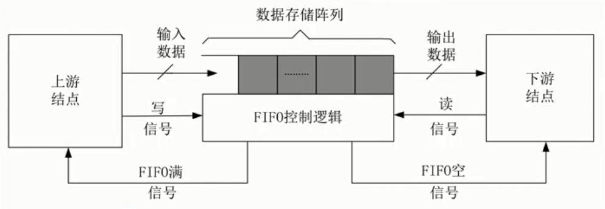
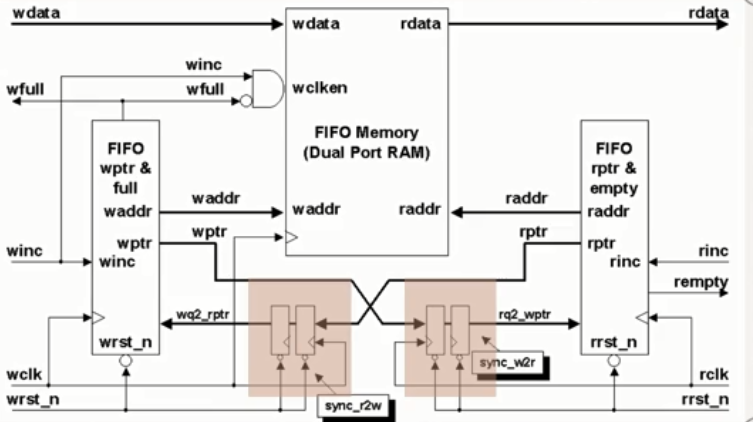
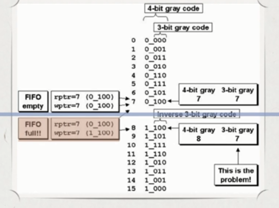
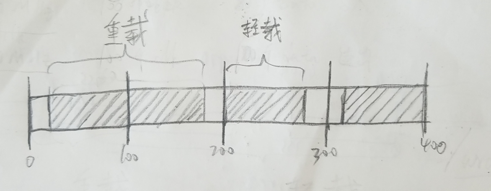
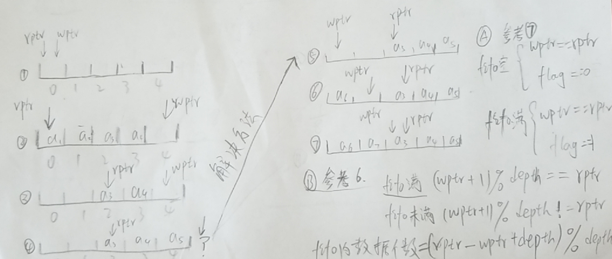

fifo设计主要包括

- 
- 
- 存储部分
- 写时钟域电路部分
- 读时钟域电路部分
- 跨时钟域电路部分

fifo设计需要注意几个关键部分

1. fifo设计读写指针与格雷码

   - 由于fifo是工作在两个不同的时钟域中读地址在某一个时刻将地址跳变 ```0111--->1000``` 

   - 如果读时钟恰好在这个时刻读取数据，得到的地址有可能是```0000~1111```中的任何一个值这个不确定的读地址值会导致空满状态判断错误

   - 引用格雷码后，相邻数值只有1位发生翻转，1位翻转所引起亚稳态的概率远远小于几位同时翻转所引起亚稳态的概率，因此，格雷码能很好的控制亚稳态出现的概率

   - 并不是一定要用格雷码做读写指针，而是当深度为2次幂的时候，刚好满足消除亚稳态的需求，而fifo中亚稳态不能从根本上消除，只是采用格雷码会大大降低亚稳态出现的频率

   - 格雷码的特点

     - 相邻的两个数值之前只会有一位发生变化，其余各位都相同
     - 格雷码是一种循环码，0和最大数（$2^n-1$）之间也只有一位不同
     - 假设fifo的的深度为8，则读写指针可采用格雷码进行编码，```0~7 ==>000,001,011,010,110,111,101,100```
     - 那么当fifo深度为6，如果读写指针继续采用格雷码，则无法实现消除亚稳态的目的
     - 可以如下表所示设置读写指针

     - | 0    | 1    | 2    | 3    | 4    | 5    |
       | ---- | ---- | ---- | ---- | ---- | ---- |
       | 000  | 001  | 011  | 010  | 110  | 111  |
       | 000  | 001  | 011  | 010  | 110  | 100  |

     - 在非二次幂深度的情况下，格雷码已经不再使用，此时解决方法有如下三种

       - 若深度为偶数，可采用最接近处的2次幂的格雷码编码，在此基础上修改
       - 深度为一般数值时，自行设计一种逻辑电路，或查找表，已实现指针每次只能跳变一次的功能
       - 当设计方法过于复杂时，在没有特定需求的情况下，可以将fifo深度设置为2次幂，浪费空降，简化电路

   - 格雷码失效的后果
     - 地址同步出错，但只有1位出错，在这种情形下，依然能够保证fifo功能的正确性
     - 格雷码在相邻两个周期跳变会出错但不会使fifo不能工作，但是超过两个周期时就不一定了，因为这时不止一位会出错
     - 所以地址总线的偏斜一定不能超过1个周期，否则格雷码失去作用
     - 将地址总线打两拍同步或者多拍同步的差异
       - 地址总线打两拍，避免亚稳态传播，不能消除亚稳态现象（时钟异步，亚稳态不可以避免）
       - 多拍可以将亚稳态出现的概率进一步降低，提高系统MTBF
   - 二进制码转换格雷码，从最左边第一位开始，一次将每一位与左邻一位异或（XOR），作为对应格雷码该位的值，最左一位不变
   - 格雷码转换二进制码，从左边第二位起，将每位与左边一位解码后的值异或（XOR）作为改为解码后的值（最左边一位不变）

2. 空满标志的判断方法

   - 通过比较读写地址进行空满判断，但是读写地址属于不同的时钟域，所以比较之前需要先将读写地址进行同步处理，此机制保证了fifo在空满极限情况下，依然留有余量，存在一定的冗余空间，即保守的来说，满不一定是真满，空不一定是真空，实现写满而不溢出，读空而不多读
   - 区分空满状态可以在地址中增加一个额外的位，参考数据结构中设置标志位
     - 当写指针怎建并越过最后一个fifo地址时，就将这个未用的MSB加1，其他位回零
     - 对读指针也进行同样的操作，此时对于深度为$2^n$的fifo，需要读写指针位宽为n+1位
     - 如果读写指针的MSB不同，说明写指针比读指针多折回了一次                              
     - 如果两个指针的MSB相同，说明两个指针折回的次数相同，其余为相等的情况下，说明fifo为空
   - 使用格雷码如何判断空满标志
     - 
     - 空标志的判断方法不变，依然是读写指针相同
     - 对于满标志，当各类码除了MSB外，具有镜像对称的特点
   - 判断满的条件
     - wptr和同步过来的rtpr的MSB不相等，因为wptr必须必rptr多折回一次
     - wptr和rptr的次高位不相等
     - 例
       - 参照上图，当读指针指向7，写指针指向8除了MSB完全相同，当不能说他为满
       - 上图位置7和15，转化为二进制对应的是0111和1111，MSB不同说明多折回一次，1111代表同一位

3. fifo深度设置

   1. 例
      - $f_{wrclk} = 100MHz,f_{rdclk} = 80MHz$ 
      - fifo写数据侧每100 个写时钟周期写入80个数据
      - fifo读数据侧每100 个读时钟周期读出100个数据
   2. 根据上面的例子
      1. 
      2. 数据如果背靠背传输会连续的突发写入160个数据，这时我们成为重载，轻载与之相对，在100个写时钟内写入80个数据
      3. 数据重载的时间 $b_t = b_l / f_{wrclk} = 160/100$
      4. 数据重载时间所能读出数据的个数 $d_{rnum} = b_t *f_{rdclk} * r_x = 160/100 * 80 * 100/100 = 128$
      5. fifo内参与的数据个数也就是fifo所需要的深度即 $depth = b_l - d_{rnum} =160 -128 = 32$
   3. 为了便于设计fifo得出同一化的公式，将问题一般化
      - 写时钟频率：$f_{wclk}$；读时钟频率：$f_{rclk}$
      - 写的时候每b个时钟会有a个数据写入fifo；读的时候每y个时钟会有x个数据读出fifo
      - $depth = b_l - (b_l/f_{wclk}) * f_{rclk} * x/y = b_l - b_t * f_{rclk} * x/y = b_l-b_t*r_x$
   
4. 两种fifo设置的区别

   - normal synchronous FIFO mode 与 show-ahead synchronous FIFO mode区别

   - 选则第一种普通方式则 rdreq 信号作为实际意义上的读请求信号，当该信号有效时 FIFO 中的控制逻辑从存储器中读取一个数据输出到 q 端。 
   - 如果选中 Show-ahead 方式，则 rdreq 实际作为了读应答信号，即 rdreq 还没有有效时， q 端口上已经输出了一个有效的数据， rdreq 信号有效的时候则相当于通知 FIFO 内部的控制逻辑 q 端口上的数据已经被读取，则 FIFO 内部的逻辑会从 RAM 中再取出一个新的数据，在下一个时钟周期输出到 q 端口上。该模式在实际中应用也非常的普遍，因为 q 端口上的数据 与 rdreq 同时有效，没有读潜伏期。 

tips

- 缩写
  - 突发读/写长度   $b_l = brustlength$
  - 突发读/写时间 $b_t = brust time$
  - 读数据的效率$r_x = 读时钟频率 * （读出数据个数/所用周期数）$
  - 重载时读出数据的个数$d_{rnum} = data      read     number$
  - 深度 depth
- fifo设计参考
  - 


异步fifo设计

 两个IP pll 

复位信号异步释放

异步fifo

- 存储，分布式寄存器堆，异步ram
- 异步信号的控制，指针的二进制形式转换成格雷码形式，打两拍，传递到异步信号同步处理模块，
- 空信号的产生，将写指针传输进来，解格雷，比较
- 满信号的产生，将读信号传输进来，解格雷，比较

时序约束

物理约束——对FPGA的输入输出端口的物理管脚指定，IOstandard的设置，参照原理图

顶层文件的结构

输入输出信号

1. 异步时钟
   1. 找到两个晶振，一个是普通用户的全局时钟输入引脚输入的，差分形式输入进来，是一个200m的时钟，用来生成写时钟
   2. 从一个高速bank上输入进来，一般是作为pcie的参考时钟，是100m的时钟，用来生成读时钟
2. 异步复位信号
3. fifo的写控制和写数据信号
4. fifo的读控制和读数据信号

差分形式的时钟信号转成单端时钟，使用IBUFDS，不转也行，只要把pll设置成支持差分时钟的就行，但实际上需要ibufds，相当于pll帮你插入

单端时钟输出后经过bufg，相当于把这个系统时钟的布线引到全局布线资源，全名叫dy线缓冲布线资源，两个原因，一个是fpga布线的时候默认会将所有的时钟路径都使用这种全局布线资源，如果没有经过bufg的话，他会使用本地布线资源，布线完成后就会有警告，如果使用本地布线资源的话会对时钟性能有消极影响，如果本意就是要使用本地布线资源，要使用时序约束上设置一下，告诉vivado就是要使用本地布线资源，否则会一直报crtical warning，第二个原因是时钟路径一般都要使用全局布线资源，因为fpga中没有时钟树的综合，使用全局布线资源后fpga有一个专门的时钟树的管理模块，包括pll，mmcm，全局时钟布线资源，都属于fpga中时钟树的一部分，使用这个全局时钟布线资源后，会降低时钟歪斜

经过bufg 后，经过pll，用clk_wiz生成的ip核，主要包括四个信号，一个是200m时钟的输入信号，做了二分频，变成100m的输出，还需要一个复位信号，就是顶层输入的的异步复位信号，不用把同步释放后的信号加上，因为同步释放也是需要时钟的，pll又必须先给复位才能输出时钟，所以同步释放的信号加上后，复位信号永远处于复位状态，时钟信号就出不来，时钟信号出不来，复位状态就只能保持，所以时钟异步复位的信号就可以了。最后一个是locked信号，当locked为1 的时候，表明输出100m时钟信号是稳定的，因为pll是锁相环，需要一定时间将频率稳定下来，需要多少时间稳定根据具体情况而定，标准是输出为1就是稳定的。从pll出来的写时钟用户就可以正常的使用在异步fifo里了

读时钟从高速bank进来一个差分时钟，是100m的时钟，一般作为pcie的参考时钟，经过ibufds_GTE2，这个和写时钟的ibufds是不一样的，ibufds是针对一些普通的非高速bank上的一些全局的差分时钟的输入引脚经过ibufds转成单端，从高速bank上进来的一些差分时钟的参考时钟要使用ibuf_GTE2这个原语将输入时钟转成单端时钟，在经过bufg引到全部布线资源上，如果不引用bufg布线的时候同样会报警告，从bufg输出的端口就已经被引入到全局布线资源上，在经过pl二l分频成50m的时钟，信号和上一个一样，从pll输出的读使能输出到读时钟域

200m的非高速bank上引入的时钟生成100m的clk_wr这个写时钟，这个clk_wr和差分时钟是同步时钟的关系，clk_wr是一个生成时钟，输入的差分时钟是clk_wr的master_clk，二者相对相位是已知的尽管频率不同

100m的高速bank上引入的时钟生成50m的clk_rd的读时钟，clk_rd和100m的差分时钟是同步时钟的关系，类似于写时钟的道理

clk_rd和clk_wr之间是异步时钟，属于不同的master_clk，也就是来自不同的时钟源，相位关系不能确定，涉及到clk_rd和clk_wr 之间信号交互的话是没有办法分析的，需要使用异步时钟的约束方法将其约束

在这个例子中，因为在写时钟下生成的写指针要从写时钟域传到读时钟下，打两拍后才在进行解格雷，解格雷之后再与读时钟下的读指针进行比较，生成empty信号，这是一个格雷码的传递，不能直接使用set_clock_groups或设置伪路径的话是不太靠谱的，如果直接设置成伪路径的话确实不会分析时序路径了，优化时候也不会进行优化，例子中是小工程，可能影响不太大，但是在资源利用率比较大的情况下，很有可能目的寄存器和源寄存器会被拉的很远，去优化别的关键路径，这时有可能造成格雷码失效，就不能起到多比特信号跨时钟域的效果，所以一般使用set_maxdelay -path only来约束，这条命令只考虑了数据路径，不考虑时钟路径的延时，通过这样的一个约束，时序引擎就不会对这条时序路径进行完整的分析

上面是时钟路径上的处理

复位路径上的处理

复位路径是一个纯异步复位，复位有效时间点和释放时间点都是不确定的，跟时钟是完全异步的，复位信号进来之后对其进行异步复位同步释放，一般来说在一个大型的设计中都要做这个处理，目的是要减小recovery和removal的违例。

异步复位同步释放 async_rst_sync模块

先把复位信号进入wr的异步复位同步释放的模块中， 同步释放需要参考时钟，复位信号要与哪一个时钟保持一致就输入那个时钟，时钟使能信号是由于使用了pll，  时钟的输出是有一个稳定的时间的，假如说外部复位信号比较短，是一个比较短的脉冲，比pll稳定的时间还要短，当复位信号一旦被释放，经过clk_wr两个时钟沿后复位被释放，但这时clk_wr信号还不稳定，也就是说rst_wr_n已经释放，这时用户逻辑已经运行起来了，但clk_wr可能还不稳定，所以就有可能出错，在locked信号为高之前，会出现上升沿和下降沿，但时钟周期可能不是100m，如果外部复位信号的释放点在locked为1之后再被释放就没有问题了，设计中只要用到pll就要考虑到这种情况，即locked 没有为1，复位信号被释放，所以要使用这个clk_wr_en信号

无论fpga还是设计都没对复位信号使用全局布线资源还是本地布线资源没有明确的需求，由于复位信号驱动的寄存器比较多，所以有时为了增加驱动能力，需要经过bufg，但是经过bufg后recovery或这removal的时序违例情况更严重，如果违例情况更严重，将设计中不许要复位的信号取消掉，将bufg去掉，让复位信号使用本地布线资源，本地布线资源的特点是驱动能力低，但是布线延时小，经过bufg驱动能力强，布线延时大，延时大很容易造成复位信号连接到目的寄存器很容易超过一个时钟，造成removal或者recovery违例，一般情况下没有强制要求bufg的，bufg出来后直接作为异步fifo使用的rst_wr

每一个时钟域都有自己的复位信号，每一复位信号都要进行独立的异步复位同步释放，与clk_rd同步的复位信号生成过程相同，在复位路径上加非门是没有问题的，如果加与门或者或门可能会引入比较大的逻辑延迟，加非门没有问题，一般增强驱动的缓冲器一般也是由两个非门构成的，但不要加其他门

以上就是时钟信号和复位信号的处理

约束时会将rst_n设置为伪路径，所以会把外部的纯异步复位到第一级触发器的路径全部忽略掉，rst_wr_n是不需要设置伪路径的，这个信号可以时序分析的

异步fifo设置的参数，位宽，深度，首字置出，存储类型

异步复位同步释放模块。源复位和目的复位信号，源复位就是输入的纯异步复位信号，目的复位就是异步复位同步释放的信号，目的复位信号与目的时钟保持同步，同时要有目的时钟的使能信号，在目的时钟使能信号无效的时候，就算源复位释放目的时钟的也不会释放复位，一定在目的时钟有效的情况下，目的复位才会复位

异步fifo模块。根据深度设置地址总线的位宽，clog计算位宽

u_wptr_full 模块。会输出一个二进制的写地址和格雷码的写地址，收到一个同步后的格雷码的读地址，第一个功能根据写使能生成写指针，然后把写地址传到memory模块中，第二个功能是把写指针转换成格雷码，输出并同步到读时钟域下，第三个功能是判断空满，将已经同步的读格雷码与写格雷码进行比较，产生空满信号，好处是快，性能有一定的提升，不用解格雷，占用逻辑资源小，解格雷不容易写成参数化（第二种方法是接受已经同步到写时钟域的读格雷码，解格雷后与二进制的写指针进行比较）

读指针空信号的判断，与写信号的判断类似，第一步是读指针有效并且不空的情况下，将读指针加1，将二进制转换为格雷码，将同步到读时钟域下的写格雷码经过判断，与wptr_full类似

sync_ptr的模块是跨时钟域处理，将进来的格雷码指针打两拍后直接输出，需要注意的是从`ptr_in`到`__ptr_out`就是一个跨时钟域路径，在`clk_out`时钟域下驱动`__ptr_out`被赋值了一个在`clk_in`时钟域下的信号，这就是典型的跨异步时钟路径，处理的话就是使用分组，伪路径，和maxdelay来处理，因为是fifo模块，要使用maxdelay来处理，第二拍的就是在同一个时域下了，这是源时钟和目的时钟都是clk_out，这条路径就不是跨时钟域

代码风格是将时序逻辑和组合逻辑分开写，

将跨时钟的信号做成一个模块

xlinix中有配置逻辑单元叫clb，clb中分为m slace 和l slace，l slace 中会有lut，由来做组合逻辑，m slace中lut是用来做分布式的存储的，这里使用的clb中的资源，也就是m slace 中的lut。如果使用block ram的话，他是使用片上的存储，不使用逻辑资源的也就是clb。

block ram 的写入和读出必须是与时钟保持同步，使用逻辑资源，寄存器堆生成的fifo写入动作和时钟保持一致，读出操作可以是异步读出的，只要给地址他就能立马给出数据，所以如果是首字置出的形式，建议使用寄存器堆生成的fifo


首先要进行两个约束，物理约束和时序约束，

物理约束就是绑定输入输出与管脚，绑定管脚后要设置IOSTANDARD，参考原理图

时序约束首先该对哪些进行约束，如果不知道，可以先约束一下已知的信号，之后综合一下，然后打开约束向导，根据向导进一步补充

- 主时钟肯定是要约束的，约束时钟周期，
- 异步复位信号需要约束为伪路径，
- 普通输入信号约束inputdelay，普通输出信号约束outputdelay，
- 对于内部要约束生成时钟，
  - 一种是pll产生的，一般不用约束，约束后会覆盖掉时序引擎自己的约束，会报crtical warning，
  - 第二种是用户逻辑产生的，用户使用lut或者触发器的q端产生的时钟，这个时钟vivado没法推断，实际设计中不要使用这样的时钟，fpga中有同一的时钟资源管理，使用pll，bufg，如果使用lut生成的时钟没有办法管理的，质量没法保证，在asic中是有时钟综合的，通过时钟综合进一步确定时钟的质量，但是fpga中时钟树的位置是比较固定的，就是通过pll或者mmcm以及全局时钟的布线资源来完成时钟的管理，如果使用用户自定义的lut或者寄存器时钟质量无法保证

内部模块时序约束的代码，要对代码结构十分清晰，哪些地方进行了跨时钟域，那些地方没有，建议每一个模块使用一个时钟，对于跨时钟域单独完成一个模块，写时钟域约束时也很方便

异步fifo中，每个模块只有一个时钟域，这时写时序约束就非常方便

尤其是在要约束maxdelay的时候，因为要指定跨时钟路径的起点和终点，如果把跨时钟域模块和其他模块合在一起，这样做不太好找时序路径，第二是模块只有一个时钟域也是有益处的。

而对于分组和伪路径是不用找时序路径的，但是不建议这样做


异步时序有路径延时的要求，所以要加上一个datapath_only，如果不加datapath_only就相当于是多周期约束，指定源寄存器也就是时序路径的起点，一般是源寄存器的时钟端口或者是数据输如端口，时序路径终点，一般目的寄存器的d端口，或者fpga的输出端口，由于寄存器是多比特的，使用通配符约束

约束为8ns是因为格雷码在写时钟下产生，在读时钟域下采样信号，读时钟是50m，写时钟是100m，一般约束为读时钟和写时钟中最小的一个周期，也就是写时钟的10ns，约束为最小时钟周期的80%，这样就保证，不会超过8ns的延迟

这样的话就确保两个寄存器不会超过8ns的延迟，也就是说写时钟信号在变化后8ns之前稳定下来，避免了格雷码失效的情况，在下一个时钟周期有下一个bit产生就不会有数据歪斜的问题了，数据歪斜就是多个比特同时发生变化，到达目的寄存器采样的时候多个bit都是不稳定的，格雷码每次只变化1bit，在目的寄存器采样的时候，只有最新变化的是不稳定的，要么采样到新数据要么采样到旧数据

这样约束完之后，还有其他的跨异步时钟路径，还有其他信号跨时钟域了，但不是格雷码的寄存器了。但是这时不能使用setclocksgroups，因为setclocksgroups优先级比较高，会覆盖掉maxdelay，所以一般还是使用maxdelay约束，但是对这个数据路径延迟是没有要求的，可以设置大一点，这个效果就像设置成伪路径一样的，这样就保证了不会覆盖掉maxdelay， 

越详细的约束优先级越高，所以第一条时序约束的优先级是比第二条时序约束的优先级越高


```tcl
################# current design ####################
set_property CFGBVS VCCO [current_design]
set_property CONFIG_VOLTAGE 3.3 [current_design]
set_property BITSTREAM.CONFIG.UNUSEDPIN PULLNONE [current_design]
#####################################################
#

############## system reset define ##################
set_property PACKAGE_PIN T16     [get_ports rst_n]
set_property IOSTANDARD LVCMOS33 [get_ports rst_n]

############## Master clock define ##################
set_property PACKAGE_PIN R4         [get_ports sys_clk0_p]
set_property IOSTANDARD DIFF_SSTL15 [get_ports sys_clk0_p]

set_property PACKAGE_PIN F10        [get_ports sys_clk1_p]
set_property LOC IBUFDS_GTE2_X0Y3   [get_cells IBUFDS_GTE2_sys_clk1]


############## pins define ##################
set_property PACKAGE_PIN Y16 [get_ports wr_en]
set_property IOSTANDARD LVCMOS33 [get_ports wr_en]

set_property PACKAGE_PIN AA15 [get_ports {wr_data[0]}]
set_property PACKAGE_PIN AB15 [get_ports {wr_data[1]}]
set_property PACKAGE_PIN AA14 [get_ports {wr_data[2]}]
set_property PACKAGE_PIN AA16 [get_ports {wr_data[3]}]
set_property PACKAGE_PIN AB11 [get_ports {wr_data[4]}]
set_property PACKAGE_PIN AB16 [get_ports {wr_data[5]}]
set_property PACKAGE_PIN AB12 [get_ports {wr_data[6]}]
set_property PACKAGE_PIN AB17 [get_ports {wr_data[7]}]
set_property IOSTANDARD LVCMOS33 [get_ports {wr_data[*]}]

set_property PACKAGE_PIN Y13 [get_ports fifo_full_wr]
set_property IOSTANDARD LVCMOS33 [get_ports fifo_full_wr]

set_property PACKAGE_PIN W14 [get_ports rd_en]
set_property IOSTANDARD LVCMOS33 [get_ports rd_en]

set_property PACKAGE_PIN AA13 [get_ports {rd_data[0]}]
set_property PACKAGE_PIN AB13 [get_ports {rd_data[1]}]
set_property PACKAGE_PIN AB7 [get_ports {rd_data[2]}]
set_property PACKAGE_PIN AB6 [get_ports {rd_data[3]}]
set_property PACKAGE_PIN AA6 [get_ports {rd_data[4]}]
set_property PACKAGE_PIN AA8 [get_ports {rd_data[5]}]
set_property PACKAGE_PIN AB8 [get_ports {rd_data[6]}]
set_property PACKAGE_PIN W7 [get_ports {rd_data[7]}]
set_property IOSTANDARD LVCMOS33 [get_ports {rd_data[*]}]


set_property PACKAGE_PIN Y14 [get_ports fifo_empty_rd]
set_property IOSTANDARD LVCMOS33 [get_ports fifo_empty_rd]


```


```tcl
############## system reset define ##################
set_false_path -from [get_ports rst_n] -to [all_registers]
#约束复位信号，这个伪路径是纯异步复位信号到异步复位同步释放模块的两个寄存器给忽略了
#其他部分是没有必要屏蔽的
#####################################################


############## Master clock define ##################
create_clock -period 5.000  [get_ports sys_clk0_p]
#create_clock -name sys_clk0_p -period 5.000  [get_ports sys_clk0_p]
#在时序分析是会以指定的名字进行分析，时序路径在分析是会有一个名字
#时钟占空比不是50%的时候使用 -waveform
create_clock -period 10.000 [get_ports sys_clk1_p]

#set_clock_groups -name async_clk -asynchronous -group [get_clocks -include_generated_clocks sys_clk0_p] -group [get_clocks -include_generated_clocks sys_clk1_p]
#后面要使用maxdelay来约束异步时钟路径，由于set_clock_groups的优先级较高，所以不用这条命令来约束
#####################################################

############## Generate clock define ##################
create_generated_clock -name clk_wr -source [get_pins U_clk_wiz_0/clk_in1] -divide_by 2 [get_pins U_clk_wiz_0/clk_out1]
create_generated_clock -name clk_rd -source [get_pins U_clk_wiz_1/clk_in1] -divide_by 2 [get_pins U_clk_wiz_1/clk_out1]
#生成时钟的约束，因为这个设计中只有pll生成的生成时钟，这个生成时钟可以约束也可不约束
#但是不约束的话，pll内部的时序约束会自动的对生成时钟进行约束，但是约束后的生成时钟的名字是不知道，想知道的话可以通过TCL的一个命令查询
#但是我们为什么要知道这个生成时钟的名字呢，因为后面约束需要用到这个生成时钟名字，如果不知道就无法约束
#生成时钟的约束只要知道master clock，因为通过pll产生的生成时钟是经过主时钟倍频分频相移产生的
#所以在约束的时候只需要指定源就行，源就是masterclock，首先要知道源是谁，可以知道源时钟是sys_clk0_p，但是我们只要约束网表上的一个节点，时序分析时就会自动的向上查询，一直查到源时钟
#方便起见，设置masterclock的时候就直接约束pll的输入时钟就行了
#divided_by,multiply_by,edge_shift
#####################################################

#set_false_path -from [get_clocks clk_wr] -to [get_clocks clk_rd]
#set_false_path -from [get_clocks clk_rd] -to [get_clocks clk_wr]

############## Inputdelay define ##################
set_input_delay -clock clk_wr 6.000 [get_ports wr_en]
set_input_delay -clock clk_wr 6.000 [get_ports {wr_data[*]}]
set_input_delay -clock clk_rd 12.000 [get_ports rd_en]
#input_delay要指定输入的管脚，inputdelay都要有一个参考时钟，这个参考时钟是采样输入信号的时钟
#clk_wr是10ns，约束了6ns，也就是外部延时是6ns（ppt.56分析过）留给芯片内的是4ns
#设置为60%之后如果出现违例将外部预留延时减少，给外部留的少一点
############## Outputdelay define ##################
set_output_delay -clock clk_wr 3.000 [get_ports fifo_full_wr]
#约束外部延时为3，留给芯片内部的延时是7，
#本来是6ns，出现了违例，所以向下调整
#或者查看时序违例的原因是什么，如果是组合逻辑过长，就调整组合逻辑
#但是这个信号输出经过了obuf，这个延时比较大， 没有办法降下来
#因为obuf在fpga的四周，寄存器在fpga内部，走线延迟比较大
#无法调整obuf的延时，所以只能调整外部延时
set_output_delay -clock clk_rd 12.000 [get_ports {rd_data[*]}]
set_output_delay -clock clk_rd 12.000 [get_ports fifo_empty_rd]
#outputdelay约束的参考时钟也是不一样的，信号的产生分属于不同的时钟域
############## Maxdelay define ##################
#格雷码的异步时序比较特殊，需要约束数据延迟
#datapth_only必须要加，如果不加相当于是多周期约束，如果加了就只考虑数据的延迟
#时序路径的起点，一般是源寄存器的时钟端口，或者是fpga的数据输入端口
#时序路径的终点，一个是目的寄存器的数据输入端口，或者fpga的输出端口
#使用get_cells只用指定到寄存器就行，通过层级指定寄存器
set_max_delay -datapath_only -from [get_cells {U_ASYNC_FIFO/U_wptr_full/_wr_gray_reg[*]}] -to [get_cells {U_ASYNC_FIFO/U_sync_ptr_wr/__ptr_out_reg[*]}] 8.000
#在写时钟下产生格雷码，写时钟是100m，在读时钟下采样数据信号，读时钟是50m
#一般约束的量是不能超过写时钟或读时钟中最快的时钟的时钟周期，一般约束为时钟周期的80%，如果不够还可以降，也就是格雷码下写时钟下变化后，在一个时钟周期下稳定下来
#“数据歪斜”的本质是多个比特同一时刻发生变化到达目的寄存器采样的时间点是不一样的
#但是格雷码是每次只会变化一个bit，格雷码变化后会在一个周期内稳定下来
set_max_delay -datapath_only -from [get_clocks clk_wr] -to [get_clocks clk_rd] 80.000
#有一些其他的路径也会跨时钟域，但是不是格雷码的寄存器，
#第一种是使用set_false_path，第二种是使用maxdelay
#但是一定不能使用set_clock_groups，因为他优先级比较高，会覆盖掉maxdelay
#使用maxdelay约束为80ns，相当于没有要求了，效果与设置为伪路径比较类似
#时序约束是有一个优先级的区别的，而且是基于tcl的也就是后执行的命令会覆盖掉前面的相同的命令
#换种说法是越详细的约束优先级越高
 

set_max_delay -datapath_only -from [get_cells {U_ASYNC_FIFO/U_rptr_empty/_rd_gray_reg[*]}] -to [get_cells {U_ASYNC_FIFO/U_sync_ptr_rd/__ptr_out_reg[*]}] 8.000
set_max_delay -datapath_only -from [get_clocks clk_rd] -to [get_clocks clk_wr] 80.000

###############################################################################
# End
###############################################################################


```


vivodo中的时序报告

一般来说critical warning需要关注一下

report timing summary

指定时钟组，也就是设计中可能有多个时钟组


时序约束要抓紧呀

再不看忘了


