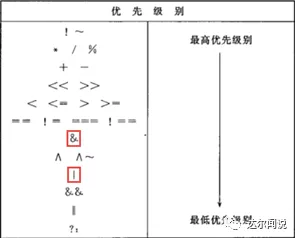
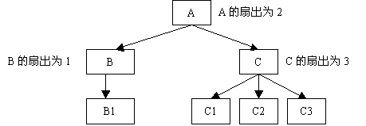
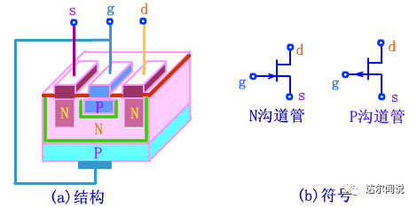

## 知识点自测

1. 时序约束与分析
   - 这部分内容的题目无论在FPGA岗还是在数字IC岗永远都是重中之重，几乎没有哪一套题会忽略这部分内容，所以一定要掌握。对于这部分内容，我们也在之前做过详细的解析，包括公式的推导、计算、以为一些路径的约束。这部分内容的小题就是考察对建立保持时间的理解，大题主要就是计算了。这套题所考察的计算题还是很有代表性的，也是本套题的压轴题，如果全部分析、计算正确还是需要花一些时间的，建议把这题吃透。
2. 数字IC全套设计流程中的知识点
   - 这部分内容在本套题所考察的还是挺多的，从半导体的迁移率、DC、DFT、PVT、PT、功耗到PPA、芯片测试、工艺、良率再到一些总线的认识和Linux的基本操作，考察的内容都是每个领域中最基本的点，并没有深入，也就是考察所谓的广度，只有对整个IC开发流程都熟悉才能够做对。
3. 数字电路基本知识
   - 这部分内容一本数电书就可以搞定，会考到布尔表达式的化简、卡诺图、加法器等基本逻辑电路的计算、竞争冒险问题、RAM和ROM的地址计算问题、寄存器和锁存器的异同。
4. 跨时钟域问题
   - 这种类型的题目也是非常容易考察的，快到慢、慢到快、多比特、单比特这四种不同场景所针对的解决方法都要明白，甚至要会写相关的代码，这部分内容最难的情况是让你手写异步FIFO的代码。
5. Verilog语法
   - 这部分内容主要考察一些基本的语法、运算符的用法和优先级、任务、函数、仿真、Verilog编程大题。

## wire与reg的区别

wire

- wire型数据通常用来表示用以assign关键字指定的组合逻辑信号
- verilog程序模块中输入输出信号类型默认时自动定义为wire型
- wire型信号可以用作任何方程式的输入，也可以用作assign语句或实例原件的输出

reg

- reg型数据常用来表示always模块内的指定信号，常代表触发器
- 在时序逻辑always模块内被赋值的每一个信号都必须被定义为reg型
- reg型数据的默认初始值是不定值

触发器和锁存器的区别

- 锁存器靠控制信号的电平实现数据的保存
- 触发器靠控制信号的边沿变化实现数据的保存

## latch 和flipflip的区别


## cpld与fpga的异同

- fpga是在cpld之后发展出的一种更复杂的pld
- fpga集成了更多且更复杂的资源，包括可配置的逻辑块，时钟资源，时钟管理模块，块存储资源，互联资源，专用dsp模块，输入/输出块，XADC模块等，在一些高性能的fpga内还提供了吉比特收发器和PCI-E模块等硬核资源
- cpld使用与或阵列，fpga使用查找表结构，这是fpga最基本的原理

## 查找表LUT（look-up table）原理

- 由布尔逻辑代数理论可知，对于一个n输入的逻辑运算，最多产生2的n次方个不同的组合，如果预先将每个逻辑输入对应的结果保存在一个存储单元中，就相当于实现了逻辑门电路的功能
- fpga内的组合逻辑电路均由查找表实现
- LUT实现组合逻辑电路的功能由输入决定，而不是由复杂度决定
- LUT实现组合逻辑有固定的传输延迟 

- 相较于传统的逻辑门电路，LUT实现组合逻辑电路的功能克服了以下缺点
  - 逻辑门电路的输入变量从输入经过逻辑门运算后送到逻辑输出变量，存在一定的延时，延迟大小与逻辑电路的复杂度相关，并且是不确定的，延迟时间的不确定，工作频率就不确定，工作频率与时序逻辑电路的工作速度密切相关，由于工作速度的不确定，从而影响到了整个电路的性能
  - 逻辑电路的复杂度与输入逻辑变量的个数和逻辑电路所使用的逻辑门的数量有关，很明显，逻辑电路输入变量越多，电路越复杂

## verilog 操作符优先级




## 约束文件

- xlinix vivado集成开发环境使用xlinix 设计约束（xlinix design constraints，XDC）
- XDC是基于标准的synopsys设计约束（synopsys design constraints，SDC）的
- XDC文件特点
  - 不是简单的字符串，遵循tcl语法命令
  - 通过vivado tcl 翻译器就可以像理解tcl命令那样理解他们
  - 可以读取tcl指令，然后按照顺序对命令进行分析
- 如何添加XDC
  - 在设计的不同阶段均可添加XDC，将约束保存在一个或者多个XDC文件中
  - 通过read_xdc命令
  - 将他添加到其中一个设计工程的约束集中
- 通过TCL脚本生成的约束，可以通过下面的方法运行TCL脚本
  - 运行source命令
  - 将TCL叫脚本添加到其中一个设计工程约束集中

## 模块端口定义

- 三种模块端口定义，input， output， inout

- 我是这么理解的，首先在模块命后的括号内定义端口，然后声明端口
  - 声明端口时同时声明端口的数据类型，没有声明端口类型的情况下默认为线网类型，端口类型有线网（net）型和寄存器（reg）型
  - 有符号（signed）型数据，无符号型数据，没有声明端口有无符号时，默认为无符号型的端口

## verilog的描述方式

- 行为级描述是verilog hdl最高抽象级别的描述方式，可以按照要求来实现一个设计算法，而不用关心具体的实现方式，但是行为级描述是不可以被综合的，行为级描述语句可以描述逻辑行为，包括initial语句和always语句，用于对设计进行仿真，不能转化为实际的电路结构。

- 寄存器传输级（rtl）级描述，数据流描述，可以理解为在一个复杂的数字系统中，应该包含有数据流和控制流，控制流用于控制数据的流向，寄存器传输，任何数据从输入到输出，都需要经过寄存器来对数据重定序，这样，保证数据从输入到输出满足书序收敛的条件，不会出现竞争冒险与亚稳定状态。完成后将转化为实际的电路

## 系统任务和函数，编译器指令

- 以" $ "开始的标识符表示系统任务或者系统函数
- 以" ` "开始的的某些表示符看做编译器指令

## verilog 中数字的使用

- 不太理解：" 在任何时候，负数应该使用二进制补码形式表示 "，这是啥意思？

- ```<+/-><size><'base_format><number>```
- 第一的尖括号里为正负，可正可负也可以不写，不写默认为正数或者无符号数
- 第二个尖括号为位宽，在使用数字时必须带位宽，位宽包括有符号数的符号位
  - 未指定位宽，默认位宽至少32位
  - size位宽小于number位宽，将高位截断，保留低位
  - size位宽大于number位宽，根据正负（符号位）补全，正数补0，负数补1；无符号数补0；number最高位为x/z则同样补x/z
- 第三个尖括号为数的格式，base_format = {b, o, d, h, sb, so, sd, sh}，s代表为有符号数，
  - 可有与第一个尖括号中的正负搭配使用，完全的定义，不会产生歧义
  - 也可以只有第一个尖括号中的正负不写s，有点问题哎，尽量避免这样的定义
  - 也可以没有第一个尖括号的正负值有后面的s，当然是默认为正的有符号数
- 第四个尖括号中可以出现的数字为 number = {0, 1, 2, 3, 4, 5, 6, 7, 8, 9, a, b, c, d, e, f, x, z, ?}(不区分大小写)以及作为连接符的下划线"_",
  - x不确定态，z高阻态，？作用同z
  - x,z,?，根据base_format的定义，所代表的位宽可以为1,2,4，当然十进制的话我也不知啦，不要那么用，没有意义

## 属性attribute

- 参见数字设计权威指南何宾

- 知道但不会用，感觉是指定一些特定的东西，在综合是加进去，比如之前用过的探针属性，属性有自己的名字，以及自己对应的值

## testbench文件中的时间定义

Verilog语言中预先定义了一些任务和函数，用于完成一些特殊的功能，它们被称为系统任务和系统函数，这些函数大多数都是只能在Testbench仿真中使用的，使我们更方便的进行验证。

`timescale1ns**/**1ns //时间尺度预编译指令时间单位/时间精度

时间单位和时间精度由值1、10、和100以及单位s、ms、us、ns、ps和fs组成

时间单位：定义仿真过程所有与时间相关量的单位，仿真中使用 “#数字”表示延时相应时间单位的时间，例#10表示延时10个单位的时间，即10ns

时间精度：决定时间相关量的精度及仿真显示的最小刻度

`timescale1ns**/**10ps 精度0.01，**#**10.11表示延时10110ps

而下面这种写法就是错误的，因为时间单位不能比时间精度小

`timescale100ps**/**1ns

```1 s = 1,000 ms = 1,000,000 μs = 1,000,000,000 ns = 1,000,000,000,000 ps```

皮秒，符号ps（英语：picosecond ），1皮秒等于一万亿分之一秒（```10^(-12)s```）

``` 1,000 ps= 1ns```

```1,000,000 ps = 1μs ```

```1,000,000,000 ps = 1ms```

```1,000,000,000,000 ps = 1s```

纳秒，符号ns（英语：nanosecond ），1纳秒等于十亿分之一秒（```10^(-9)s```）

```1 ns= 1000ps```

```1,000 ns= 1μs ```

```1,000,000ns = 1ms```

```1,000,000,000 ns= 1s```

微秒，符号μs（英语：microsecond ），1微秒等于一百万分之一秒（```10^(-6)s```）

```0.000 001 μs= 1ps```

```0.001 μs= 1ns```

```1,000 μs= 1ms```

```1,000,000 μs= 1s```
毫秒，符号ms（英语：millisecond ），1毫秒等于一千分之一秒（10-3秒）

```0.000 000 001 ms= 1ps``` 

```0.000 001 ms= 1ns ```

```0.001 ms = 1μs ```

```1000 ms = 1s```

```verilog
`timescale 1ns/1ps //单位/精度
#100 //延时100ns
//-------------------------
`timescale 10ns/1ps
#100//延时100*10ns
#0.1//0.1ns = 1ps，仿真精确到小数点后一位
```

## 时钟管理单元（PLL，DLL）

​	PLL（Phase-Locked Loop）相位锁定的环路，也就是常说的锁相环，锁相环在模拟电路和数字电路系统中均有广泛的应用，很多mcu芯片如stm32，msp430，等都集成了片上的pll，用来通过片外较低频率的晶振产生的时钟倍频得到较高频率的时钟信号以供mcu内核和片上的外设使用，在很多的洗衣芯片中也用到得了pll来通过较低的晶振时钟得到符合协议要求的时钟信号，例如典型的usb协议芯片

- 锁相环 PLL
  - PLL （phase locked loop，锁相环），模拟电路
  - pll与dll的区别：pll是数字的，dll是模拟的，pll精度较高
  - 特性：能够将输入的周期信号就行分频和倍频，并最终输出一个或多个稳定的，与输入信号频率和相位相关的信号
  - 总结：能够通过对输入的时钟信号进行分频，倍频，相位控制，从而得到一路或者多路更高或者更低的时钟信号

## 参数传递

- define 与localparam和parameter最大的区别就是 define 可以跨文件传递参数；parameter只能在模块间传递参数；而localparam只能在其所在的module中起作用，不能参与参数传递。

  1. 新建参数模块文件（我命名为para.v）；

  2. 在para.v文件中使用'define宏定义参数（部分）

     ```verilog 
     //`define+name+参数 　
     `define 　　STATE_INIT	3'd0
     `define 　　STATE_IDLE	3'd1
     `define 　　STATE_WRIT	3'd2
     `define 　　STATE_READ	3'd3
     `define 　　STATE_WORK	3'd4
     `define 　　STATE_RETU	3'd5
     ```

  3. 在需要调用参数的文件init.v中使用`include "para.v"：

     ````include "para.v"```

4. 在init.v文件需要参数的地方使用`name 调用（部分）：`

   ````state_init <= `STATE_INIT;```

  5. localparam与parameter的区别与用法

- parameter可用作在顶层模块中例化底层模块时传递参数的接口；

- localparam的作用域仅仅限于当前module，不能作为参数传递的接口。

- ```Verilog
  //用法
  parameter       DATA_WIDTH = 16;
  parameter       ADDR_WIDTH =  5;
  localparam      DW = DATA_WIDTH - 1;
  localparam      AW = ADDR_WIDTH - 1;
  
  ```

## 电源设计

- cyclone IV E 需要三组供电
  - 内核供电   1.0V；非低电压版本为1.2V
  - pll模拟电路供电，数字电路供电1.2V，模拟电路供电固定的2.5V，使用LDO器件 
  - I/O单元供电，电压值从1.2V~3.3V（1.2；1.5；1.8；2.5；3.0；3.3），共6中可选值，IO Bank 每个bank的IO供电都可以不同

## 配置电路设计

- cyclone IV E 基于SRAM的结构的，SRAM掉电就会丢失，因此系统上电后，必须要有配置电路将正确的配置数据加载到SRAM中，然后FPGA才能正常运行
- 五种配置方式（AS，AP，PS，FPP，JTAG）
  - AS 主动串行方式，电路简单，成本低廉，常用语中小容量的FPGA
  - AP主动并行方式，消耗引脚比较多，常用于配置过程的时间要求较高
  - PS被动串行方式，使用一个外部的主机MCU或者CPLD，常用于通过网络方式对fpga的升级
  - JTAG配置方式，可以在器件正常工作过程中捕获运行数据，JTAG指令具有最高优先级
- 对FPGA进行配置
  - FPGA中没有flash，FPGA基于sram架构，掉电程序丢失，FPGA程序存储在外部的flash中，叫做epcs， 实际上是就是spf flash芯片（stm32 片上程序一般存储在flash中）
  - 使用jtag直接配置 .sof，FPGA 掉电，就会变成白片
  - 使用外部器件进行片配置，flash不会丢失，FPGA上电时主动加载程序
  - 使用外部的控制器进行配置

## 硬件乘法单元

- 18*18硬件乘法器，乘数和被乘数输入宽度最大为18位的乘法器
- 乘法器电路复杂，使用fpga内部资源能实现，但是性能会受限，也消耗更多的面积，不利于降低成本和功耗
- 硬件乘法单元在芯片设计时功能和布局都已经确定，即使不使用，他也在
- 每个硬件乘法电路也能拆分成两个位宽为9的存储器 

## 编码方式的区别

对于状态机

- 独热码，每一个状态均使用一个寄存器， 在于状态比较时仅仅需要比较一位， 相比其他译码电路简单；

- 格雷码，所需寄存器数与二进制码一样，译码复杂，但相邻位只跳动一位，一般用于异步多时钟域多 bit 位的转换，如异步 FIFO；

- 二进制码，最为常见的编码方式，所用寄存器少，译码较复杂。 

对于计算

- BCD 码中最常用的是 8421 码，其各个 bit 权值分别是 8d、 4d、 2d、 1d

- 同理 5421 码各位的权依次为 5d、 4d、 2d、 1d。 5421 码特点是最高位连续 5 个 0 后连续 5 个 1，故其当计数器采用这种编码时，最高位可产生对称方波输出

- 余 3 码是在 8421 码上加 0011b 的出来的；

- 格雷码的特点是任意两个相邻的代码只有一位二进制数不同，编码格式不唯一；

- 余 3 循环码具有格雷码的特点并且编码的首尾可以连接来进行循环，这样可用反馈移位寄存器来实现，硬件实现简单。 

- BCD码利于十进制的计算

  BCD 码的运算规则： BCD 码是十进制数，而运算器对数据做加减运算时，都是按二进制运算规则进行处理的。这样，当将 BCD 码传送给运算器进行运算时，其结果需要修正。修正的规则是：当两个 BCD 码相加，如果和等于或小于 1001b(即十进制数 9)，不需要修正；如果相加之和在 1010b 到 1111b(即十六进制数 0AH～0FH)之间，则需加 6d 也就是 0110 进行修正；如果相加时，本位产生了进位，也需加 6 进行修正。下面举例说明：计算 5+8，将 5和 8 转换为 8421 BCD 码后输入加法器，则运算如下： 0101 + 1000 = 1101 结果大于 9d，+0110b 即加 6d 修正得出 10011b，补充高位为 0001_0011b。 即 5+8=13，结论正确。

  BCD 码的主要应用之一就是数码管，假设要将十进制数 158 显示， 一般解决办法是把需要显示的十进制数的个、十、百、千位数等进行拆分，即把 158 拆分出 1、 5、 8，然后查出对应的数码管显示段码再送去给数码管连接的 IO 口。这个过程可以进行下面的运算：先进行除法运算 158/100 得出百位 1，再取余 158%100 = 58 后继续进行除法运算 58 / 10 得出十位 5，再进行一次取余 158%10 ，得到个位 8。以上过程可以看出需要除法，但是由于除法运算是比较消耗计算时间导致整体需要的指令周期太久。但是如果先将其转换为 BCD 码，则可大幅度减少运算时间。 具体应用将在数码管一讲中详细介绍。 

## readmemb与readmemh的使用

1. 在verilog中有$readmemh(“filename”, mem_name)命令，在使用这个命令时，”filename”中的路径要用反斜杠’/’，而不是斜杠’\’。如

   - $readmemh("F:/mydesigen/re_input.txt",re_input);

   - 上面的语句是正确的，而如果用斜杠就有问题，如

   - $readmemh("F:\mydesigen\re_input.txt",re_input);

2. readmemb（“D：/file1/file2/ramh.dat”，a）；即可以调用到放置在任意处的存储文件。当采用$readmemb（“ramh.dat”，a）；这种方式时，ramh.dat文件必须放置在工程下的simulation文件夹下，亲测其他放置都无效。

3. 关于存储文件后缀，.dat .txt 甚至不加后缀都可以，只要保证程序里调用的与文件夹中实际的一致，可以索引到即可

4. 对于需要的txt文件，其格式为每行一个数据，存储顺序。文档中由上至下，对应数组由低到高。

   - 例如用matlab产生文件则可以这样写

     ```fid0 = fopen('F:\path\re_input.txt','w+');```

     ```fprintf(fid0,'%x \n',real(info));```

     其中的换行符是必须的。同时，在matlab中，路径语句的斜杠’\’或是反斜杠’/’都没有问题。

5. 不可综合。readmemb、readmemh、initial 都是不可综合语句（怎么可以这样呢！那大数组怎么赋值？）也就是说只能在仿真时调试用。

6. 对于$readmemh对应的16进制文件，不用写成4'hA，最简单的A即可。

## verilog 中计算的化简

- 可以将其拆分为2的幂级数，比如10 = 2+8，尽量不要使用乘法器
- 如果相除之后产生大量小数位，可以先将被除数扩大到商没有小数，将计算结果进行其他计算，最终在将结果缩小相应的倍数，因为在FPGA终没有浮点数这一说，所有产生小数的结果，只能精确到1，采用上述方法后，可以将结果进一步的精确
- 如果结果太大可以将结果扩大的倍数放小一点，这样造成的为是结果精度的减小
- 考虑溢出问题

## 阻塞赋值与非阻塞赋值的六个原则

- 时序电路建模时，用非阻塞赋值；
- 锁存器电路建模时，用非阻塞赋值；
- 用 always 块建立组合逻辑模型时，用阻塞赋值；
- 在同一个 always 块中建立时序和组合逻辑电路时，用非阻塞赋值；
- 在同一个 always 块中不要既用非阻塞赋值又用阻塞赋值；
- 不要在一个以上的 always 块中为同一个变量赋值。  

## 原语，primitive

不同的厂商，原语不同；同一家的FPGA，不同型号的芯片，可以也不一样；原语类似最底层的描述方法。使用原语的好处，可以直接例化使用，不用定制IP；即可通过复制原语的语句，然后例化IP，就可使用；Xilinx是通过直接修改原语中的参数再例化IP来使用；Xilinx公司的原语分为10类，包括：计算组件，IO端口组件，寄存器/锁存器，时钟组件，处理器组件，移位寄存器，配置和检测组件，RAM/ROM组件，Slice/CLB组件，G-tranceiver。

硬件原语比较底层，可以针对一个逻辑单元来操作，是软件中集成好的，不需要向调用IP核那样复杂的过程，可以直接在代码中调用，当然功能相对比较简单。而IP核功能比较多，调用时需要设置很多参数。

## 扇入/扇出

扇入（fan-in）是定义单个逻辑门能够接受的数字信号输入最大量的术语。大多数TTL逻辑门有一个或两个输入端，也有一些有两个以上的输入端。一个典型的逻辑门有1、2个扇入信号。

在 软件工程中，模块的扇入是指有多少个上级模块调用它。扇入越大，表示该模块被更多的上级模块共享。这当然是我们所希望的。但是不能为了获得高扇入而不惜代价，例如把彼此无关的功能凑在一起构成一个模块，虽然扇入数高了，但这样的模块内聚程度必然低。这是我们应避免的。

扇出（fan-out）是一个定义单个逻辑门能够驱动的数字信号输入最大量的专业术语。大多数的TTL逻辑门能够为10个其他数字门或驱动器提供信号。因而，一个典型的TTL逻辑门有10个扇出信号。
　　在一些数字系统中，必须有一个单一的TTL逻辑门来驱动10个以上的其他门或驱动器。这种情况下，被称为缓冲器的驱动器可以用在TTL逻辑门与它必须驱动的多重驱动器之间。这种类型的缓冲器有25至30个扇出信号。逻辑反向器（也被称为非门）在大多数数字电路中能够辅助这一功能。



一个模块的扇出数过大或过小都不理想，过大比过小更严重。一般认为扇出的上限不超过7。扇出过大意味着管理模块过于复杂，需要控制和协调过多的下级。解决的办法是适当增加中间层次。

一个模块的扇入是指有多少个上级模块调用它。扇人越大，表示该模块被更多的上级模块共享。这当然是我们所希望的。但是不能为了获得高扇人而不惜代价，例如把彼此无关的功能凑在一起构成一个模块，虽然扇人数高了，但这样的模块内聚程度必然低。这是我们应避免的。

设计得好的系统，上层模块有较高的扇出，下层模块有较高的扇人。其结构图像清真寺的塔，上面尖，中间宽，下面小。

## PVT对电路性能的影响

制造工艺（Process）、工作电压（Voltage）、温度（Temperature）对芯片运行的速度影响很大，这三个量也就是我们常说到的PVT，数字电路设计时会做静态时序分析（STA），分析在各种PVT条件下芯片的时序是否满足要求，也就是对芯片的工作速度进行分析。在分析建立时间是否满足时序要求时要使用慢速模型，即高温+低压+慢速模型；分析保持时间是否满足时序要求时要使用快速模型，即低温+高压+快速模型。而封装方式不是对电路工作速度的主要影响因素。

## 串行总线/并行总线。

总线：是一组传输通道，是各种逻辑器件构成的传输数据的通道，一般由由数据线、地址线、控制线等构成。

接口：是一种连接标准，又常常被称之为物理接口。

协议：就是传输数据的规则

**串行数据传输时**，数据是一位一位地在通信线上传输的，先由具有几位总线的计算机内的发送设备将几位并行数据经并-串转换硬件转换成串行方式，再逐位经传输线到达接收站的设备中，并在接收端将数据从串行方式重新转换成并行方式，以供接收方使用。

**并行通信传输中**有多个数据位，同时在两个设备之间传输。发送设备将这些数据位通过对应的数据线传送给接收设备，还可附加一位数据校验位。接收设备可同时接收到这些数据，不需要做任何变换就可直接使用。并行方式主要用于近距离通信，计算机内的总线结构就是并行通信的例子。

**SDIO** （Secure Digital Input and Output）是SD型的扩展接口，SDIO协议是由SD卡的协议演化升级而来的，很多地方保留了SD卡的读写协议，同时SDIO协议又在SD卡协议之上添加了CMD52和CMD53命令。所以SDIO和SD卡规范间的一个重要区别是增加了低速标准，低速卡的目标应用是以最小的硬件开始来支持低速I/O能力。其特点是：（1）与多媒体卡系统规格书版本4.2全兼容，支持三种不同的数据总线模式：1位（默认）、4位和8位。（2）与较早的多媒体卡系统规格版本全兼容（向前兼容）。（3）与SD存储卡规格版本2.0全兼容。（4）与SD I/O卡规格版本2.0全兼容，支持两种不同的数据总线模式：1位（默认）和4位。（5）完全支持CE-ATA功能（与CE-ATA数字协议版本1.1全兼容）。8位总线模式下数据传输速率可达48MHz。（6）数据和命令输出使能信号，用于控制外部双向驱动器。所以不能简单的将SDIO划分到并行总线或串行总线，要看它用的是哪种模式，所以这里暂时不选。

**SPI**（SerialPeripheral Interface）是摩托罗拉公司提出的同步串行总线方式。3~4线接口，收发独立、可同步进行。因其硬件功能强大而被广泛应用。在单片机组成的智能仪器和测控系统中，如果对速度要求不高，采用SPI总线模式是个不错的选择。它可以节省I/O端口，提高外设的数目和系统的性能。标准SPI总线由四根线组成：串行时钟线（SCK）、主机输入/从机输出线（MISO）。主机输出/从机输入线（MOSI）和片选信号（CS）。有的SPI接口芯片带有中断信号线或没有MOSI。

**IIS**（Inter-IC Sound Bus）是飞利浦公司为数字音频设备之间的音频数据传输而制定的一种总线标准。I2S大部分是3线的（除了时钟和数据外，还有一个左右声道的选择信号），I2S主要用来传输音频信号。如STB、DVD、MP3等常用。I2S标准中，既规定了硬件接口规范，也规定了数字音频数据的格式。I2S有3个主要信号：（1）串行时钟SCLK，也叫位时钟（BCLK），即对应数字音频的每一位数据，SCLK都有1个脉冲。SCLK的频率=2×采样频率×采样位数。（2）帧时钟LRCK（也称WS），用于切换左右声道的数据。LRCK为“1”表示正在传输的是左声道的数据，为“0”则表示正在传输的是右声道的数据。LRCK的频率等于采样频率。（3）串行数据SDATA，就是用二进制补码表示的音频数据。所

**AHB**（AdvancedHigh Performance Bus）是AMBA（AdvancedMicrocontroller Bus Architecture）V2.0总线规范的一部分，AMBA总线规范是ARM公司提出的总线规范，被大多数SoC设计采用，它规定了AHB （Advanced High-performance Bus)、ASB (Advanced System Bus）、APB（Advanced Peripheral Bus）。AHB用于高性能、高时钟频率的系统结构，典型的应用如ARM核与系统内部的高速RAM、NAND FLASH、DMA、Bridge的连接。APB用于连接外部设备，对性能要求不高，而考虑低功耗问题。ASB是AHB的一种替代方案。AHB总线由AHB总线主机(Master)、AHB总线从机(Slave)和Infrastructure构成。Infrastructure由仲裁器、数据多路选择器、地址控制多路选择器、译码器构成。AHB总线有以下特性：（1）Burst 传输 。（2）Split 事务处理。（3）单周期Master移交。（4）单一时钟沿操作。（5）无三态。（6）更宽的数据总线配置（64bit/128bit）。


## 芯片测试

芯片测试实际上是一个比较大的范畴，一般是从测试的对象上分为晶圆测试和最终测试，对象分别是尚未进行封装的芯片和已经封装好的芯片。为啥要分两段? 简单的说，因为封装也是有成本的，为了尽可能的节约成本，可能会在芯片封装前，先进行一部分的测试，以排除掉一些坏掉的芯片。而为了保证出厂的芯片都是没问题的。最终测试是芯片测试的最后一道拦截，也是必须的环节。

晶圆测试（Wafer Test或CP-Chip Probering），Wafer就是晶圆，这个由Fab进行生产，上面规则地放着芯片（Die）。当晶圆上形成了一个个格状的晶粒时，通过针测的方式对每个晶粒进行电气特性检测。一般每个芯片的拥有的晶粒数量是庞大的，组织一次针测试模式是非常复杂的过程，这要求了在生产的时候尽量是同等芯片规格构造的型号的大批量的生产。数量越大相对成本就会越低，这也是为什么主流芯片器件造价低的一个因素。

最终测试（Final Test）也叫封装测试，所谓封装测试其实就是在芯片封装后进行的测试，把已制造完成的半导体元件进行结构及电气功能的确认，以保证半导体元件符合系统的需求的过程。

## 芯片参数

MTBF（Mean Time Between Failure）平均故障发生间隔时间，是衡量一个产品的可靠性指标，它反映了产品的时间质量，是体现产品在规定时间内保持功能的一种能力。具体来说，是指相邻两次故障之间的平均工作时间，也称为平均故障间隔，这个平均故障时间越久说明产品故障少的就是可靠性高

ATE（Auto Test Equipment）pattern count为测试机台的测试pattern数量，pattern多意味着测试全面

Fault coverage为故障覆盖率定义为在所有故障中检测到的故障的百分比，这个指标越高越好，100%是最好的效果

Yield在IC中表示芯片的良率，即达到标称性能规格的器件或电路的百分比，这个指标是越高越好

## 逻辑分析仪

- Intel的FPGA开发工具Quartus中的在线逻辑分析仪叫SignalTap
- Xilinx的FPGA开发工具Vivado中的在线逻辑分析仪叫ILA
- Xilinx的FPGA开发工具ISE中的在线逻辑分析仪叫ChipScopes
- Lattice的FPGA开发工具Diamond中的在线逻辑分析仪叫Reveal

逻辑分析仪是分析数字系统逻辑关系的仪器。逻辑分析仪是属于数据域测试仪器中的一种总线分析仪，即以总线（多线）概念为基础，同时对多条数据线上的数据流进行观察和测试的仪器，这种仪器对复杂的数字系统的测试和分析十分有效。逻辑分析仪是利用时钟从测试设备上采集和显示数字信号的仪器，最主要作用在于时序判定。由于逻辑分析仪不像示波器那样有许多电压等级，通常只显示两个电压（逻辑1和0），因此设定了参考电压后，逻辑分析仪将被测信号通过比较器进行判定，高于参考电压者为High，低于参考电压者为Low，在High与Low之间形成数字波形。

在对数字信号进行观察时，尤其是对FPGA中的内部、接口信号进行观察时，我们常常会用到逻辑分析仪，因为我们的数字信号只有高（1）和低（0），且很多信号是并行执行的，用逻辑分析仪来观察再适合不过了，且还可以通过FPGA开发工具在FPGA内部搭建在线逻辑分析仪（Intel的FPGA开发工具Quartus中的在线逻辑分析仪叫SignalTap、Xilinx的FPGA开发工具ISE中的在线逻辑分析仪叫ChipScopes、Xilinx的FPGA开发工具Vivado中的在线逻辑分析仪叫ILA、Lattice的FPGA开发工具Diamond中的在线逻辑分析仪叫Reveal），来抓取FPGA内部的信号，十分的方便。

信号间串扰适合用逻辑分析仪么？

- 我们先来了解下什么是串扰。串扰是两条信号线之间的耦合、信号线之间的互感和互容引起线上的噪声。容性耦合引发耦合电流，而感性耦合引发耦合电压。PCB板层的参数、信号线间距、驱动端和接收端的电气特性及线端接方式对串扰都有一定的影响。检查这种问题用示波器是最好的了。

信号上升缓慢可以用逻辑分析仪观察么？信号的占空比可以用逻辑分析仪么？

- 信号上升沿缓慢是一个过程变化，不是所谓的只有高（1）和低（0）的情况，应该用示波器来观察，而不是逻辑分析仪
- 逻辑分析仪是可以观察到波形占空比不同的，但是想要观察占空比的细微差别是很难做到的，可以看出不同的比例，但是并不能看出时钟的抖动，时钟的抖动导致占空比这种细微误差的现象，这就很难用逻辑分析仪来观察了，必须通过示波器测量来发现问题。

组合的数字逻辑出现异常可以用逻辑分析仪观察么？

- 如果说组合的数字逻辑的各个信号是并行的且还是数字信号，那无疑是用逻辑分析仪来找问题，平时我们仿真也是这么做的，但如果是多个模拟信号之间的组合的话那用逻辑分析仪就很难分析了，虽然这种情况很少见，更多的是数字信号之间的组合所以综合对比

## 关于Xilinx器件和Vivado适用的代码风格

- 多使用Vivado自带的代码模板；
- 尽量避免使用异步复位；
- 在模块边界上使用寄存器而非组合逻辑；
- 使用流水结构来降低逻辑层数；
- 采用适当的RAM和DSP的实现方式（是否选用硬核）；
- 在综合后或是逻辑优化（opt_design）后的时序报告上分析代码优化的方向。

##   ZYNQ是什么

系列是赛灵思公司(Xilinx)推出的行业第一个可扩展处理平台，旨在为视频监视、汽车驾驶员辅助以及工厂自动化等高端嵌入式应用提供所需的处理与计算性能水平。将完整的 ARM® Cortex™-A9 MPCore 处理器片上系统 （SoC） 与 28nm 低功耗可编程逻辑紧密集成在一起，可以帮助系统架构师和嵌入式软件开发人员扩展、定制、优化系统，并实现系统级的差异化。潜在意思是单个硅芯片就可以用来实现整个系统的功能

实际上，Zynq就是两大功能块：双核Arm的SoC和FPGA。PS： 处理系统 （Processing System），也就是ARM的SOC的部分。 PL： 可编程逻辑 （Progarmmable Logic），也就是FPGA部分。这有点像xilinx以前推出的powerPC+FPGA平台。不能说是一个嵌入arm核的FPGA，称为以高性能FPGA为外设的双核arm或许更为合适

ZYNQ作为首款将高性能ARMCortex-A系列处理器与高性能FPGA在单芯片内紧密结合的产品，为了实现ARM处理器和FPGA之间的高速通信和数据交互，发挥ARM处理器和FPGA的性能优势，需要设计高效的片内高性能处理器与 FPGA 之间的互联通路。因此，如何设计高效的 PL 和 PS 数据交互通路是 ZYNQ 芯片设计的重中之重，也是产品设计的成败关键之一。ZYNQ具有集成的存储器和外设的高速通信接口， AXI总线：AXI本是由ARM公司提出的一种总线协议。用于PL和PS之间的通信。在ZYNQ中有支持三种AXI总线

AXI 是 Xilinx 从 6 系列的 FPGA 开始引入的一个接口协议，主要描述了主设备和从设备之间的数据传输方式。在 ZYNQ 中继续使用，版本是AXI4，所以我们经常会看到 AXI4.0，ZYNQ 内部设备都有AXI接口。其实AXI 就是ARM 公司提出的 AMBA（Advanced Microcontroller Bus Architecture）的一个部分，是一种高性能、高带宽、低延迟的片内总线，也用来替代以前的 AHB 和 APB 总线。第一个版本的 AXI （AXI3）包含在 2003 年发布的 AMBA3.0 中，AXI 的第二个版本 AXI（AXI4）包含在 2010 年发布的AMBA4.0 之中。

- AXI4：（For high-performance memory-mapped requirements.）主要面向高性能地址映射通信的需求，是面向地址映射的接口，允许最大256轮的数据突发传输；
- AXI4-Lite：（For simple, low-throughput memory-mapped communication ）是一个轻量级的地址映射单次传输接口，占用很少的逻辑单元。
- AXI4-Stream：（For high-speed streaming data.）面向高速流数据传输；去掉了地址项，允许无限制的数据突发传输规模。

## 芯片工艺

在芯片制造中，工艺结点分为28nm，12nm，7nm等，其中这些28，12，7的含义是指**栅极宽度**



该题目算是一个行业科普性的问题，既然以后要从事该行业的工作，就要对行业中的一些相关术语有一个大致的了解，不然就显得很外行。我们也常常会听到一些IC设计公司在宣传自家芯片的时候都说该芯片采用了多少nm的工艺，其实nm说的就是栅极宽度（所以答案为B）。下面为结型场效应管的立体结构图，其中g为栅极，s为源极，d为漏极。

目前集成电路工艺的飞速发展已经有量产的7nm制程的芯片，下一步就是向5nm进军，这样单位面积上的晶体管数量不断增加。而根据登纳德缩放比例，晶体管面积的缩小使得其所消耗的电压以及电流会以差不多相同的比例缩小。也就是说，如果晶体管的大小减半而时钟频率不变，该晶体管的功耗将会降至四分之一。另一方面我们使用新的集成电路工艺可以让设计者大大地提高芯片的时钟频率，因为提高频率所带来的更多的功耗会与晶体管缩放减少的功耗抵消，芯片的性能可以依靠提升时钟频率来获得提高。所以依靠更先进的集成电路工艺我们就可以设计出更复杂、集成度更高、性能更强大的芯片。

## 数字系统之间的接口电平标准

我们在对FPGA项目进行约束的时候，常常看到这样的电平标准，例如LVCOM18，LVCOS25，LVDS，LVDS25等等，其实这些都是一系列的电平标准，为了更加深刻地理解电平标准，下面摘选自《FPGA之道》这本书对于电平标准的讲解来理解。

1. 什么是双阈值标准
   - 所谓的双阈值标准，是针对数字电路而言，数字电路表示电平的只有1和0两个状态，在实际的电路中，需要约定什么样的电压为1，什么样的电压为0。数字电路中的双阈值是这样定义的，需要大于某一个阈值表示电平1，小于某一个阈值表示电平0
   - 例如TTL接口电平标准：
     1. 对于输出端，状态1的电压要求为大于等于2.4V，状态0的电压要求为小于等于0.5V;
     2. 对于输入端，状态1的判定要求为大于等于2.0V，状态0的判定要求为小于等于0.8V;
2. 下面详细介绍一些接口电平标准：
   1. TTL（Transistor-Transistor Logic）
      1. 从其命名就可以看出，这种接口电平标准的初衷是用于基于三极管结构的数字系统之间的。工作于TTL接口标准下的数字电路，其内部有源器件的标准电源供给应为5V
      2. 对于输出端，状态1的电压要求为大于等于2.4V，状态0的电压要求为小于等于0.5V;
      3. 对于输入端，状态1的判定要求为大于等于2.0V，状态0的判定要求为小于等于0.8V;
      4. 对比输出、输入端的电压要求，可以看出输出端的电压输出要求要比输入端的双阀值判定标准更加严格，这样做主要是考虑到噪声的干扰以及电信号在输出与输入间的传递速度，从而让双阀值判定标准更加的可靠。
   2. LVTTL（Low Voltage Transistor-Transistor Logic）
      1. 由于2.4V与5V之间还有很大空间，这对改善噪声干扰并没有什么明显的好处，而且还会增加系统的功耗，并且由于数字状态1、0之间电平相差较大，还会影响到数字电路的响应速度。因此后来就把TTL的电压范围进行了一些压缩，从而形成了LVTTL，也即低压TTL电平标准。以下介绍两种目前常用的LVTTL标准：
      2. LVTTL3V3
         1. LVTTL3V3的意思，即其内部有源器件的标准电源供给为3.3V
         2. 对于输出端，状态1的电压要求为大于等于2.4V，状态0的电压要求为小于等于0.4V;
         3. 对于输入端，状态1的判定要求为大于等于2.0V，状态0的判定要求为小于等于0.8V;
         4. 对比输出、输入端的电压要求可知，为了保证双阀值判定的稳定性和抗噪性，输出端的电压要求仍比输入端的双阀值判定标准要严格，这点对于所有的数字系统接口标准是一样的，以后不再赘述。
      3. LVTTL2V5
         1. LVTTL2V5的意思，即其内部有源器件的标准电源供给为2.5V
         2. 对于输出端，状态1的电压要求为大于等于2.0V，状态0的电压要求为小于等于0.2V;
         3. 对于输入端，状态1的判定要求为大于等于1.7V，状态0的判定要求为小于等于0.7V。
   3. CMOS（Complementary Metal Oxide Semiconductor）
      1. 从其命名就可以看出，这种接口电平标准的初衷是用于基于NMOS、PMOS组成的MOS管结构的数字系统之间的。工作于CMOS接口标准下的数字电路，其内部有源器件的标准电源供给为5V
      2. 对于输出端，状态1的电压要求为大于等于4.45V，状态0的电压要求为小于等于0.5V;
      3. 对于输入端，状态1的判定要求为大于等于3.5V，状态0的判定要求为小于等于1.5V。
      4. CMOS与TTL接口相比，有了更大的噪声容限，并且其输入阻抗也远大于TTL输入阻抗。
   4. LVCOMS
      1. 同TTL一样，鉴于功耗和响应速度的考虑，CMOS也同样衍生出了LVCMOS接口标准，并且由于MOS管相对于三极管的导通门限更加低，因此LVCMOS比LVTTL更容易使用较低的电压进行通信。以下介绍几种目前常用的LVTTL标准：
      2. LVCOMS3V3
         1. LVCMOS3V3的意思，即其内部有源器件的标准电源供给为3.3V
         2. 对于输出端，状态1的电压要求为大于等于3.2V，状态0的电压要求为小于等于0.4V;
         3. 对于输入端，状态1的判定要求为大于等于2.0V，状态0的判定要求为小于等于0.7V。
      3. LVCOMS2V5
         1. LVCMOS2V5的意思，即其内部有源器件的标准电源供给为2.5V
         2. 对于输出端，状态1的电压要求为大于等于2.0V，状态0的电压要求为小于等于0.4V;
         3. 对于输入端，状态1的判定要求为大于等于1.7V，状态0的判定要求为小于等于0.7V。
      4. LVCOMS1V8
         1. LVCMOS1V8的意思，即其内部有源器件的标准电源供给为VCC=1.8V，当然这是有一定容忍度的，不过与之前介绍的电平标准不同，这个容忍度会影响它的输出、输入情况
         2. 对于输出端，状态1的电压要求为大于等于VCC-0.45V(若VCC精确等于1.8V，则为1.35V)，状态0的电压要求为小于等于0.45V;
         3. 对于输入端，状态1的判定要求为大于等于0.65倍的VCC(若VCC精确等于1.8V，则为1.17V)，状态0的判定要求为小于等于0.35倍的VCC(若VCC精确等于1.8V，则为0.63V)。
      5. LVCOMS1V5
         1. LVCMOS1V5的意思，即其内部有源器件的标准电源供给为VCC=1.5V，它的容忍度也会影响到其输出、输入情况
         2. 对于输出端，LVCMOS1V5没有明确的要求，但是肯定是状态1越接近VCC越好，状态0越接近0V越好;
         3. 对于输入端，状态1的判定要求为大于等于0.65倍的VCC(若VCC精确等于1.5V，则为0.975V)，状态0的判定要求为小于等于0.35倍的VCC(若VCC精确等于1.5V，则为0.525V)。
      6. LVCOMS1V2
         1. LVCMOS1V2的意思，即其内部有源器件的标准电源供给为VCC=1.2V，它的容忍度也会影响到其输出、输入情况
         2. 对于输出端，LVCMOS1V2也没有明确的要求，但是肯定是状态1越接近VCC越好，状态0越接近0V越好;
         3. 对于输入端，状态1的判定要求为大于等于0.65倍的VCC(若VCC精确等于1.2V，则为0.78V)，状态0的判定要求为小于等于0.35倍的VCC(若VCC精确等于1.2V，则为0.42V)。
   5. LVDS（Low Voltage Differential Signaling）
      1. LVDS，即低压差分信号，其输入、输出与之前所介绍的接口电平都不同，它需要通过两根线来完成通信。其内部有一个恒流源IS，大约恒定输出3.5-4mA的电流值。由于LVDS的电压摆幅仅有350mV左右，电流也仅有3.5mA左右，而且又是差分传输，因此具有高速、超低功耗、低噪声和低成本等优良特性。
   6. RS（Recommended Standard）
      1. RSxxx是美国电子工业协会EIA(全称为Electronic Industry Association)制定的一种串行物理接口标准。RS的意思为推荐标准，xxx为标识号。
      2. RS232总线标准共设有25条信号线，这里我们仅讨论其数字电平接口判定标准。
         1. RS232的标准电源供给为±12V或±15V
         2. 状态1的电压要求为-15V到-3V之间
         3. 状态0的电压要求为3V到15V之间。
      3. RS485RS485相当于RS232的升级版，与LVDS类似，RS485也是采用差分的形式来传递信息(不过RS485是真的传了两路电压信号过去)，因此抗干扰性要优于RS232。这里，我们同样仅关心其数字电平接口判定标准。
         1. RS485的状态1，其两线之间的电压差要求为2V到6V之间;
         2. 状态0，其两线之间的电压差要求为-6V到-2V之间。
3. 不同标准之间能否混连?
   1. 上面介绍了多种数字系统之间的接口电平标准，通常在使用的时候，还是强烈建议大家为数字系统接口的双方选择一致的标准。
   2. 不过有时候受限于两方的一些配置情况，可能并不能找出统一的电平标准来进行通信，那么此时，是不是除了设计接口转换电路板以外就没有别的方法了呢?并不是的，其实，有些不同的接口电平标准是可以兼容的。
   3. 首先单端和差分是不可能兼容的，因为从物理连线上它们就不一样。但是对于同种类的接口，如果A电平标准的输出符合B电平标准的输入，那么就称A的输出可驱动B的输入，如果反之亦然，那么称A、B两种电平标准可相互驱动。
   4. 例如，CMOS的输出是可以驱动TTL输入的，但是反之则不行，因为TTL的状态1输出仅为大于等于2.4V，并不能达到CMOS判决状态1所需要的大于等于3.5V;但是LVTTL3V3和LVCMOS3V3却可以相互驱动，因为它们的输出都能满足彼此的输入判定要求。

## 亚稳态

定义：触发器在某个规定时间段内无法达到一个确认的状态

原因：触发器的Tsu/Th，输出端Q在时钟沿之后一个比较长的时间处于不确定的状态，而Q稳定后的值是随机的与输入D端数据无关

消除：多级寄存器同步，只能降低不能消除，当降低到几十年一次时，任务亚稳态不是引起设备故障的原因

## 同步异步清零相关概念

同步异步相对于时钟信号，也就是说摸个信号是同步的还是异步的要看他发生变化时是不是按照时钟信号来的

同步清零相对于异步清零，对于资源的消耗是不同的

```verilog
//同步复位
always@(posedge clk )
    if(!rst)
        cnt <= 4'd0;
//异步复位
always@(posedge clk or negedge rst)
    if(!rst)
        cnt <= 4'd0;

```


