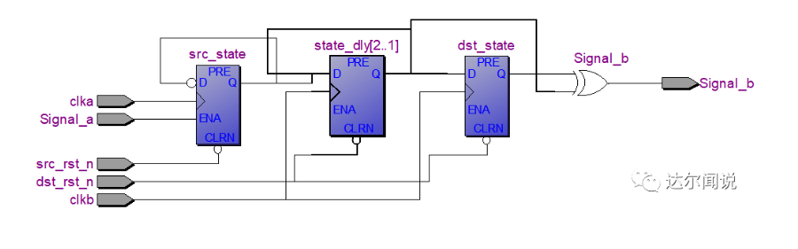

## 一. 了解FPGA的周边

1. 芯片产业的当前状况以及未来发展的要求

   1. 生活中的芯片有80%是可以与互联网通信的，芯片分为模拟芯片，数字芯片，数模混合芯片
   2. 新型技术：人工智能，VR，模式识别，金融等的特点
      1. 技术趋势上训练数据样本量巨大
      2. 数据密集型高性能计算的规模迅速增长
      3. 并行存储容量和带宽的要求越来越高
      4. 对网络要求带宽更高并且演示更低
   3. 对硬件芯片提出更高要求——这就需要FPGA及ASIC，特点
      1. 效能更高
      2. 并行模式更宽泛
      3. 支持数据并行和任务并行
      4. 计算密度高

2. 芯片的整个产业链

   1. foundry 晶圆厂
      - TSMC，台积电，沙子变成制作芯片的材料
   2. fabless 无晶圆设计公司
      - broadcom，qualcomm，nvidia，华为海思，紫光
   3. EDA 软件公司
      - 自动化软件三巨头，candence，synopsys，menbrgraphics,华大九天
   4. Design Service设计服务公司
      - verisilicon，lalchip
   5. IP vender IP供应商
      - arm
   6. IDM 集成设计与制造
      - IDM工厂即垂直整合制造工厂。 垂直整合制造 指从设计,制造,封装测试到销售自有品牌IC都一手包办的半导体垂直整合型公司
      - 大疆，比特大陆，小米

3. 芯片行业的一些就业岗位

   1. 算法/IC架构
   2. ==数字IC前端设计==
   3. ==数字IC验证==
   4. ==IC后端==
   5. 模拟IC设计
   6. 混合IC设计
   7. 版图设计
   8. IC生产/封装/测试/运营
   9. 方案硬件开发
   10. Firmware嵌入式驱动开发
   11. IC市场/销售/FAE
   12. 技术市场

4. ==前端设计岗位的工作职责==

   1. 功能和指标定义

   2. 架构设计

      1. 完成芯片中数字部分的高层次算法。为应将提供一个正确的软件功能模型
      2. 架构的分析与建模，为RTL实现提供总体性的设计指导
      3. 使用工具，matlab（通信，数字信号处理），c++，c，sv，system c

   3. RTL编写

      - 完成高层次描述到Verilog HDL的实现
      - 需要熟练使用工具VIM，EMAC

   4. 功能验证（前仿真）动态仿真

      - 特点是时间长，主要是验证功能是否完善，耗时较长

      - 使用工具 modelsim，VCS
      - 使用语言是c/c++，systemverilog，基于UVM方法学

   5. ==逻辑综合优化==

      1. 静态时序分析——保证设计中所有的路径，满足内部时序单元对建立时间和保持时间的要求
         - 上一句话的解释：无论起点是什么，信号都可以被即使的传递到该路径的重点，并且在电路正常工作的时间段内保持恒定
      2. 工具 PrimeTime，Tempus
      3. sdc同逻辑综合一起，STA中会修大量的steup，hold，前端修timing较快，但是代码是经过长时间的功能验证的，这样做后还需不需要进行功能验证，所以一般前端不修timing
      4. 逻辑综合，优化（从此开始需要考虑物理特性，电特性）
         1. 将RTL代码映射为与工艺库相关的网表
         2. 频率，面积，功耗，等多种条件约束的工程优化问题
         3. 插入DFT，clock gating
         4. 加入memory，各种IP等，I/O，PLL
         5. DesignComplier

   6. 一致性验证

      1. RTL代码，逻辑综合后的网表都可抽象为两个由节点和边构成的图，这个环节通过比较这两张图是否一致的方法来确定逻辑综合生成的网表是否正确
      2. 输入的文件：RTL代码，netlist，约束
      3. 输出的文件：match和verify的报告

## 二. 逻辑综合

1. 综合概述
   1. 综合是前端设计中的重要步骤之一，将行为描述电路RTL级的电路装换到门级的过程
   2. DesignCompiler 是synopsys公司的用于做电路综合的核心工具
   3. 逻辑综合的目的
      1. 解决电路门级结构
      2. 寻求时序与面积的平衡
      3. 增强电路的测试性
   4. 综合的三个阶段
      1. 转译  
      2. 优化：速率面积功耗
      3. 映射：与工艺库对应的门级网表
2. 可综合风格
   1. 完整的always敏感信号列表
   2. 每个always敏感信号列表对应一个时钟
   3. 不允许wait生命和#delay声明（在不需要综合的模块中可以使用）
   4. 非阻塞<=，阻塞=
   5. 可综合的四大法宝 —— always，if-else，case，assign
3. 模块划分

   1. 分开异步逻辑和同步逻辑
   2. 分开控制逻辑和存储器

## 三. 速度，功耗，面积

1. 速度
   - 芯片的工作时钟，设计在芯片上稳定运行时所能够达到的最高频率，这个频率有设计的时序状况决定
2. 面积
   1. 对于FPGA可以用所消耗的触发器（CFF），和查找表数量来衡量，更是影响到芯片的选型
   2. 操作符的使用，对操作符进行重视
   3. 多比特信号的操作，在运行过程中，将暂时用不到的信号为剔除掉
   4. 在RTL编码中考虑布局布线问题，布局布线中的热点问题
      - 热点问题是指设计的功能在一定的面积内使用大量的布线资源
      - 使用了一个支路很多的mux，可以通过分级等办法来解决
3. 功耗
   1. $P_d =  sum ` a*f*C*V $
      - a翻转次数，f工作频率，C该点的电容，V电压值, $p_d$电路隔点的功耗总和
      - 电容和电压RTL代码无法改变
   2. ==减小功耗的办法==
      1. 门控时钟
      2. 增加使能信号
      3. 对模块进行控制，需要时工作
      4. 毛刺会增加大量的功耗，但是毛刺无法避免，需要把产生毛刺的电路放在电路传播的最后
      5. 控制电路翻转次数，减少编码的翻转次数，比如使用循环码

## 四. RTL设计指导原则

1. RTL级设计的评判标准
   1. 时序性能
   2. 所占面积
   3. 可测试性
   4. 可重用性
   5. 功耗
   6. 时钟域的分配
   7. 复位信号的设计
   8. 是否与EDA工具匹配
   9. 是否发挥芯片的特点

2. 设计原则，确定一个要求另一个

   1. 设计所消耗的面积更小
      - 在单位芯片上实现的功能模块更多，需要芯片的数量更少
      - 成本降低
   2. 设计余量比较大，运行的频率较高
      - 设计的健壮性更强
      - 整个系统的质量更有保证

   - 在满足设计时序要求的前提下，占用最小的芯片面积

   - 在所规定的的面积下，使设计的时序余量更大，频率更高
   - 当前芯片行业的发展状况下，一般在面积和速度冲突时，速度优先

## 五. 面积与速度互换

1. 面积与速度互换

   1. 模块复用，串并转换，乒乓操作，流水线

2. 模块复用
   - 设置参数，提高模块的可复用性,可配置性
   - 将模块之间解耦，提高每个模块的独立性

3. 串并转换

   - 将需要进行相同操作数据分组，实例化处理模块，进行并行处理

4. 乒乓操作

   

   - 特点
     1. 输入数据选择单元与输出数据选择单元按节拍相互配合转换
     2. 经过缓冲的数据流=》数据流运算处理模块=》进行运算与处理
     3. 在再这个模块的两端看数据，输入数据流和输出数据流式连续不断的，没有任何停顿，因此非常适合对数据流进行流水线处理
   - 可以节约缓冲空间（用低速模块处理高速数据流的例子）
     - 在WCDMA基带应用中，一帧数据分为15个时隙，数据速率是3.84Mbps，一帧时长10ms缓冲一帧数据所需内存38400bit
     - 乒乓操作后，只需要两个ram来进行操作，缓存一个时隙的数据送入处理单元，只需要38400/15 = 2560bit==》2560*2bit的缓存空间

5. 流水线

   

   1. 将一个复杂的逻辑分成几个步骤，使这几个步骤并行，可以充分提高运行频率
   2. 流水线设计特点以及需要考虑的因素
      1. 系统时钟取决于最慢的流水线级的延迟
      2. 流水线的分割点以及级数的确定需要考虑率的因素
      3. 单位延迟时间及时钟频率的发小决定了数据通过速率
      4. 过多的级数不一定能产生最快的效果
      5. 太多寄存器的插入会导致芯片面积增加，布线困难，时钟偏差增加

## 六. 同步电路与异步电路

1. 同步与异步针对的是是否同处一个时钟域
   - 同一时钟域，不同的时钟域主要是针对时钟源点来说的
   - 有好几个时钟，但他们处于一个pll，他们的相位和倍数都是可控的，因此他们是同步时钟
   - 如果两个时钟出自不同的pll，即使频率相同，也是异步时钟
   - 部分数字电路设计都基于全局的时钟信号，即同步电路设计，在一个理想的全局时钟控制下，只要电路的各个功能环节都实现了时序收敛，整个电路就可以可靠工作了
2. 同步电路设计
   - 定义
     - 电路变化只能在时钟沿处发生
   - 优点
     1. 在同步设计中，EDA工具可以保证电路系统的时序收敛，有效避免了 电路设计中竞争冒险现象
     2. 由于触发器只有在时钟边缘才改变取值，很大限度的减少了整个电路受毛刺和噪声的影响 
   - 缺点
     1. 存在时钟偏斜（clock skew），时钟抖动（clock jitter）
     2. 时钟树综合，需要加入大量的延迟单元，使得电路的面积和功耗大大增加
3. 全局异步电路
   - 定义
     - 全局异步设计与同步设计最大的不同就是他的电路中的数据传输可以在任何时候发生，电路中没有一个全局的或局部的控制时钟
   - 异步电路设计的优点
     1. 模块化特性突出
     2. 对信号的延迟不敏感
     3. 没有时钟偏斜问题
     4. 有潜在的高性能特性
     5. 好的电磁兼容性
     6. 具有低功耗的特性
   - 异步电路的缺点
     1. 设计复杂
     2. 缺少相应的EDA工具的支持
     3. 在大规模集成电路设计中应该避免采用异步电路设计


## 七. 亚稳态与亚稳态消除

1. 亚稳态的概念和原理

   1. 亚稳态是指处触发器无法在某个规定时间段内达到一个可确认的状态
   2. 当一个触发器进入亚稳态时，既无法确定该单元的输出电平，也无法预测何时输出才能稳定在某个正确的电平上
   3. 在这个期间，触发器输出一些中间级电平，或者可能处于震荡状态，并且这种无用的输出电平可以演信号通道上的各个触发器级联式的传播下去 

2. 故障间隔平均时间MTBF

   - 公式： $MTBF = (e^{t_{MET}/C_2})/(C_1f_{clk}f_{data})$

   - $t_{MET} $ 寄存器从时钟上升沿触发后的时序余量时间
     - 如果要提升$t_{MET}$ ，需要降低$t_{data}$ 
     -  $t_{data}$指两个寄存器间的逻辑延迟以及走线延迟之和，最大程度的减小它，只能是在两个寄存器之间不添加任何逻辑
   - $f_{clk}$ 接收时钟域的时钟频率
   - $f_{data}$ 数据的变化频率
   - $c_1,c_2$ 与器件有关的参数
   - 公式中看出亚稳态不可能从根本上消除，但可以通过采取一定的措施使其对电路的影响降低
   - 为避免上述亚稳态问题，即参数MTBF尽可能的大，通常采用的方法是双锁存器法，即在一个信号进入另一个时钟域前，将该信号用两个锁存器连续锁存两次，最后得到的采样结果就可以消除亚稳态问题
   - 一个信号在过渡到另一个时钟域时，如果仅仅在一个触发器将其锁存，那么$b_{clk}$进行采样的结果可能是亚稳态，这也是信号在跨时钟域应该注意的问题

3. 消除亚稳态的方法 —— 即在不同时时钟域之间如何安全的传递信号

   1. 双锁存器法（虽然叫锁存器，实际是两个触发器），双锁存器同

      

      - ==常用于慢时钟域转换到快时钟域==

      - 优点
        - 结构简单，易于实现，面积消耗小
      - 缺点
        1. 增加了两个时钟周期，对时钟性能有消极影响
        2. 当快时钟域转到慢时钟域时，易造成慢时钟采样丢失，还没来得及采样，数据就变化了

   2. 使用几级DFF进行异步信号同步最合适

      1. 两级寄存器已经可以将亚稳态出现的概率降的足够低，因此二级就可以了

   3. 寄存器同步法是否可以消除亚稳态

      1. 对于典型的0.25um工艺的asic器件，MTBF = 2.01（day），也就是说每隔两天便可能出现一次亚稳态，同样参数，在使用双寄存器法后，这个时间可以延迟到$10^9$年
      2. 只是降低了亚稳态的概率，并不能消除亚稳态

4. 单bit信号跨时钟域如何传输

   1. 边沿检测同步电路（慢到快）

      

      1. 这种方法通常应用在慢速时钟向快速时钟传递过程中，可以检测输入信号的上升沿，也可以检测她的下降沿 
      2. 使用条件
         1. 输入数据的宽度必须必一个接受时钟周期加上一个同步触发器的hold时间要长，最安全的就是两个同步周期宽度
         2. 慢时钟域的脉冲保持到被快时钟的同步器拿到 

   2. 脉冲同步基本功能（快到慢）

      1. 从快时钟域去除一个单时钟宽度脉冲，然后在慢时钟域中建立另一个单时钟宽度的脉冲

   3. 结绳法

      

      1. 信号从快时钟到慢时钟过渡时，慢时钟将可能无法对变化太快的信号实现正确采样
      2. 双锁存器，脉冲，边沿这三种方法对两个时钟之间的关系要求很严格，结绳法使用任何时钟域的过渡
      3. 原理
         1. 将快时钟域信号的脉冲周期延长，等到慢时钟同步采样后再解绳，还原为原来的脉冲宽度 
      4. 结绳法优缺点
         1. 可以实现快时钟想慢时钟过渡的问题，使用范围广
         2. 结绳法实现比较复杂，特别是效率不高，在对设计性能要求较高的场合慎用

   4. 慢到快如何实现

      1. 双锁存器法
      2. 边沿检测同步电路使用条件

   5. 快到慢如何实现

      1. 脉冲同步器的使用条件
      2. 结绳法对脉冲宽度和间隔的要求
      3. 结绳法分类

   6. 采样中，快到慢，与，慢到快，在考虑问题时有什么区别，为什么不能用慢时钟直接采样快时钟域的信号

      1. 慢到快只要考虑亚稳态问题
      2. 快到慢处了亚稳态问题外，还需要考虑慢时钟的采样速率问题，因为根据采样定理采样频率低于信号最高频率的两倍的时候，是无法完整采样的

5. 多bit指示信号跨时钟域如何传输

   1. 存在问题及解决方法
      1. 有可能两个指示信号存在一定的时钟偏斜
         - 解决方法
           - 两个信号合并
           - 如果不能合并，需要加入额外的信号
      2. 数据流大多具有连续性，即背靠背传输，数据流要求信号具有较快的传输速度 
         - 解决方法
           - 使用sram，fifo
   2. 同步策略FIFO
      1. 优点
         1. 易于实现
      2. 缺点
         1. 没有外部读写地址线
         2. 只能顺序写入顺序独处 
      3. 常见参数
         1. FIFO宽度/深度
         2. 满/空标志
         3. 读写时钟
      4. 分析数据重载和轻载时的传输任务
         1. 数据传输任务为每100个写时钟写入80个数据，也就是有20个写时钟是空闲的
            1. 背靠背（最坏情况）也就是在160个写时钟内写入160个数据，这是传输任务要求的最长的写如数据成为burst长度
            2. $Time:burst_{cycle} * t_{wclk} = burst_{cycle}/f_{wclk} = 160/100$
            3. $data_{numread} = Time/t_r = Time * f_r = 160/100*80$
            4. $depth = burst - data_{numread} = 160-160/100*80 = 32$
         2. 一般化
            1. 写时钟频率：wclk
            2. 读时钟频率：rclk
            3. 写的时候每b个时钟会有a个数据写入fifo
            4. 读的时候每y个时钟会有x个数据写入fifo
            5. $burst_{length}$表示这段时间写入的数据量
            6. $burst_{length}/wclk$表示burst持续的时间
            7. $rclk * x/y$表示读数据的实际速度
            8. $depth = burst_{length} - burst_{length}/wclk * rclk * x/y$
            9. 两者差值就是fifo中数据的残留量，也就是fifo的最小深度

## 八. 复位电路

1. 复位电路的功能
   1. 复位电路是每个数字逻辑电路中最重要的组成部分之一
   2. 仿真的时候使电路进入初始状态或者预知状态
   3. 对于综合实现的真实电路通过复位使电路进入初始状态或者其他预知状态
   4. 逻辑电路的任何一个寄存器，存储结构和其他逻辑单元都必须附加复位逻辑电路，以保证电路能够从错误的状态中恢复，可靠的工作
2. 需要设置复位信号的电路
   1. 通常来说时序电路是双稳态电路，所以上电之后必须要有一个初始态，所以时序电路必须要有复位信号
   2. 组合逻辑电路没有记忆功能，所以不涉及复位电路
3. 复位电路分为同步复位和异步复位
   1. 同步复位（==在代码书写中敏感信号列表只有时钟信号没有复位信号==）
      1. 复位信号发生变化时并不立即生效，只有当有效时钟采样到已变化的复位信号后，才对所有寄存器进行复位
      2. 优点
         1. 有利于仿真器的仿真
         2. 可以使所设计的系统成为100%的同步复位电路，这有利于时序分析，综合出来的fmax一般较高
         3. 因为他只有在时钟有效电平到来时才有效，所以可以滤除高于时钟频率的毛刺
      3. 缺点
         1. 复位信号的有效时长必须大于时钟周期，才能完成复位任务，同时还要考虑复位延时等因素（组合逻辑延迟以及时钟偏斜）
         2. 大多数逻辑器件都只要异步复位端口，采用同步复位的话综合器就会在寄存器的数据输入端口插入组合逻辑，这样就会消耗较多的逻辑资源
   2. 异步复位（==敏感信号列表中要有复位信号==）
      1. 异步复位是指当复位信号到达时无论时钟沿是否有效，都会立即对目标复位
      2. 优点
         1. 节省资源
         2. 设计简单
         3. 信号识别方便，时钟偏斜最小
      3. 缺点
         1. 复为信号释放时容易出现问题，复位信号释放时在时钟有效沿附近，就很容易出现亚稳态
         2. 复位信号容易受到毛刺的影响
4. 推荐复位电路 —— 异步复位，同步释放
   1. 异步复位——就是复位信号不受时钟影响，在任意时刻只要是低电平就能复位
   2. 同步释放——让复位信号取消的时候刚好与时钟信号同步

## 九. Verilog tips

1. 硬件语言的基本概念

   1. 互连（connectivity）wire型变量描述各个模块之间的端口与网线连接关系
   2. 并发（concurrecy）可以有效的描述并行的硬件系统
   3. 时间（time） 定义了绝对和相对的时间度量，可综合操作符具有的物理延迟

2. 逻辑复制，负载均衡

   - 在电路设计中，若果发现一个信号驱动的负载过多，同一个信号赋值给较多的信号，可以通过信号复制，进而降低信号的传播延迟，提高性能 

3. 资源共享，减小面积

   1. 在电路设计中，如果发现同一组信号驱动好几个不同的信号，可以通过资源共享的方式减小面积，不过在现在的计数条件下， 面积优化的重要性一般低于性能优化

4. 语句优化

   1. 资源顺序重排，降低传播延时

      ```verilog
      sum1 <= a + b + c;
      sum2 <= a + b + d;
      sum3 <= a + b + e;
      //优化后
      temp = a + b;
      sum1 <= temp + c;
      sum2 <= temp + d;
      sum3 <= temp + e;
      
      ```

   2. 将到来较晚的信号放在后面，隐藏其延迟

      ```Verilog
      z = a+b+c+d;//a信号到来较晚
      //优化后
      z = ((b+c)+d)+a;
      ```

   3. 三目运算符仅用于连线，always用于逻辑计算

      - ？：仅用于信号连接，多层嵌套后难以阅读，并很难被综合器解释

        ```verilog
           assign a = (b==1)?((c&&d)? 1'b1:1'b0):1'b0;
           //优化后
           always@(*)
           	begin
           		if(b==1)
           			if(c&&d==1)
           				a = 1'b1;
           			else 
           				a = 1'b0;
           		else 
           			a = 1'd0;
           	end
        ```

5. if-else语句优化

   1. 通常加法器消耗晶体管较多，根据需要选择先加后选，先选后加

      - 选择先加后选择电路面积较大
      - 选择先选后加则对选通信号有较高要求，如果选通信号到来较迟，则影响电路的频率

   2. 单if语句，无优先级的判断结构，推荐使用单if语句

      - 单if语句与多if语句的区别

        ```verilog 
        always@(*)
        being 
        	z = 0;
        	if(sel13)
        		z = d;
        	else if(sel12)
        		z = c;
        	else if(sel1)
        		z = b;
        	else if(sel0)
        		z = a;
        end
        //****************************************
        always@(*)//多if结构
            begin
                z=0;
                if(sel1) z = b;
                if(sel2) z = c;
                if(sel13) z = d;
                if(sel10) z = a;
            end
        //思考两种写法的生成的电路
        ```

6. case语句优化

   1. 与单if语句的区别是条件是互斥的，多用于指令译码电路

7. latch                                    

   1. 综合器很难解释latch，因此除非特殊用途，一般避免一如latch

   2. 寄存器与锁存器的区别

      1. 寄存器是边沿触发的， 例```always@(posedge clk) q<=data;```
      2. 锁存器是电平敏感的，例```always@(*) if(enable) y = data;```
      3. 思考上述两行代码的时序图

   3. latch的缺点

      1. latch由电平触发，非同步控制，在使能信号有效时latch相当于通路，在使能信号无效时latch保持输出状态，dff由时钟沿触发，同步控制
      2. latch容易产生毛刺，dff则不易产生毛刺
      3. latch将静态时序分析变得极为复杂

   4. 一般的设计规则

      - 在绝大多数设计中避免产生latch，latch最大的危害在于不能过滤毛刺，这对于下一级电路是极其危险的，所以只要能用d触发器的地方，就不用latch，在完成设计代码时尽量使用完备的if-else，为case语句添加一个default语句

   5. 容易引入latch的途径使用不完备的条件判断语句

      ```Verilog
      always@(*)
      	begin
      		if(cond ==1)
      			data_out = data_in;
      	end
      //********************************
      always@(*)
      	case{sel0,sel1,sel2}
      		2'd0:z = d;
      		2'd1:z = b;
      		2'd2:z = c;
      	endcase
      ```