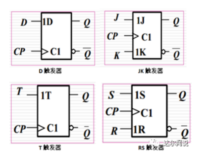
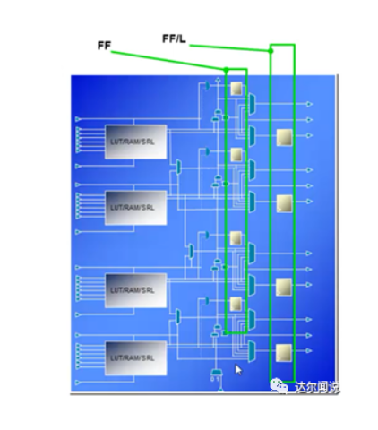
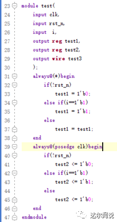
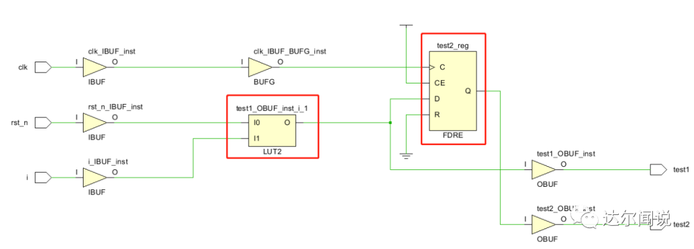
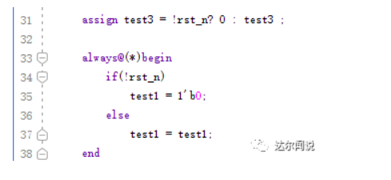
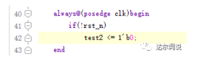
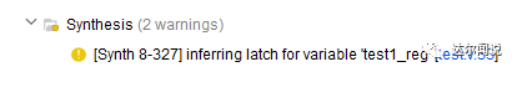

1）锁存器是什么？

从概念上来讲，锁存器是电平触发的存储单元，数据存储的动作取决于输入时钟（或者使能）信号的电平值。简单而言，锁存器的输入有数据信号和使能信号，当处于使能状态时，输出随着输入变化而变化，当不处于使能状态时，输入信号怎么变化都不会影响输出。

2）触发器是什么？

触发器是对脉冲边沿敏感的器件，它的变化只会在时钟的上升沿或者下降沿到来的瞬间改变。下图是几个典型的触发器：

3）区别？

从上面的描述可以看出，锁存器是电平触发的，触发器是边沿触发的。如果是电平触发的，当使能的时候，如果输入信号不稳定，那么输出就会出现毛刺。而触发器就不会出现这种问题，他的变化只会在边沿的时候触发。

4）register是什么？

register是寄存器，用于暂时存放参与运算的数据和运算结果。在实际的数字系统中，通常把能够用来存储一组二进制代码的同步时序逻辑电路称为寄存器。由于触发器内有记忆功能，因此利用触发器可以方便地构成寄存器。由于一个触发器能够存储一位二进制码，所以把n个触发器的时钟端口连接起来就能构成一个存储n位二进制码的寄存器。

5）为什么多用register？

换个角度来讲，为什么少用latch呢？首先，latch是电平触发的，这样就容易产生毛刺；其次，latch将静态时序分析变得极其复杂；再者latch会浪费硬件资源（对FPGA而言）。因为在FPGA当中，是没有latch单元的，要生成latch单元需要耗费其他资源。

以Xilinx器件为例，如下图所示，是Silce的结构，每个Silce包含两列触发器，第一列只可以配置成触发器，第二列可以配置成锁存器和触发器，如果第二列的触发器被配置成锁存器，第一列触发器就不能用了。

6）latch是如何产生的？

网上大多数都指出，由于if或者case语句的逻辑表达不完全产生的。其实就我个人而言，这样说并不完全正确。首先需要区分一点，我们定义一个类型的时候，单纯的定义reg或者wire其实并不代表它最终实现的真正类型，这得看我们写的代码，这么说也许比较抽象，下面直接上代码：

在这段代码里面，test1和test2都是定义为reg类型的，都放在了always语句块里面，除了触发条件不同，其他都相同，下面看看在Vivado综合之后的结果：

可以看到test2是综合成寄存器（触发器）的，而test1直接就“消失”了，被“安排”在了一个LUT“里面”，这也正说明，定义并不代表着最终的结果。在这里，always(*)里面的所谓“reg”，其实和wire没有区别，为了方便称呼，我把wire和这类“reg”统称作“类wire”。

前面铺垫了这个是为了什么呢？为了说明以下会产生latch的两种情况：

①类wire型的数据“自己等于自己”的情况下会产生latch；

②类wire型的数据，由于if或者case语句的逻辑表达不完全，会产生latch。

下面举个例子，如下图所示，test1和test3的表示式不一样，但其实是一样的，都是类wire型。他们都存在着“自己等于自己”的情况。哪怕test1的else内容删除之后，还是会产生latch。

在Vivado中，真正的reg型，如果不在case里面加上default，或者if不加上else，都不会产生latch，如下图所示，如果我们没有定义else，那么在else的情况下，寄存器的值保持不变，其实相当于自动“附加”上“else  test2 <= test2; ”，而reg不用怕“自己等于自己”。

最后总结，上面只是描述了非常直接的“自己等于自己”的情况，有的时候自己并无意如此，但经过多个逻辑表达式之后，还是会有不受时序约束的“自己等于自己”的情况，这样也是会产生latch。其实就算无意中“伪reg”产生了latch也不用急，在综合的时候也会有提示，如下图所示：

有的时候会在implementation的时候提示产生了”loop”，然后直接error了。因此在写代码的时候，特别是fpga的时候，一定要避免产生latch，为了保险起见，也为了良好习惯，不管是什么数据类型，都要在case最后加上default，在if最后加上else。

