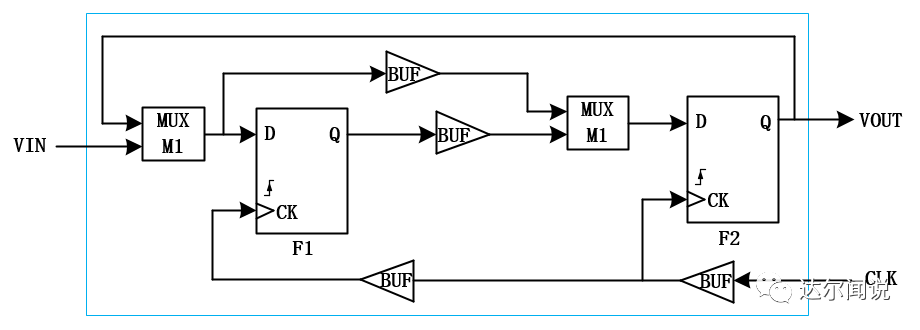
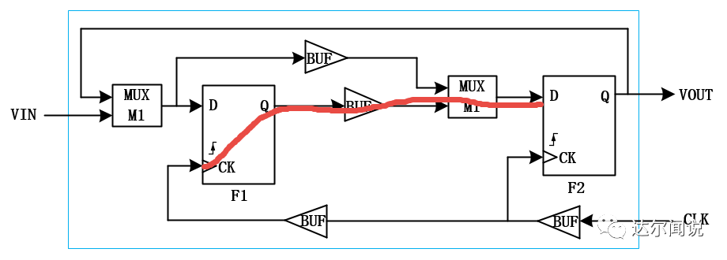
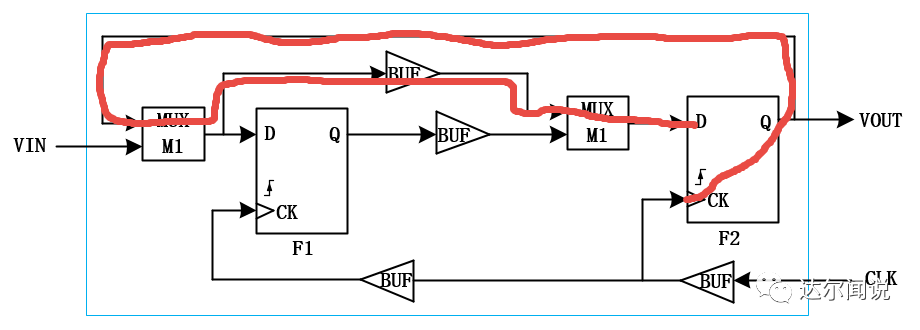

图中电路共有三种器件：MUX，BUFFER，DFF，请分析并回答问题。

假设各电路的传出延时为：

TVIN：max delay:8ns;min delay:4ns

TBUF：max delay:2ns;min delay:1ns

TMUX：max delay:3ns;min delay:1ns

DFF：

Tclk-Q：max delay:4ns；min delay:1ns

TSETUP：4ns；THOLD：1.5ns

1）请问本电路是否存在hold time问题？如果有，请修改电路在不影响功能的前提下fixhold time问题。

2）请指出本电路setup time的关键路径，并求最高工作频率是多少？

第二问是要指出setuptime关键路径（critical path），那什么是关键路径呢？关键路径简单的理解就是延迟最大的那条路径，所以我们要找出setup time中延迟最大的那条路径，这条路径决定了系统中时钟所能工作的最大频率。

