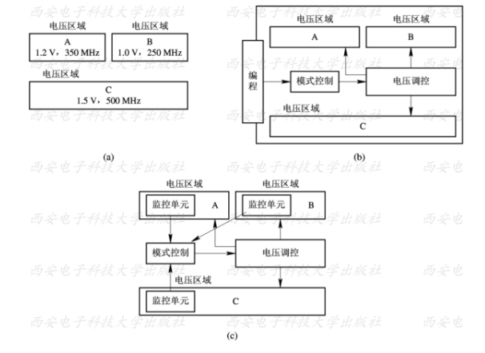
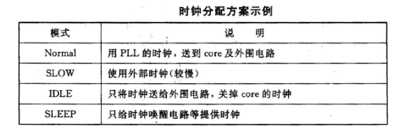

对于低功耗我们需要了解的内容

- 低功耗设计的目的
- 功耗的构成/类型
- 低功耗设计与优化
- 功耗分析与流程——使用EDA工具

==减小功耗的办法==

1. 门控时钟
2. 增加使能信号
3. 对模块进行控制，需要时工作
4. 毛刺会增加大量的功耗，但是毛刺无法避免，需要把产生毛刺的电路放在电路传播的最后
5. 控制电路翻转次数，减少编码的翻转次数，比如使用循环码

电压主要是对动态功耗的影响较大，从动态功耗的公式也可以看出供电电压越高功耗越大。温度主要影响静态功耗，静态功耗主要有两种漏电流，一种是亚阈值电流，一种是pn结反向漏电电流。温度升高静态功耗主要受到亚阈值电流增大，高温让亚阈值电流大幅度提高，几乎是指数级别的，从而导致功耗的增加

## 低功耗设计的目的

- 便携性设备等需求
  - 设备耗电量
- 可靠性与性能的影响
  - 耗电多发热就多，发热多电路工作频率就不高
- 成本的影响
  - 发热多设备的散热成本就高

## 功耗的构成/类型

1. 功耗的构成

   a. 动态功耗

   - 开关功耗/翻转功耗
   - 短路功耗/内部功耗
   - 开关功耗在动态功耗中占大部分比例，动态功耗主要跟电源的供电电压、翻转率以及负载电容有关

   b. 静态功耗

   - 静态功耗主要是由漏电流引起的功耗，漏电流主要是指栅极泄漏电流和亚阈值电流，静态功耗往往与工艺有关
   - 计算公式 $P_{leak} = V_{DD} * I_{leak}$

   c. 浪涌功耗

   - 浪涌功耗是浪涌电流引起的功耗，浪涌电流是指开机或者唤醒的时候，器件流过的最大电流，因此浪涌电流也称为启动电流，一般情况下，浪涌功耗不是我们关注的地方，只是有这个功耗存在

2. 系统结构

   根据设备的结构或者设备的构成进行分类，以SoC为例主要分为，不同应用功耗占比不同，但是下面前三者占了绝大部分功耗

   - 时钟树功耗
   - 处理器功耗
   - 存储器功耗
   - 其他逻辑和IP核功耗
   - 输入输出pad功耗

3. 工艺库中的功耗模型

   - 开关功耗计算与相关库信息
   - 内部功耗与相关库信息
   - 静态功耗/漏电功耗与相关库信息

## 低功耗设计与优化

低功耗设计主要是自顶向下的

首先在系统架构层面上如何进行低功耗设计（或者可以从哪些方面进行低功耗设计），系统与架构层次的低功耗设计，可以节省70%以上的功耗。这个层次上的设计往往是由系统和架构设计人员进行的，这些人员往往是有着丰富经验的设计人员。他们制定了低功耗设计方案，由下一级的设计人员（比如做前端设计、做Flow的人员）进行具体实现。

其次在RTL层面和门级层面上介绍低功耗设计的方法，这两个种方法主要是依靠RTL代码和Design Compiler实现的，这是我们前端设计人员进行低功耗设计与优化所需要知道的，我们会着重介绍；

最后简单介绍在物理设计层次上面降低功耗的方法。

## 系统与架构级低功耗设计

1. 多电压设计技术（Multi-VDD）
   1. 多电压设计技术介绍
      1. A：各电压区域有固定的电压，如上图（a）所示
      2. B：各电压区域具有固定的多个电压，由软件决定选择哪一个电压，如上图（b）所示
      3. C：自适应的方式，各电压域具有可变的，由软件决定选择哪一个电压，如上图（c）所示
      4. A是固定分配的电压；而B和C为动态电压管理，涉及到软硬件协同设计，这里我们放到后面进行介绍。这里主要是从整体上进行介绍多电压设计技术及其要求，然后给出A方式的一个例子以及一个多电压低功耗设计的脚本示例。
      5. 
   2. 多电压综合库及电压模式控制单元
      1. 电平转换器（level shifter）：把高（低）电压区域的信号转换到低（高）电压区域。信号通常包括数据、时钟、扫描链数据等。
      2. 电源隔离单元（power isolation cell）:主要用于模块的输入、输出。它可以关掉电源时，将信号保持为常数，从而避免单元的输入悬空。
      3. 保持寄存器（retention register）：在不工作的情况下，将寄存器的状态保留下来。
      4. 为了实现电压的动态管理——无论是使用硬件还是软件进行动态管理，都需要在设中加入电压模式控制单元。该模块的功能是：系统不工作时， 进入IDLE模式， 这时候可以关掉不工作模块的电源； 当系统工作时， 给工作模块提供正常电压。这个模块可以是软件实现，也可以是硬件实现。
2. 软/硬件协同设计
   1. 软硬件划分
   2. 动态电压频率调节DVFS技术
      - DVFS技术：dynamic voltage dynamic frequency scaling，动态电压频率技术，是一种通过将不同电路模块的工作电压及工作频率降低到恰好满足系统最低要求，来实时降低系统中不同电路模块功耗的方法。
      - 电路模块中的最大时钟频率和电压紧密相关，如果一个电路能够估算出它必须做多少工作才能完成当前的任务，那么理论上讲就可以将时钟频率调低到刚好能适时完成该任务的水平。降低时钟频率意味着可以同时降低供电电压。频率和电压同时降低，功耗就大大降低了。这个是DVFS的原理。
      - DVFS技术这个种方法属于电压的动态管理，可以通过软件和硬件的方式实现。将DVFS合并到操作系统的调度程序和实时嵌入式任务管理服务当中，利用一个可编程的DC-DC开关电压调节器、一个可编程的时钟产生器和一个宽操作域的高性能处理器等资源进行实现。这种技术的使用需要系统使用者决定，这里不进行详述，只需要知道在系统层面可以考虑使用这种方法进行降低功耗。
   3. 低功耗软件（操作系统）的动态功耗管理
      - 使用软件的方式进行自适应地选择功耗。在系统软件过程运行过程中，可以在操作系统中加入功耗管理机制，把没有使用到的硬件单元关掉，这便是系统功耗的动态管理。
3. 系统时钟分配
   1. 系统时钟的分频也是系统层面降低功耗可以考虑的方面。时钟是系统中频率最高的信号，其功耗功之高是不容置疑的。在系统设计层面，可以考虑应用要求，将系统设置为不同的工作模式，加入时钟控制模块，在不同的工作模式下选用不同频率的时钟，并且将一些不需要的模块时钟关闭。时钟的分配可以使用内部的状态机实现，也可以使用软件实现。
   2. 
4. 算法与IP选择
   1. 算法：算法级在算法级降低功耗是非常有价值的。 在设计算法时， 要分析该算法需要多少ALU操作, 需要多少次存储器访问, 要尽量使那些耗能多的操作最小化。算法级低功耗设计跟具体设计有关。比如，对于大规模运算的应用（比如FFT），使用对数系统（logarithmic number system，lns）比使用线性系统更好。lns在降低平均位元活跃度（也就是降低0和1的变化程度）的同时使用加法和减法实现乘除法，使效率比线性系统更高。因此基于lsn算法来实现FFT可以节省大量的功耗，但是加法器和乘法器的宽度会增加，使用FPGA实现时就会需要更大的LUT(查找表)，而且这个查找表的大小是以指数增长的。在一些行为综合工具中，可采用延时功耗乘积表示系统的优化目标，以降低完成特定计算所需的状态转换数，生成高效的计算结构。算法这一方面的低功耗设计让算法工程去考虑吧，我们来了解一下就可以了。
   2. IP：现在的SoC设计依赖于IP的集成。在选择IP时，除了考虑到性能要求，还需要考虑到功耗问题。例如，在选择CPU时，可以分析在完成相同的功能时，哪种CPU功耗更大。

在系统层次上，除了可以上面那些因素外，我们还可以考虑**异步设计**。在现在的系统设计中，一个系统可能使用多个时钟，但是在每个时钟控制的区域内部都设计成一个同步的子系统。通过时钟树综合、插入缓冲器减少时钟的偏移。这种方法在时钟网络上添加了大量的缓冲器，时钟网络消耗的功耗也增加。在异步设计里面，不需要全局时钟，两个模块通过握手信号进行交互，这时候就可以减少功耗。因此异步设计也是降低功耗的一种方法。

在大多是DSP中，需要用到FFT算法。FFT算法需要频繁访问存储器，我们可以在存储器和处理器之间添加**缓存**，在处理器需要之前，预先将相关数据从存储器中取到缓存里面。使用小范围的缓存能够使计算能耗大量下降，提高的FFT的效能。因此在系统设计的时候，特别是系统架构设计的时候，可以考虑基于缓存的系统体系结构进降低功耗。

系统层次上面的低功耗设计方法还有很多，比如说可测性设计上进行低功耗设计、存储器（内存）的低功耗设计等，这些都可以在系统层次上面进考虑，这里就不一一列出来了。

## RTL级低功耗设计

1. 并行与流水的选择
2. 资源共享与状态编码
3. 操作数隔离
   1. 操作数隔离的原理
   2. OI的物体选择
   3. 操作数隔离的范围
   4. 隔离逻辑的设置
   5. 操作数隔离的复原
4. 门控时钟
   1. 门控时钟概述
   2. 综合库中的门控时钟模型
   3. 门控时钟实现
   4. 门控时钟的处理
   5. 手动插入门控时钟

## 门级电路低功耗设计优化

1. 门级电路的功耗优化综述
2. 多阈值电压设计
   1. 多阈值电压设计原理
   2. 门级网表/RTL代码的多阈值电压设计
   3. 布线后的多阈值电压设计
   4. 多阈值电压设计与多阈值库的报告
3. 基于EDA工具的动态功耗优化
4. 总体功耗优化
5. 门控电源
   1. 电源门控概述与原理
   2. 工艺库中的电源门控单元
   3. 电源门控设计流程

## 功耗的分析

### 1）功耗分析与流程概述

a. 功耗分析流程的输入输出

b. 开关行为的一些概念

c. 开关行为（文件）情况表示

### 2） 无向量分析法

a. 设置翻转变量

b. 标记翻转率

### 3） SAIF—RTL  BACK 分析法

a. RTL forward SAIF文件

b. RTL backward SAIF文件

c. 功耗的分析

### 4） SAIF—GATE分析法

a. library forward SAIF文件（简称为库SAIF文件）

b. GATE backward SAIF文件的生成

c. 功耗的分析

- power compiler 产生库SAIF文件-->VCS产生gate backward SAIF文件-->power compiler进行功耗分析

### 5）VCD转SAIF分析法

a. VCD文件的产生

b. VCD文件转换成SAIF文件

c. 功耗的分析

- VCS产生VCD文件——》power compiler 将VCD文件转换为SAIF文件——》power compiler 进行分析功耗

d. 使用vcd2saif程序的好处，主要有下面三点：

　　1.  VCD产生的速度快;

　　2.  VCD是IEEE的标准并且适用于进行后仿真;

　　3.  转换的过程快。

### 6）功耗分析报告

我们是通过分析功耗报告（report_power命令产生）来查看设计功耗的，一个功耗报告的示例部分内容如下所示：

- Cell  Internal  Power=883.0439 mW(66%)
- Net  Switching Power=453.0173 mW(34%)
- Total  Dynamic  Power=1 .3361 W(100%)
- Cell Leakage Power = 391.5133 nW

二、门级电路

1. 门控时钟技术
   - 芯片工作时，很大一部分功耗是由于时钟网络的翻转消耗的，对于一个设计中的寄存器组由于时钟信号CLK的翻转，寄存器组会持续在CLK的上升沿来临时读取数据输入端的数据，而这时读取的数据是不变的，这就消耗了额外的功耗。如果时钟网络较大，这部分引起的功耗损失会很大。
   - 门控技术基本原理就是通过关闭芯片上暂时用不到的功能和它的时钟，从而实现节省电流消耗的目的，门控时钟对翻转功耗和内部功耗的抑制作用最强，是低功耗设计中的一种最有效的方法。通过一个时能信号控制时钟的开关。当系统不工作时可以关闭时钟，整个系统处于非激活状态，这样就能够在某种程度上降低系统功耗。
   - 通常情况下，时钟树由大量的缓冲器和反相器组成，时钟信号为设计中翻转率最高的信号，时钟树的功耗可能高达整个设计功耗30%。加入门控时钟电路后，由于减少了时钟树的开关行为，节省了开关功耗。同时，由于减少了时钟引脚的开关行为，寄存器的内部功耗也减少了。采用门控时钟，可以非常有效地降低设计的功耗，一般情况下能够节省20%~60%的功耗。”
   - 使用门控时钟并不符合同步设计的思想。ASIC中使用较多，FPGA中不推荐使用
2. 多电压供电
3. 多阈值电压
   - 根据多阈值电压单元的特点，为了满足时序的要求，关键路径中使用低阈值电压的单元(low Vt cells)，以减少单元门的延迟，改善路径的时序。而为了减少静态功耗，在非关键路径中使用高阈值电压的单元(high Vt cells)，以降低静态功耗。因此，使用多阈值电压的工艺库，我们可以设计出低静态功耗和高性能的设计。