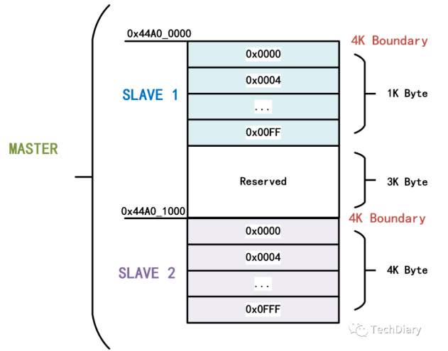
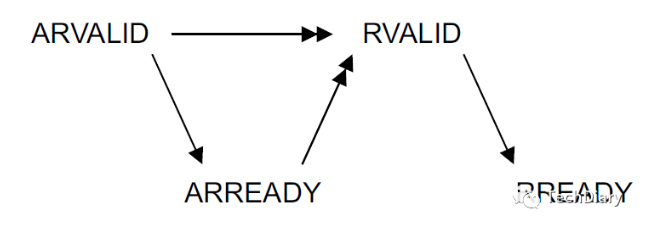
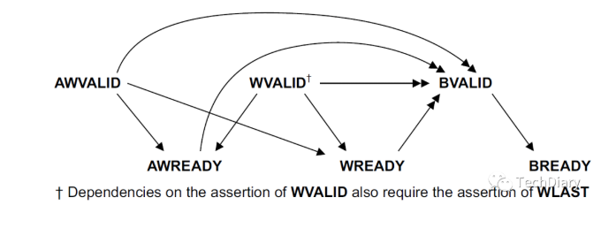

## AMBA

1. AMBA概述（总线接口协议）

   - AMBA总线阵营的强大超乎多数人的想象。AMBA总线是一个在SoC领域使用的事实上的标准。SoC的总线有很多标准，例如Silicore的Wishbone总线、IBM的CoreConnect总线（包括PLB、OPB、DCR）、Altera的Avalon总线、OCP-IP的OCP总线等等。ARM公司的AMBA总线也是其中一种。AMBA（Advanced Microcontroller Bus Architecture）高级微处理器总线架构
   - AMBA总线标准定义了高性能嵌入式微控制器的通信标准	

   - AMBA是有效连接IP核的“数字胶”，并且是ARM复用策略的重要组件
   - AMBA不是芯片与外设之间的接口，而是ARM内核与芯片上其他元件进行通信的接口
   - AMBA可以将RISC处理器（精简指令集处理器）集成在其他IP芯核和外设中

2. 发展历史

   1. AMBA总线V1.0——1995年发布
      - AMBA总线V1.0于1995年正式发布，用于SoC内部各个模块间的互联，支持多个主设备，支持芯片级别测试。
      - 在AMBA V1.0中定义了两条总线，ASB(Advanced System Bus)和APB(Advanced Peripheral Bus)。V1.0还定义了一个连接存储器的外部接口，这个外部接口可以用做测试。
      - ASB总线是一个快速总线接口，使用独立的地址数据总线，支持流水传送方式，支持多个主设备与从设备，采用集中译码和仲裁方式。ASB总线的主要作用是连接CPU，DMA引擎，内部存储器和一些快速外部设备。
      - APB总线连接一些慢速设备，APB是ASB的Secondary Bus，ASB与APB的组成结构从今天的技术上看，AMBA V1.0总线十分简陋，设计这样的总线标准甚至可以作为几个研究生的毕业论文。
      - AMBA总线的最大优点是开放的架构，和因此带来的免费。开放的总线标准使AMBA总线迅速普及，而且更易吸收整个半导体界的成果。 
   2. AMBA总线V2.0——1999年发布
      - 1999年AMBA总线更新到V2.0，增加了一个新的总线AHB(Advanced High-Performance Bus)。AHB总线取代了ASB在系统中的位置，使ASB进一步下移，增加了Split传送方式进一步提高了存储器读的效率，总线宽度最高可达128位。 
   3. AMBA总线V3.0——2001年发布
      - ARM发布了AMBA V3.0总线规范，引入ATB(Advacned Trace Bus)和AXI(Advanced eXtensible Interface)总线。AXI总线的引入，使AMBA总线迈向新的台阶，性能已经可以与IBM的CoreConnect抗衡。
      - AXI是一条现代总线。
        1. AXI总线分离了一个总线周期的地址阶段和数据阶段，更便于实现在现代总线中常用的Pipelining和Split技术。
        2. AXI总线进一步分离了总线通路，将AHB的单通路分解为Read Data，Read Address，Write Data，Write Address和Write Response共5个独立通路，进一步加速了对存储器的读写访问。 
        3. AXI总线接口逻辑设计较为复杂，与AHB总线相比多使用50%的资源。AXI的一次总线周期至少需要传送64字节的数据，而AHB总线是16字节，这也导致AXI总线的传送延时高于AHB总线。
        4. AXI总线的目标不是用于替换AHB总线，在一个SoC中，AXI总线和AHB依然并存，只是AXI总线更接近ARM内核，AHB总线更贴近外部设备。 AMBA总线阵营规范了嵌入式领域的平台总线，日益壮大。
   4. AMBA总线V4.0——2010年发布
      - 2010年3月8日，ARM正式推出AMBA V4.0总线，引入了QoS机制，进一步增强了多层结构，将AXI总线细分为AXI4，AXI-Lite和AXI-Stream。 这一切并不是AMBA V4.0最重要的更新。如同Nehalem内核最重要的变化并不是流水线，而是QPI互联结构，在AMBA4总线中最值得注意的是片间互联总线CoreLink CCI(Cache Cohenrent Interconnect)架构。 CoreLink CCI架构使得多个SMP系统之间实现Cache共享一致性成为可能，Cortex A15也借此超越了用于嵌入式领域的PowerPC和其他多核MIPS。在整个处理器总线阵营中只有IBM的CoreConnect和Intel的QPI可以与之抗衡。
      - CoreLink的横空出世，使Cortex A15具备了和Intel的高端处理器Nehalem和Sandy Bridge抗衡的能力。在服务器领域，Cortex A15内核与Nehalem内核间的较量就是CoreLink和QPI之间的角逐。 
      - AMBA总线标准提供的AXI，AHB，ASB，APB和ATB总线，不仅使用在ARM处理器系统中，MIPS和PowerPC处理器也开始使用AMBA总线。TI和Freescale的DSP也在使用AMBA总线。AMBA总线已经无孔不入，在整个嵌入式领域，没有可以向其挑战的对手。 
      - 面对ARM内核，Intel并不畏惧，面对AMBA总线阵营，Intel只剩下无奈。可以预计在相当长的一段时间里，Intel无法推出一条能和AMBA总线抗衡的SoC平台总线。Intel只能暂时向AMBA总线示弱。
   5. 

3. 总的来说，AMBA4.0中包括AHB、APB、AXI、ASB、ATB总线，这些内容加起来就定义出一套为了高性能SoC而设计的片上通信的标准

   - APB (Advanced Peripheral Bus) 高级外围总线
     - APB主要用在低速且低功率的外围，可针对外围设备作功率消耗及复杂接口的最佳化；APB在AHB和低带宽的外围设备之间提供了通信的桥梁，所以APB是AHB或ASB的二级拓展总线 ；
   - ASB (Advanced System Bus) 高级系统总线
     - 用的很少
   - AHB (Advanced High-performance Bus) 高级高性能总线
     - AHB主要是针对高效率、高频宽及快速系统模块所设计的总线，它可以连接如微处理器、芯片上或芯片外的内存模块和DMA等高效率模块；
   - AXI (Advanced eXtensible Interface) 高级可拓展接口
     - AXI：高速度、高带宽，管道化互联，单向通道，只需要首地址，读写并行，支持乱序，支持非对齐操作，有效支持初始延迟较高的外设，连线非常多；
   - ATB(Advanced Trace Bus)
     - ATB

## 基于AMBA的片上系统  

大多数挂在总线上的模块(包括处理器)只是单一属性的功能模块：主模块或者从模块。主模块是向从模块发出读写操作的模块，如CPU，DSP等；从模块是接受命令并做出反应的模块，如片上的RAM，AHB／APB 桥等。另外，还有一些模块同时具有两种属性，例如直接存储器存取(DMA)在被编程时是从模块，但在系统读传输数据时必须是主模块。

　　如果总线上存在多个主模块，就需要仲裁器来决定如何控制各种主模块对总线的访问。虽然仲裁规范是AMBA总线规范中的一部分，但具体使用的算法由RTL设计工程师决定，其中两个最常用的算法是固定优先级算法和循环制算法。AHB总线上最多可以有16个主模块和任意多个从模块，如果主模块数目大于16，则需再加一层结构(具体参阅ARM公司推出的Multi-layer AHB规范)。

　　APB 桥既是APB总线上唯一的主模块，也是AHB系统总线上的从模块。其主要功能是锁存来自AHB系统总线的地址、数据和控制信号，并提供二级译码以产生APB外围设备的选择信号，从而实现AHB协议到APB协议的转换。

## AXI

从AMBA的发展历史可以知道，我们现在说的AMBA主要指的是他的4.0版本，ZYNQ作为首款将高性能ARMCortex-A系列处理器与高性能FPGA在单芯片内紧密结合的产品，为了实现ARM处理器和FPGA之间的高速通信和数据交互，发挥ARM处理器和FPGA的性能优势，需要设计高效的片内高性能处理器与 FPGA 之间的互联通路。因此，如何设计高效的 PL 和 PS 数据交互通路是 ZYNQ 芯片设计的重中之重，也是产品设计的成败关键之一。AXI 是 Xilinx 从 6 系列的 FPGA 开始引入的一个接口协议，主要描述了主设备和从设备之间的数据传输方式。在 ZYNQ 中继续使用，版本是AXI4.0。在ZYNQ中，支持AXI-Lite，AXI4和AXI-Stream三种总线，但PS与PL之间的接口却只支持前两种，AXI-Stream只能在PL中实现，不能直接和PS相连，必须通过AXI-Lite或AXI4转接。PS与PL之间的物理接口有9个，包括4个AXI-GP接口和4个AXI-HP接口、1个AXI-ACP接口，均为内存映射型AXI接口。

在ZYNQ中有支持三种AXI总线。
- AXI4：（For high-performance memory-mapped requirements.）主要面向高性能地址映射通信的需求，是面向地址映射的接口，允许最大256轮的数据突发传输；
- AXI4-Lite：（For simple, low-throughput memory-mapped communication ）是一个轻量级的地址映射单次传输接口，占用很少的逻辑单元。
- AXI4-Stream：（For high-speed streaming data.）面向高速流数据传输；去掉了地址项，允许无限制的数据突发传输规模。

AXI总线和接口的区别：

- 总线是一种标准化接口，由数据线、地址线、控制线等构成，具有一定的强制性。
- 接口是其物理实现，即在硬件上的分配。

### AHB与AXI、APB的区别与联系

- AXI是先进的可扩展接口，AHB是先进的高性能总线，APB是高级外围总线；
- AHB和APB都是单通道总线，不支持读写并行；而AXI是多通道总线，总共分为五个通道，能够实现读写并行；
- AHB和AXI都是多主/从设备，且通过仲裁机制实现总线控制权的分配；而APB是单主设备多从设备，其主设备就是APB桥，不具有仲裁机制；
- 在数据操作方面，AHB和AXI支持突发传输，APB不支持；此外，AXI支持数据的非对齐操作，AHB不支持；
- AHB主要是针对高效率、高频宽及快速系统模块所设计的总线，它可以连接如微处理器、芯片上或芯片外的内存模块和DMA等高效率模块
- APB主要用在低速且低功率的外围，可针对外围设备作功率消耗及复杂接口的最佳化；APB在AHB和低带宽的外围设备之间提供了通信的桥梁，所以APB是AHB或ASB的二级拓展总线 
- AXI：高速度、高带宽，管道化互联，单向通道，只需要首地址，读写并行，支持乱序，支持非对齐操作，有效支持初始延迟较高的外设，连线非常多


## AXI 协议的特点

- 允许插入寄存器已保证时序收敛
- 适合高带宽低延时设计，无需复杂的桥就能实现高频操作
- 能满足大部分器件的接口要求，向下兼容已有的AHB和APB接口，提供互联架构的灵活性与独立性
- 适合高初始延时的存储控制器
- 基于burst传输，只需传输首地址
- AXI区别与其他总线的地方在于他的通道分离特性
  - AXI4具有五个独立的通道：读地址通道，读数据通道，写地址通道，写数据通道，写回应通道。每个通道中均含有ready信号和valid信号，并且除了ready信号，通道内其他信号的方向是一致的，如果抛开这两个信号来讲，通道内的信号是单向的。
  - 独立的读写通道，可提供低资源消耗DMA
  - 地址，数据，与控制信号处于不同阶段，分离的地址/控制、数据相位
- 写回应信号被单独的剥离出来的原因
  1. 从数据流向的角度分析，写回应的数据流与写数据的回应相反，而读回应与读数据的数据流方向相同
  2. 从使用频率的角度分析，写回应信号的使用频率通常比写数据信号的使用频率要低，而读回应与读数据信号的使用频率是相同的
  3. 综上，将写回应信号剥离而不剥离读回应是复合显示情况的，且节省了资源
- 每个通道都具有ID标签，不同的传输任务具有不同的ID，这也是AXI支持乱序收发的基
- 不对齐传输（unaligned transfers）
  - 支持多种寻址方式
  - 使用字节选通，支持非对齐的数据传输
  - AXI支持非对齐传输，在大于一个字节的传输中，第一个字节的传输可能是非对齐的，如32bit数据包起始地址在0x1002，非32bit对齐，主机可以
  - 使用低位地址线来表示非对齐的起始地址
  - 提供对齐的起始地址，使用字节线来表示非对齐的起始地址
  - 当传输位宽超过1byte，起始地址不为数据总线硬件带宽（byte单位）整数倍时，为不对齐传输，不对齐传输的时候需要配合数据选通在第一次传输的时候将某几个byte置为无效，使第二次突发传输的起始地址（从机自动计算）为突发尺寸的整数倍'
-  传输中，通道传输的先后有以下规定
  - 写响应通道传输必须在写操作完成以后进行
  - 读数据通道传输必须在读地址通道传输后进行
  - 必须遵循一系列的状态依赖关系
- 通道握手信号的依赖关系
  - 为防止死锁，通道握手信号需要遵循一定的依赖关系。
  - VALID信号不能依耐READY信号。
  - AXI接口可以等到检测到VALID才断言对应的READY，也可以检测到VALID之前就断言READY。
- outstanding机制
  - 支持发送多个待执行地址（outstanding address）
  - 支持outstanding AXI可以连续发送多个突发传输的首地址而无需等待之前的突发传输完成，这有助于流水处理transaction
  - 当从机的outstanding为N时，从机可以缓冲N个指令，也就是说可以在执行一个指令时（读或写），继续与读地址或写地址通道握手N-1次。
  - 设计中outstanding设置为1，即在完成整个传输任务前不接收新的写指令。

## 通道信号定义总览

### 全局通道

| 通道   | 信号    | 方向 | 描述             |
| ------ | ------- | ---- | ---------------- |
| Global | ACLK    |      | 全局时钟         |
| Global | ARESETn |      | 全局复位，低有效 |

时钟: 每个AXI组件使用一个时钟信号ACLK，所有输入信号在ACLK上升沿采样，所有输出信号必须在ACLK上升沿后发生。

复位: AXI使用一个低电平有效的复位信号ARESETn，复位信号可以异步断言，但必须和时钟上升沿同步去断言。

复位期间对接口有如下要求：

- 主机接口必须驱动ARVALID，AWVALID，WVALID为低电平；
- 从机接口必须驱动RVALID，BVALID为低电平；
- 所有其他信号可以被驱动到任意值。

在复位后，主机可以在时钟上升沿驱动ARVALID，AWVALID，WVALID为高电平

### 读/写地址通道

| 通道        | 信号              | 方向 | 描述           |
| ----------- | ----------------- | ---- | -------------- |
| WADDR/RADDR | AWID/ARID         | M2S  | 写/读地址ID号  |
| WADDR/RADDR | AWADDR/ARADDR     | M2S  | 写/读地址      |
| WADDR/RADDR | AWLEN/ARLEN       | M2S  | 突发长度       |
| WADDR/RADDR | AWSIZE/ARSIZE     | M2S  | 突发数据包大小 |
| WADDR/RADDR | AWBURST/ARBURST   | M2S  | 突发类型       |
| WADDR/RADDR | AWLOCK/ARLOCK     | M2S  | 锁定类型       |
| WADDR/RADDR | AWCACHE/ARCACHE   | M2S  | 存储类型       |
| WADDR/RADDR | AWPORT/ARPORT     | M2S  | 保护类型       |
| WADDR/RADDR | AWQOS/ARQOS       | M2S  | 服务质量       |
| WADDR/RADDR | AWREGION/ARREGION | M2S  | 区域标志       |
| WADDR/RADDR | AWUSER/ARUSER     | M2S  | 用户自定义     |
| WADDR/RADDR | AWVALID/ARVALID   | M2S  | 写有效地址     |
| WADDR/RADDR | AWREADY/ARREADY   | S2M  | 准备接受地址   |

AWLEN/ARLEN

- ARLEN[7:0]：读地址通道的突发长度接口，AWLEN[7:0]：写地址通道的突发长度接口
- 突发长度为每次突发传输的传输次数，范围限制**1~16**（AXI4增量模式1~256）。每次传输的突发长度为**AxLEN[3:0] + 1**（AXI增量模式AxLEN[7:0] + 1）
- 传输任务中的传输数据包的个数，在INCR传输类型下可以传输1-256个数据包，在其他类型下只能传输1-16个数据包，特别的，wrap传输类型只能传输2，4，8，16个固定的数据包，LEN=0代表传输一个数据包

AxSIZE传输数据包大小，位宽为3位

- ARSIZE[2:0]：读地址通道突发尺寸，AWSIZE[2:0]：写地址通道突发尺寸
- 突发尺寸为每次传输的byte数量，与突发传输的地址预测相关性很强。每次的突发尺寸不能超过数据通道的宽度；若突发尺寸小于数据通道宽度，需要指定哪些位数是有效的。突发尺寸为2^AxSIZE[2:0]

- | AxSIZE | 传输字节数 | AxSIZE | 传输字节数 |
  | ------ | ---------- | ------ | ---------- |
  | 3‘b000 | 1          | 3'b100 | 16         |
  | 3’b001 | 2          | 3'b101 | 32         |
  | 3'b010 | 4          | 3'b110 | 64         |
  | 3'b011 | 8          | 3'b111 | 256        |

突发类型AXI

- AWBURST/ARBURST

  1. | AxBURST | 传输类型      | AxBURST | 传输类型     |
     | ------- | ------------- | ------- | ------------ |
     | 2‘b00   | 固定（FIXED） | 2‘b10   | 回环（WRAP） |
     | 2’b01   | 递增（INCR）  | 2’b11   | 未定义       |

  2. 固定传输类型是对一个地址重复写入数据，递增传输类型是地址自动增长，不断写入数据流，需要特别说明的是回环传输类型，就是地址递增到一定边界后从起始位置继续递增

- FIXED：固定突发模式每次突发传输的地址相同，用于fifo访问

- INCR：增量突发模式，突发传输地址递增，突发增量与突发尺寸有关，传输过程中，地址递增，增加量取决于AWLEN/ARLEN

- WRAP：回卷突发模式，和增量突发类似，但会在特定高地址的边界处回到低地址处，传输地址不会超出起始地址所在的块，一旦递增超出，则回到该快的起始地址，突发地址可以溢出性递增，突发长度仅支持2，4，8， 16

- 传输首地址和每次传输的大小对齐，最低的地址整个传输的数据大小对齐，地址空间被划分为长度（突发尺寸*突发长度）的块，即回环边界等于AxSIZE * AxLEN

- Burst_Length=AxLEN[7:0]+1，burst不能跨4KB边界

- 不支持提前终止burst传输(可以通过关闭所有数据字段的方式使一段传输数据无效，但传输行为必须完成)

突发类型，突发长度，突发数据包大小的计算公式

- 数据包字节数		$$ Number_{Bytes} = 2^{AxSIZE}$$
- 传输长度				$$Burst_{Length}=AxLEN + 1$$

```$
起始地址（Start_Addr）: AxADDR
对齐地址（Aligned_Addr）：(INT(Start_Addr / Number_Bytes))*Number_Bytes
回环界（Wrap_Boundary）：(INT(Start_Addr / (Number_Bytes * Burst_Len))) * (Number_Bytes * Burst_Len)
当地址递增至Wrap_Boundary + (Number_Bytes * Burst_Len)时：
当前传输地址：Address = Wrap_boundarys
下一个传输地址：Address = Start_Addr + ((N-1)*Number_Bytes) - (Number_Bytes * Burst_Len)
其中N表示数据包在整个Burst传输长度中的序号
```

AWLOCK/ARLOCK

- 这个信号在AXI4中仅保留一位，为低指示传输为正常传输，为高指示独有传输

AXI支持不同的存储类型

| ARCACHE[3:0] | ARCACHE[3:0] | memory type                           |
| ------------ | ------------ | ------------------------------------- |
| 0000         | 0000         | Device Non-bufferable                 |
| 0001         | 0001         | Device Bufferable                     |
| 0010         | 0010         | Nomal Non-cacheable Non-bufferable    |
| 0011         | 0011         | Nomal Non-cacheable Bufferable        |
| 1010         | 0110         | Write-through No-allocate             |
| 1110(0110)   | 0110         | Write-through Read-allocate           |
| 1010         | 1110(1010)   | Write-through Write-allocate          |
| 1110         | 1110         | Write-through Read and Write-allocate |
| 1011         | 0111         | Write-back No-allocate                |
| 1111         | 0111(0111)   | Write-back Read-allocate              |
| 1011         | 1111(1011)   | Write-back Write-allocate             |
| 1111         | 1111         | Write-back Read and Write-allocate    |

AxPORT指明访问是否被允许的信号，位宽为3位

| AxPORT    | 值   | 功能       | 值   | 功能       |
| --------- | ---- | ---------- | ---- | ---------- |
| AxPORT[0] | 0    | 非优先访问 | 1    | 优先访问   |
| AxPORT[1] | 0    | 安全访问   | 1    | 非安全访问 |
| AxPORT[2] | 0    | 数据访问   | 1    | 指令访问   |

AWQoS/ARQoS

- quality of service 手册中并没有该信号的确切用途，但是建议将其用于优先级声明信号，值越高优先级越高

AWREGION/ARREGION

- 区域标记为，位宽为4位，可以标记16个区域，当从机有很多分离的地址空间时，使用这个信号可以仅使用一个物理总线就能实现多个逻辑总线的功能，经典的使用时一个外设控制寄存器与数据寄存器分离的时候，使用该信号可以在不对地址解码的情况下访问到两块地址空间
- 例如，当一个外设控制寄存器的地址空间为0x0000 - 0x00FF，数据寄存器的地址空间为0x1000 - 0x1FFF，就可以将地址位设置为12位（0x000-0xFFF），控制寄存器的区域标记为4'b0000，数据寄存器的区域标记为4'b0001，实际寻址的地址为区域标记+地址位，其中区域标记位作为高位加在地址位前就可以了。

### 写数据通道

| 通道  | 信号   | 方向 | 描述           |
| ----- | ------ | ---- | -------------- |
| WDATA | WDATA  | M2S  | 写数据         |
| WDATA | WSTRB  | M2S  | 数据片选       |
| WDATA | WLAST  | M2S  | 最后一个写数据 |
| WDATA | WUSER  | M2S  | 用户自定义     |
| WDATA | WVALID | M2S  | 写操作有效     |
| WDATA | WREADY | S2M  | 准备接受数据   |

数据（xDATA）窄带传输（narrow transfers）

1. 当主机产生比他数据总线xDATA要窄的传输时，为窄带传输，每次传输的数据位数不同，由地址和控制信号决定哪个字节被传输
   - 固定地址的突发下，使用同一段数据线
   - 在递增地址和包装地址突发下，使用不同段信号线
2. INCR和WRAP，不同的字节线决定每次burst传输的数据，Fixed每次传输使用相同的字节线

### 写回应通道

| 通道  | 信号   | 方向 | 描述           |
| ----- | ------ | ---- | -------------- |
| WRESP | BID    | S2M  | 写回应ID标签   |
| WRESP | BRESP  | S2M  | 写回应         |
| WRESP | BUSER  | S2M  | 用户自定义     |
| WRESP | BVALID | S2M  | 写回应有效     |
| WRESP | BREADY | M2S  | 准备接受写回应 |

### 读数据通道

| 通道  | 信号   | 方向 | 描述           |
| ----- | ------ | ---- | -------------- |
| RDATA | RID    | S2M  | 读操作ID标签   |
| RDATA | RDATA  | S2M  | 读数据         |
| RDATA | RLAST  | S2M  | 最后一个读数据 |
| RDATA | RUSER  | S2M  | 用户自定义     |
| RDATA | RVALID | S2M  | 读操作有效     |
| RDATA | RREADY | M2S  | 准备接受读数据 |
| RDATA | RRESP  | S2M  | 读回应         |

RRESP读响应结构

1. 读传输的响应信息是附加在读数据通道上的，写传输的响应信息是独立在写响应通道上的
2. RRESP[1:0]/WRESP[1:0]
   1. OKEY(b00)正常访问成功
   2. EXOKEY（b01）Exclusive 访问成功
   3. SLVERR（b10）从机错误，表明访问已经成功到达从机，但从机希望返回一个错误的情况给主机
   4. DECERR（b11）译码错误，一般由组件给出，表明没有对应的从机地址

ID类的信号（AWIB，BID，ARID，RID）

- ID信号是指传输任务序号，主机可以设置传输任务的序号指示执行的顺序，其中来自同一个主机同一个序号的指令只能顺序执行，来自同一主机不同序号的或来自不同主机的传输任务没有执行顺序的需求。因此传输任务ID的作用是指定某些特殊传输任务的顺序，当存在明确的先后顺序时，可以用相同的ID标识
- 写通道的ID在AXI4协议中被取消了，这也就意味着写通道的写顺序必须与写地址通道保持一致。spec中讲取消这一信号的原因是AXI4取消了AXI3协议中对交织写数据的支持，AXI4只能进行连续写数据，因此WID信号变得冗余，为了节省端口数将WID取消掉了。

地址类的信号

- 地址类信号的位宽代表了本个从机的地址映射区的大小，主机对从机的控制是通过访问从机的寄存器实现的
- AXI4协议规定主机上的寄存器块的最小块单元是4K byte，每个从机的开始映射地址都是4kbyte的边界，这也是每一个burst传输不能跨越4kB界限的原因（4kb的界限指的是master的地址界限，一个burst不能超过0xXXXX_X000的界限）

地址映射示意



- 图中一个MASTER主机控制两个slave从机，每个主机上寄存器块的最小单元为4kB，两个从机的寄存器（寄存器大小均为32位）被映射在一个主机的访问地址中
- 其中0x44A0_0000为从机1的偏置地址，占用空间1Kb，其中0x44A0_1000为从机1的偏置地址，占用空间4Kb
- 如果访问第一个从机的第二个寄存器，只需要访问0x44A0_0004地址的寄存器就行

数据类信号

- WDATA与RDATA为总线的数据位宽，也是每个地址下的寄存器大小。位宽可以根据总线需要设定，本设计中使用较为常用的32位
- WLAST信号指示最后一个写数据，与最后一个写数据的WVALID信号同步拉高。只有当WLAST由高变为低，一个传输任务才完成。在此之前无法中断传输过程。RLAST信号也类似。
- WSTRB为写选通信（数据选通）WSTRB
  - 指示当前传输的有效数据段。WSTRB的每一位对应数据中8位（字节），用于标记数据中对应字节是否有效
  - 有效数据段单位是8bit，也就是32bit数据位宽的总线的WSTRB信号会有4位，WSTRB[3]指示WDATA[31:24]的有效性。
    1. WSTRB对应于对应的写字节，WSTRB[n]对应WDATA[8n+7:8n]
    2. wvalid为低时，WSTRB为任意值
    3. wvalid为高时，WSTRB为高的字节必须指示有效的数据
  - WSTRB可以用在AXI4总线的“Narrow Transfer”特性中：当burst传输的数据位（burst size）小于总线位宽时，可以通过选通信号进行部分写入
  -  WSTRB信号也可以用在AXI4总线的“Unaligned Transfer”中：当传输的目标地址与寄存器的边界未对齐时，可以使用非对齐传输

## AXI总线握手机制

每个通道都有一个ready和valid信号，valid为高表示地址数据控制信息有效，ready为高示表示目标处于可以接受信息的状态

当valid和ready信号同时为高的时候，握手即视为成功，握手成功之前有三种状态

- valid先拉高
- ready先拉高
- 双方同时拉高

> 单箭头：被指向的信号可以在箭头起始端的信号有效前或后变为有效状态
>
> 双箭头：被指向的信号只能在箭头起始端的信号有效后变为有效状态

读传输过程（涉及到的信号：ARVALID，ARREADY，RVALID	，RREADY）



ARVALID与ARREADY并无指定的先后顺序，但是RVALID需要等待ARVALID与ARREADY均有效后才能变为有效，RVALID与RREADY也没有指定的先后顺序，读数据操作需要在给出读地址操作之后才能执行

写传输过程（涉及到的信号：AWVLID，AWREADY，WVALID，WREADY，BVALID，BREADY）



写传输过程大致分为两个部分，一是写信息过程，二是写回应过程，在写回应BVALID有效之前，必须要写地址通道和写数据通道握手信号均有效，写地址通道和写数据通道没有先后关系

## AXI-Stream

AXI-Stream是一种连续流接口，不需要地址线，类似于fifo，对于这类IP，ARM必须要一个转换装置才能对内存映射方式控制，例如AXI-DMA来实现内存映射到流式接口的转换

AXI-Stream适用的场合很多：视频流处理；通信协议转换，数字信号处理，无线通信，其本质都是针对数据流构建的数据通路，从信源到信宿构建起连续的数据流，这种接口适合做实时信号处理

在实际使用用，用户不需要了解AXI时序，只需要关注自己的逻辑就行

AXI-Stream是用来连接需要交换数据的两个部件的标准接口，他可以用来连接一个产生数据的主机和一个接受数据的从机，当然他可以用来连接多个主机和从机，该协议支持多种数据流使用相同共享总线集合，允许构建类似于路由，宽窄总线，窄宽总线等更为普遍的互联

AXI-Stream接口比较重要的信号线

- ACLK时钟线，所有时钟上升沿采样
- ARESETn复位线，低电平有效
- Tvalid主机数据同步线。为高表示主机准备好发送数据
- Tready从机数据同步线，为高表示从机准备好接受数据，这两根线完成了主机与从机的握手信号，一旦二者都变高有效，数据开始传输
- Tdata数据线，主机发送，从机接受
- Tlast主机发送最后一个数据指示，下一个clk数据将无效，Tvalid变为低
- Tkeep主机数据有效指示，为高代表对应的字节为有效字节，否则代表发送的为空字节
- TID，TUSER，TDEST均为多机通信信号线，不予考虑

**AXI-DMA**：实现从PS内存到PL高速传输高速通道AXI-HP到AXI-Stream的转换；

**AXI-FIFO-MM2S**：实现从PS内存到PL通用传输通道AXI-GP到AXI-Stream的转换；

**AXI-Datamover**：实现从PS内存到PL高速传输高速通道AXI-HP到AXI-Stream的转换，只不过这次是完全由PL控制的，PS是完全被动的；

**AXI-VDMA**：实现从PS内存到PL高速传输高速通道AXI-HP到AXI-Stream的转换，只不过是专门针对视频、图像等二维数据的。