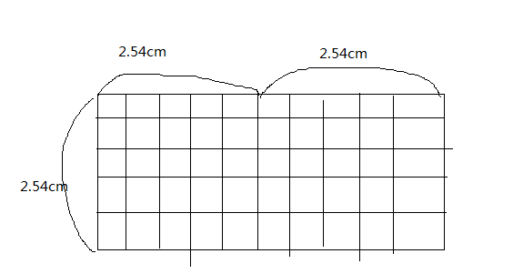
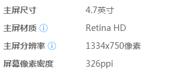

色彩空间

人能够感知到的色彩是一个三维线性空间的子集，我们将其称为色彩空间。

从光学三原色到印刷三间色，到符合认为更友好的HSL HSV色彩模型。

本文主要关注光学三原色

RGB、CMYK、YUV、YCbCr、HSL、HSV、HSB

作者：知乎用户
链接：https://www.zhihu.com/question/22077462/answer/29483467
来源：知乎
著作权归作者所有。商业转载请联系作者获得授权，非商业转载请注明出处。

RGB 是对机器很友好的色彩模式，但并不够人性化，因为我们对色彩的认识往往是”什么颜色？鲜艳不鲜艳？亮还是暗？”。HSL 模式和 HSV(HSB) 都是基于 RGB 的，是作为一个更方便友好的方法创建出来的。

- HSB 为 色相，饱和度，明度，
- HSL 为 色相，饱和度，亮度，
- HSV 为色相，饱和度，明度。

HSB 和 HSV 是是一样的，只是叫法不同，HSL 则还有一些细微的区别：

- 在所有的情况下，H(Hue) 代表色相，S(Saturation) 代表饱和度。Hue（色相）是指取值范围在0-360°的圆心角，每个角度可以代表一种颜色。B 在 HSB 模式中是 Brightness 的意思, V 在 HSV 中是值，但是所表述的是一个东西：对光的量或光源的功率的感知。色相和明度（值）可以在0 - 1或者0% - 100%间取值。

- HSL 稍微有一些不同，Hue（色相）和 HSB/HSV 模式中一样用数值表示，但是， S，同样代表“饱和度”，定义不一样，且需要转换。 L 代表亮度，和 Brightness/Value 不一样。Brightness（明度）是被认为是”光的量“，可以是任何颜色。

- 而 Lightness（亮度）是作为”白的量“来理解的。Saturation（饱和度）不一样，因为在两个模型中，饱和度都按比例缩放以适应明度或亮度的定义。

两者的区别，和他们之间对于饱和度的定义的不同。

HSB 和 HSV 是同一个东西，只是名称不同，本文后面仅使用 HSB，当提到它的时候，也代表 HSV。

HSB 和 HSL 在字面意思上是一样的：

- H 指的是**色相**（Hue），就是颜色名称，例如“红色”、“蓝色”；
- S 指的是**饱和度**（Saturation），即颜色的纯度；
- L（Lightness） 和 B（Brightness）是**明度**，颜色的明亮程度

在原理和表现上，HSL 和 HSB 中的 H（色相） 完全一致，但二者的 S（饱和度）不一样， L 和 B （明度 ）也不一样：

HSB 中的 S 控制纯色中混入**白色**的量，值越大，白色越少，颜色**越纯**

HSB 中的 B 控制纯色中混入**黑色**的量，值越大，黑色越少，明度**越高**

HSL 中的 S 和黑白没有关系，饱和度不控制颜色中混入黑白的多寡；

HSL 中的 L 控制纯色中的混入的**黑白两种颜色**。

## 光学三原色与印刷三间色

**光学的三原色**： 红（Red)、绿（Green）、蓝（Blue) （RGB）。

**印刷的三原色**： 青（Cyan)、品红（Magenta)、黄（Yellow) (CMYK)

印刷色是光照射在印刷物上， 然后折射到人眼的光的合成，所以印刷色会比光学暗淡，因为印刷色是经过印刷物过滤过光合成的，自然会比较相对暗淡。

C(100) +M(100） +Y(100） = 黑色(100，100，100）

可见黑色就是青色、品与黄色之和，但是这三种颜色混成的黑色不够纯，所以印刷学就引进了K(Black)黑色，因为B已经被Blue占用，所以黑色就只好用引文字母黑色的最后一个字母K，所以：

C(100) +M(100） +Y(100） + K(100) 等价于 C(0) +M(0) + Y(0) + K(100) = 黑色

光学三原色如何得到白色， 配色如下：

R(0） + G(0） + B(0）+A(255) =  C(0) +M(0) + Y(0) + K(100) = 黑色

联想下，是不是可见黑色就是没有颜色（0，0，0）？

我们显示屏一般采用RGB，印刷采用CMY。RGB/CMY色彩模型是通过不同量的（红/绿/蓝）||（青/品红/黄）来描述一个颜色的，对人类来说很不直观，难以理解。他们对机器很友好的色彩模式，但并不够人性化,难以直观理解，因为我们对色彩的认识往往是：什么颜色？鲜艳不鲜艳？

## 基于RGB改进的HSL/HSV色彩模型

**HSL 模式和\**HSB\**(\**HSV\**) 都是基于 RGB 的，是作为一个更方便友好的方法创建出来的**。HSB和HSV是是一样的,只是叫法不一样而已

- **HSL**：色相H(Hue) ，饱和度S(Saturation)，亮度L(Lightness)
- **HSB**：色相H(Hue) ，饱和度S(Saturation)，明度B(Brightness)

**色相H(Hue)**控制颜色种类，取值0-360°的圆心角。需要记住色相环上的六大主色:**红黄绿青蓝洋红**(即RGB夹CMY呈60°分布)用作基本参照

**饱和度S(Saturation)**控制颜色的纯度。取值0-100%。数值越大，颜色中的灰色越少，颜色越鲜艳，呈现一种从灰度到纯色的变化

**亮度L(Lightness)**和**明度B(Brightness)**控制色彩的明暗变化，取值0-100%。

## YUV与YCbCr

无论是电影还是电视刚刚出来的时候都是黑白模式。从电视台从黑白过度到彩色，但是又要兼容原来黑白模式，不得已推出了YUV**。**

[YUV是一种颜色编码方法](https://baike.baidu.com/item/YUV/3430784?fr=aladdin)。常使用在各个视频处理组件中。 YUV在对照片或视频编码时，考虑到人类的感知能力，允许降低色度的带宽。

- Y：亮度信号，灰阶值。取值：0.0 ~ 1.0
- U：色差信号R-Y(红色-亮度)。取值：-0.5 ~ 0.5；
- V：色差信号B-Y(蓝色-亮度)。取值：-0.5 ~ 0.5；

这时候也许你会问“咦，G(绿色)哪去了”，其实两种颜色加亮度也能通过算法大致表达出原本的颜色(果然偷工减料)，所以就算是融合进R 和B 里了

**行业中处理的视频格式基本是YUV信号，而不是RGB**，所以要了解视频格式的基础需了解YUV。

现在的**YUV是通常用于计算机领域用来表示使用YCbCr编码的文件。所以可以粗浅地视YUV为YCbCr**。如Y'UV, YPbPr

### YUV的优点

在最近十年中，视频工程师发现，**眼睛对于亮和暗的分辨要比对颜色的分辨更精细一些，也就是说，人眼对色度的敏感程度要低于对亮度的敏感程度**。工程师认为，在我们的视频存储中，**没有必要存储全部颜色信号。我们可以把更多带宽留给黑—白信号（被称作“亮度”），将稍少的带宽留给彩色信号（被称作“色度”）**。

#### **YUV解决彩色电视机与黑白电视机的兼容问题**

黑白视频只有Y（Luma，Luminance）视频，也就是灰阶值。到了彩色电视规格的制定，是以YUV/YIQ的格式来处理彩色电视图像，把UV视作表示彩度的C（Chrominance或Chroma），如果忽略C信号，那么剩下的Y（Luma）信号就跟之前的黑白电视频号相同。我们常用的JPG格式，采用的YUV。、

#### **YUV抗干扰性强**

采用YUV 色彩空间更重要在于它的亮度信号Y 和色度信号U、V 是分离的，这样分开的。好处就是不但可以避免相互干扰，还可以降低色度的采样率而不会对图像质量影响太大。如果U、V 为零，就没有颜色，变成黑白电视了。当然，Y 也是一个重要参数，其实平时我们看一个颜色深浅是很不一样的，而深浅取决于亮度Y，Y

#### YUV最大的优点在于只需占用极少的带宽

RGB色彩模式在输出时需要3个独立的图像信号同时传输，带宽占用较高。正常的RGB24是由24位即3个字节来描述一个像素，R、G、B各8位。而实际使用中为了减少图像数据的尺寸，如视频领域，对R、G、B所使用的位数进行的缩减，如你所说的RGB565和RGB555。

如RGB565彩色模式, 一个像素占两个字节, 其中:

- 低字节的前5位用来表示B(BLUE)
- 低字节的后三位+高字节的前三位用来表示G(Green)
- 高字节的后5位用来表示R(RED)

#### YUV采样与压缩

为什么YUV:2:0 需要的带宽只是YCbCr4:4:4的二分一？因为，他们在UV上可以减少采样。

- YUV 4:4:4采样，每一个Y对应一组UV分量。 
- YUV 4:2:2采样，每两个Y共用一组UV分量。 
- YUV 4:2:0采样，每四个Y共用一组UV分量。

视频编码

H.263、H.264、H.265、MPEG2、MPEG4、VP9

H.26x有H.261,H.262， H.263, H.263v2以及H.264，H.261基本上已经不再使用。其中H.262和H.264已经在MPEG系列中介绍，他们分别对应MPEG2的第2部和MPEG-4的第10部。不在整理这方面的资料。

------

### **H.261**

H.261其速率为64kbps的整数倍（1～30倍）。它最初是针对在ISDN(综合业务数字网,Integrated Services Digital Network)上双向声像业务(特别是可视电话、视频会议)而设计的。后来的视频编码标准都可以说是在H.261的基础上进行逐步改进，引入新功能得到的。现在的视频编码标准比起H.261来在各性能方面都有了很大的提高，这使得H.261成为了过时的标准，除了在一些视频会议系统和网络视频中为了向后兼容还支持H.261，已经基本上看不到使用H.261的产品了。但是这并不妨碍H.261成为视频编码领域一个重要的里程碑式的标准。

------

### **H.262**

H.262是由ITU-T的VCEG组织和ISO/IEC的MPEG组织联合制定的，所以制定完成后分别成为了两个组织的标准，正式名称是"ITU-T建议H.262"和"ISO/IEC 13818-2"。这两个标准在所有的文字叙述上都是相同的(也许除了封面和标价之外)。

MPEG2 Video/H.262：MPEG2(ISO/IEC 13818-2)，也被称为ITU-T H.262，是目前消费类电子视频设备中使用最广泛的视频编码标准。MPE2视频用于数字电视广播：包括陆地，海底电缆和直接卫星广播。它能在25fps(PAL)或者30fps(NTSC)的固定帧率下达到720x576像素成像。此外，它也是DVD-V中必需的编解码器。

------

### **H.263**

H.263最初设计为基于H.324的系统进行传输 （即基于公共交换电话网和其它基于电路交换的网络进行视频会议和视频电话）。后来发现H.263也可以成功的应用与H.323（基于RTP／IP网络的视频会议系统），H.320（基于综合业务数字网的视频会议系统），RTSP（流式媒体传输系统）和SIP（基于因特网的视频会议）。

基于之前的视频编码国际标准（H.261，MPEG-1和H.262／MPEG-2），H.263的性能有了革命性的提高。它的第一版于1995年完 成，在所有码率下都优于之前的H.261。 之后还有在1998 年增加了新的功能的第二版H.263+，或者叫H.263v2，以及在2000年完 成的第三版H.263++，即H.263v3。

H.263v2（通常也叫做H.263+或者1998年版H.263）是ITU-T H.263 视频编 码标准第二版的非正式名称。 它保持了原先版本H.263的所有技术，但是通过增加了几个附录显著的提高了编码效率并提供了其它的一些能力，例如增强了抵抗传输信道的 数据丢失的能力（Robustness）。H.263+ 项目于1997年底／1998年初完成（这取决于我们怎么定义"完成"）。

------

### **H.264【目前主流】**

H.263之后，ITU-T（在与MPEG的合作下）的下一代视频编解码器是H.264，或者叫AVC以及MPEG-4第 10部分。由于H.264在性能上超越了H.263很多，现在通常认为H.263是一个过时的标准（虽然它的开发完成并不是很久以前的事情）。大多数新的视频会议产品都已经支持了H.264视频编解码器，就像以前支持H.263和H.261一样。

H.264／AVC可工作于多种速率，广泛应用于Internet／intranet上的多媒体流服务、视频点播、可视游戏、低码率移动多媒体通信(视频 手机等)、交互式多媒体应用、实时多媒体监控、数字电视与演播电视和虚拟视频会议等，大有在上述领域一统天下的趋势，有非常广泛的开发和应用前景。

H.264是一种视频高压缩技术，同时称为MPEG-4 AVC，或MPEG-4 Part10。ITU-T从1998年就H.26L的H.26S两个分组，H.26L研制节目时间较长的高压缩编码技术，H.26S则指短节目标准制订部 门。前面的H.263就是H.26S标准化技术，而H.264标准是在H.26L基础上发展而来的。为了不引起误解，ITU-T推荐使用H.264作为这 一标准的正式名称。H.264集中体现了当今国际视频编码解码技术的最新成果。在相同的重建图像质量下，H.264比其他视频压缩编码具有更高的压缩比、 更好的IP和无线网络信道适应性。

------

### **H.265【应用趋势主流】**

H.265是ITU-T VCEG继H.264之后所制定的新的视频编码标准。H.265标准围绕着现有的视频编码标准H.264，保留原来的某些技术，同时对一些相关的技术加以改进。新技术使用先进的技术用以改善码流、编码质量、延时和算法复杂度之间的关系，达到最优化设置。具体的研究内容包括：提高压缩效率、提高鲁棒性和错误恢复能力、减少实时的时延、减少信道获取时间和随机接入时延、降低复杂度等。H.264由于算法优化，可以低于1Mbps的速度实现标清数字图像传送；H.265则可以实现利用1~2Mbps的传输速度传送720P（分辨率1280*720）普通高清音视频传送。

MPEG（Moving Picture Experts Group，动态图像专家组）是ISO（International Standardization Organization，国际标准化组织）与IEC（International Electrotechnical Commission，国际电工委员会）于1988年成立的专门针对运动图像和语音压缩制定国际标准的组织。

------

### **MPEG-1【过旧 - VCD\MP3】**

MPEG-1标准于1992年正式出版，标准的编号为ISO/IEC11172，其标题为“码率约为1.5Mb/s用于数字存贮媒体活动图像及其伴音的编码”。MPEG-1主要解决多媒体的存储问题，它的成功制定，使得以VCD和MP3为代表的MPEG-1产品迅速在世界范围内普及。

------

### **MPEG-2【过旧 - VCD\MP3】**

MPEG-2制定于1994年，设计目标是高级工业标准的图象质量m以及更高的传输率。MPEG-2所能提供的传输率在3-10Mbits/sec间，其在NTSC制式下的分辨率可达720X486，MPEG-2也可提供并能够提供广播级的视像和CD级的音质。MPEG-2的音频编码可提供左右中及两个环绕声道，以及一个加重低音声道，和多达7个伴音声道（DVD可有8种语言配音的原因）。由于MPEG-2在设计时的巧妙处理，使得大多数MPEG-2解码器也可播放MPEG-1格式的数据，如VCD。

------

### **MPEG-4【主流格式】**

MPEG-4在1995年7月开始研究，1998年11月被ISO/IEC批准为正式标准，正式标准编号是ISO/IEC14496，它不仅针对一定比特率下的视频、音频编码，更加注重多媒体系统的交互性和灵活性。这个标准主要应用于视像电话、视像电子邮件等，对传输速率要求较低，在4800－6400bits/s之间，分辨率为176*144。MPEG-4利用很窄的带宽，通过帧重建技术、数据压缩，以求用最少的数据获得最佳的图像质量。利用MPEG-4的高压缩率和高的图像还原质量可以把DVD里面的MPEG-2视频文件转换为体积更小的视频文件。经过这样处理，图像的视频质量下降不大但体积却可缩小几倍，可以很方便地用CD-ROM来保存DVD上面的节目。另外，MPEG-4在家庭摄影录像、网络实时影像播放也大有用武之地。

------

### **MPEG-7【多媒体内容描述接口】**

MPEG-7（它的由来是1+2+4=7，因为没有MPEG-3、MPEG-5、MPEG-6）于1996年10月开始研究。确切来讲，MPEG－7并不是一种压缩编码方法，其正规的名字叫做’多媒体内容描述接口，其目的是生成一种用来描述多媒体内容的标准，这个标准将对信息含义的解释提供一定的自由度，可以被传送给设备和电脑程序，或者被设备或电脑程序查取。MPEG-7并不针对某个具体的应用，而是针对被MPEG-7标准化了的图象元素，这些元素将支持尽可能多的各种应用。建立MPEG-7标准的出发点是依靠众多的参数对图象与声音实现分类，并对它们的数据库实现查询，就象我们今天查询文本数据库那样。可应用于数字图书馆，例如图象编目、音乐词典等；多媒体查询服务，如电话号码簿等；广播媒体选择，如广播与电视频道选取；多媒体编辑，如个性化的电子新闻服务、媒体创作等。

------

总之，无论最后储存的视频文件是 AVI还是 MOV，最后只是一个不同的容器封装起来了，真正的视频核心还是编码方式。也就是说 AVI 可以支持 H.265编码，MOV 也同样支持。也可以这样理解，不同的编码格式将会导致最后的视频有不同的画质，因为不同的编码有不同的压缩比例。

图片格式

jpeg、 jpg、png、bmp

| 格式 | 压缩模式 | 透明支持 |
| ---- | -------- | -------- |
| JPG  | 有损压缩 | 不支持   |
| PNG  | 无损压缩 | 支持     |
| BMP  | 无压缩   | 不支持   |

1.JPG：使用的一种失真压缩标准方法，24 bit真彩色，不支持动画、不支持透明色。JPEG的压缩方式通常是破坏性资料压缩（lossy compression），即在压缩过程中图像的品质会遭受到可见的破坏。一张图片多次上传下载后，图片逐渐会失真。

2.PNG：格式是无损数据压缩的，PNG格式有8位、24位、32位三种形式，其中8位PNG支持两种不同的透明形式（索引透明和alpha透明），24位PNG不支持透明，32位PNG在24位基础上增加了8位透明通道（32-24=8），因此可展现256级透明程度。

3.BMP：是一种与硬件设备无关的图像文件格式，使用非常广。它采用位映射存储格式，除了图像深度可选以外，不采用其他任何压缩，因此，BMP图像所占用的空间很大。BMP文件的图像深度可选lbit、4bit、8bit及24bit。BMP文件存储数据时，图像的扫描方式是按从左到右、从下到上的顺序。

1、优点bai。

JPG：JPEG图片格式的设计目标，是在du不影响人类可分辨的zhi图片质量的前提下，尽可能的压缩文件大小。这意味着JPEG去掉了一部分图片的原始信息，也即是进行了有损压缩。JPEG的图片的优点，是采用了直接色，得益于更丰富的色彩，JPEG非常适合用来存储照片，用来表达更生动的图像效果，比如颜色渐变。

GIF：GIF是无损的，采用GIF格式保存图片不会降低图片质量。但得益于数据的压缩，GIF格式的图片，其文件大小要远小于BMP格式的图片。文件小，是GIF格式的优点，同时，GIF格式还具有支持动画以及透明的优点。

PNG：PNG是一种比较新的图片格式，PNG-8是非常好的GIF格式替代者，在可能的情况下，应该尽可能的使用PNG-8而不是GIF，因为在相同的图片效果下，PNG-8具有更小的文件体积。

BMP：这是一种比较老的图片格式。BMP是无损的，但同时这种图片格式几乎没有对数据进行压缩，所以BMP格式的图片通常具有较大的文件大小。虽然同时支持索引色和直接色是一个优点

2、缺点

JPG：与GIF相比，JPEG不适合用来存储企业Logo、线框类的图。因为有损压缩会导致图片模糊，而直接色的选用，又会导致图片文件较GIF更大。

GIF：GIF格式仅支持8bit的索引色，即在整个图片中，只能存在256种不同的颜色。

PNG：PNG-8本身也是支持动画的，只是浏览器支持得不好，不像GIF那样受到广泛的支持。

BMP：太大的文件格式格式导致它几乎没有用武之地，现在除了在Windows操作系统中还比较常见之外，几乎看不到它。

作者：showvim
链接：https://www.zhihu.com/question/29758228/answer/849142855
来源：知乎
著作权归作者所有。商业转载请联系作者获得授权，非商业转载请注明出处。

那他们到底是有什么区别？(一句话，可看总结) 
  用最简单的话来说就是三种：  **真实性、透明性、矢量性** 
1、  真实性中就是色彩度、位深、损耗(压缩)等；(jpg、jpeg、gif、tiff、bmp)
2、  透明性就很明显了，就是支技透明的特性，但这里也有一个就是位深，他会影响透明度的深度png8与png24的差异就在这里；(png)
3、  特殊动画，就是支持帧的特点，可以做成动画；(gif)
4、  矢量性就可还原度，可再编辑的特性，通俗一点来讲就是很多人常说的放大不模糊的特点，因为他们的组成是由公式曲线方程生成的(但我们是可视化的编辑)(ai、cdr、eps)

注：后面括号里的格式并不是一定持前面的所有特性

  下面我们一个一个来讲解一下 

**Jpg格式**

这种格式是最常见的，也是用的最多的图片格式，很受大众的喜爱；

Jpg图片其实一生成出来就已经是有损的了，他是把一些不打算存储的数据抹擦掉， 

可支持有陨压缩

不支持透明

不支持动画

非矢量

色彩还原度比较好，可以支持适当压缩后保持比较好的色彩度

如果你图片颜色很多的，建议使用这个图片格式，可以使生成的图片大小比较小而不会使图片看起来很模糊（失真）

**Jpeg格式**

与jpg格式相似，经常在拷相片的时候看到得，但我们制作图片的时候一般是保存jpg，该种图片格式是文件相对jpg大，因为里面存储了很多相机里的拍摄参数，像色相、饱和度、对比度等 

可支持有陨压缩

不支持透明

不支持动画

非矢量

可用于直接打印和印刷（相对于jpg要好） 

**Png格式**

  该格式是在网页中用的较多的一种格式，因为他支持特明 

不支持压缩

支持透明、半透明、不透明

不支持动画

非矢量

网页设计中为了使图片下面的背景颜色显示出来，我们经常会使用png24透明的图片， 

Png8是类似gif的透明度，有带半透明（alpha为50%）的地方的时候以不透明处理。 

Png图片如果色彩较多或复杂，则图片生成后的格式是很大的，相比较jpg的放有5~6倍之多，所以没特别要求不能以png替代jpg的使用 

Png图片多用于网页中的图标设计 

IE6不支持png透明特性，有png的地方会以灰色底显示，相当难看，不过ie6已经慢慢淡出了我们的视线，相信png的应用会得到更广泛。 

**Gif格式**

  用于介于屏幕媒介的可视物体，如网页，使用比较多。 

用的最多的就是特点就是图片很小(一般几kb)、动画 

该格式的图片位深相对较底，只支持web色颜色种类有限，无法过渡平滑。 

可支持有陨压缩

不支持全透明

支持半透明

支持动画

非矢量

使用该格式的场景：网页背景、小图标、色彩度低的小切片、动画图片；

**Bmp格式**

  Windows格式，windows操作系统特有的图片，该图片保存了大量的图片数据，所以图片相对是比较大的，色彩度很真实，windows的桌面就是bmp格式的，通过设了桌面背景后，会在系统生成张bmp的图片用于保存该桌面壁纸，缺点：图片格式较大 

可支持有陨压缩

不支持透明

不支持动画

非矢量

**Tiff格式**

  印刷格式，色彩真实，支持保存图层(像psd，但像路径、蒙版等不可保存)，通常发给印刷公司的图片就是用这种格式的 

不支持压缩

不支持透明

不支持动画

非矢量

**ai、cdr、eps格式**

  这三种格式都是矢量格式 

对于矢量格式的图形会因为软件的版本差异而打开后有所不同。

ai格式是 Adobe公司旗下软件 Adobe Illustrator 生成的可再编辑矢量图片，与CDR可以通用，与PS可以通用，在ps里双击ai图片层会自动打开ai软件编辑，在ai里按保存后切换ps后可以看到会实时变化，正因为编辑可以同步，ai现在用的越来越广； 

cdr格式是Corel公司旗下软件CorelDRAW生成的可再编辑矢量图片，该格式不能直接与ai通用，需要导出ai格式再切换。目前多数广告公司用的广告产品排版软件就是这个； 

这个一定要与esp格式分开，esp并不是图片格式； 

Eps是Encapsulated PostScript的缩写，是跨平台的标准格式，主要用于矢量图像和光栅图像的存储。 

eps格式采用 PostScript语言进行描述，并且可以保存其他一些类型信息，例如多色调曲线、Alpha通道、分色、剪辑路径、挂网信息和色调曲线等，因此EPS格式常用于印刷或打印输出。 

该格式是可能使用cdr与ai同时打开 

**总结:**

1、  在通常情况下面 jpg与jpeg是一样的，只是里面保存的数据不一样，但我们多数使用的是jpg（后缀是小写，大写的有些是无法读写）,在图片颜色丰富的地方使用该格式保存，像拍摄的相片，ps合成的图片，经常保存图片时我会压缩20% 保留80%，看上去没有变化，但文件大小小了很多;

2、  png是用于全透明（保存png24）图片，该格式是多数用于小型格式的图片，不然文件会很大;

3、  gif是用于网络图片，可以制作成带有帧的动画图片，图片文件比较小，同时颜色也不是很丰富，不建议用于带简便的图片，除了颜色很浅很简单的切片；

4、  bmp一般是windows保存的高保真图片，图片很大；

5、  tiff一般用于印刷图片，平面设计可以保存格式并发送给制作部门制作实物，图片也一般较大； 

ai、cdr、eps是矢量图形，根据自己的使用习惯，可以调整，并没有特别的界限；

作者：飞扬
链接：https://www.zhihu.com/question/29758228/answer/109973408
来源：知乎
著作权归作者所有。商业转载请联系作者获得授权，非商业转载请注明出处。

.GIF（87年）：使用无损压缩，支持256中颜色（一般叫8 bit彩色），支持单一透明色；

2.JPG（92年）：使用的一种失真压缩标准方法，24 bit真彩色，内容比GIF丰富，不支持动画、不支持透明色。JPEG的压缩方式通常是破坏性资料压缩（lossy compression）,意即在压缩过程中图像的品质会遭受到可见的破坏。一张图片多次上传下载后，图片逐渐会失真。
 优点
 　　JPEG/JFIF是最普遍在万维网（World Wide Web）上被用来储存和传输照片的格式。JPEG在色调及颜色平滑变化的相片或是写实绘画（painting）上可以达到它最佳的效果。在这种情况下,它通常比完全无失真方法作得更好,仍然可以产生非常好看的影像（事实上它会比其他一般的方法像是GIF产生更高品质的影像,因为GIF对于线条绘画（drawing）和图示的图形是无失真,但针对全彩影像则需要极困难的量化）。

 缺点
 　　它并不适合于线条绘图（drawing）和其他文字或图示（iconic）的图形,因为它的压缩方法用在这些图形的型态上,会得到不适当的结果；

3.PNG（96年）：格式是无损数据压缩的,PNG格式有8位、24位、32位三种形式,其中8位PNG支持两种不同的透明形式（索引透明和alpha透明）,24位PNG不支持透明,32位PNG在24位基础上增加了8位透明通道（32-24=8）,因此可展现256级透明程度。
 优点
 　　* 支持256色调色板技术以产生小体积文件
 　　* 最高支持48位真彩色图像以及16位灰度图像。
 　　* 支持Alpha通道的半透明特性。
 　　* 支持图像亮度的gamma校正信息。
 　　* 支持存储附加文本信息,以保留图像名称、作者、版权、创作时间、注释等信息。
 　　* 使用无损压缩。
 　　* 渐近显示和流式读写,适合在网络传输中快速显示预览效果后再展示全貌。
 　　* 使用CRC循环冗余编码防止文件出错。
 　　* 最新的PNG标准允许在一个文件内存储多幅图像。
 缺点
 　　但也有一些软件不能使用适合的预测,而造成过分臃肿的PNG文件。

4.alpha通道：描述图片中的透明区域，此透明区域允许通透地显示背景。
    是指一张图片的透明和半透明度。例如：一个使用每个像素16比特存储的位图，对于图形中的每一个像素而言，可能以5个比特表示红色，5个比特表示绿色，5个比特表示蓝色，最后一个比特是阿尔法。在这种情况下，它要么表示透明要么不是，因为阿尔法比特只有0或1两种不同表示的可能性。又如一个使用32个比特存储的位图，每8个比特表示红绿蓝，和阿尔法通道。在这种情况下，就不光可以表示透明还是不透明，阿尔法通道还可以表示256级的半透明度，因为阿尔法通道有8个比特可以有256种不同的数据表示可能性。

5.VS
JPG VS PNG：JPG在图片压缩方面有巨大优势，但采用有损压缩，图片质量有损失。一般截屏用PNG格式不但比JPG质量高 且 文件还更小；
防锯齿PNG非常有优势。

视频格式

avi、mpeg、mp4、mov、ProRes、DNxHR、mfx、mkv、wmv、flv、rmvb、webm

视频格式一般有两个部分构成：一个是视频封装格式，一个是视频编码格式。视频封装格式简单点来理解的话就是一个【容器】，这个【容器】里封装什么样的【编码格式】最后得到一个完整的视频。

视频（Video）泛指将一系列静态影像以电信号的方式加以捕捉、纪录、处理、储存、传送与重现的各种技术。连续的图像变化每秒超过24帧（frame）画面以上时，根据视觉暂留原理，人眼无法辨别单幅的静态画面；看上去是平滑连续的视觉效果，这样连续的画面叫做视频。视频技术最早是为了电视系统而发展，但现在已经发展为各种不同的格式以利消费者将视频记录下来。网络技术的发达也促使视频的纪录片段以串流媒体的形式存在于因特网之上并可被电脑接收与播放。视频与电影属于不同的技术，后者是利用照相术将动态的影像捕捉为一系列的静态照片。

视频格式是视频播放软件为了能够播放视频文件而赋予视频文件的一种识别符号。视频格式可以分为适合本地播放的本地影像视频和适合在网络中播放的网络流媒体影像视频两大类。尽管后者在播放的稳定性和播放画面质量上可能没有前者优秀，但网络流媒体影像视频的广泛传播性使之正被广泛应用于视频点播、网络演示、远程教育、网络视频广告等等互联网信息服务领域。

## 视频封装

对于任何一部视频来说，只有图像，没有声音，肯定是不行的。所以，视频编码后，加上音频编码，要一起进行封装。封装，就是封装格式，简单来说，就是将已经编码压缩好的视频轨和音频轨按照一定的格式放到一个文件中。再通俗点，视频轨相当于饭，而音频轨相当于菜，封装格式就是一个饭盒，用来盛放饭菜的容器。目前主要的视频容器有如下：MPG、VOB、MP4、3GP、ASF、RMVB、WMV、MOV、Divx、MKV、FLV、TS/PS等。

## **.mov**

MOV即QuickTime影片格式，它是Apple公司开发的一种音频、视频文件格式，用于存储常用数字媒体类型。当选择QuickTime（*.mov）作为“保存类型”时，动画将保存为·mov文件。QuickTime用于保存音频和视频信息，包括Apple Mac OS，MicrosoftWindows95/98/NT/2003/XP/VISTA，甚至WINDOWS7在内的所有主流电脑平台支持。

------

**.mov 格式，常用格式 -**  **mov 封装支持绝对数编码，包括：H.264、H.265、ProRes、****DNxHD、****DNxHR、VP9、Kakadu JPEG 2000等****！**MOV是一种大家熟悉的流式视频格式，在某些方面它甚至比WMV和RM更优秀，并能被众多的多媒体编辑及视频处理软件所支持，用MOV格式来保存影片是一个非常好的选择。当然很多视频剪辑也会使用无损压缩视频作为视频格式使用，大部分使用的是苹果的电脑与剪辑软件。 

## **.mfx**

MXF 是英文 Material eXchange Format（素材交换格式）的缩语。MXF 是 SMPTE（美国电影与电视工程师学会）组织定义的一种专业音视频媒体文件格式。MXF主要应用于影视行业媒体制作、编辑、发行和存储等环节。SMPTE为其定义的标准包括：SMPTE - 377M、SMPTE - EG41、SMPTE - EG42等，并不断进行更新和完善。MXF文件通常被视为一种“容器”文件格式，也就是说MXF文件格式与内容数据的格式无关，这得益于MXF底层使用了KLV（键-长度-值）三元组编码方式。MXF文件通常包含文件头、文件体和文件尾等几个部分。

目前没有任何一种文件外壳格式 可以满足广播制作的所有需求。 而MXF被设计为可以满足绝大数当前 和未来的媒体交换的需求。我们期望看到媒体在 不同的载体上交换， 包括：音视频服务器、 离线和近线存储系统、 编辑工作站、 录像设备 （带有以太网文件传出能力）、流媒文件格式等。 最重要的是MXF允许不同的公司 （应用程序） 间不需依赖特定的文件格式 就能交换资源。 当然，这只是一个美好的愿望， 但是，著名的公司的行动 已经使我们看到了希望， 品尼高公司（Pinnacle） 最早在Liquid后期编辑系列产品中 就支持了这个格式，因为它需要用OMF在它的非编系统和 播出系统 （例如Palladium） 间建立无缝的桥梁， 爱维德（Avid）在最新的Xpress编辑系统中 也表明支持MXF （要知道， 它一直是OMF最强的支持者）， 而苹果公司著名的非编软件 Final Cut Pro最新推出的5.0版本中， 已经可以直接导入MXF了。

## **.avi**

AVI（Audio Video Interleaved）即音频视频交错格式，是微软公司于1992年11月推出、作为其Windows视频软件一部分的一种多媒体容器格式。AVI文件将音频（语音）和视频（影像）数据包含在一个文件容器中，允许音视频同步回放。类似DVD视频格式，AVI文件支持多个音视频流。AVI信息主要应用在多媒体光盘上，用来保存电视、电影等各种影像信息。

------

**.avi 格式，常用格式 - 体积大算法简单！**其中数据块包含实际数据流，即图像和声音序列数据。这是文件的主体，也是决定文件容量的主要部分。视频文件的大小等于该文件的数据率乘以该视频播放的时间长度，索引块包括数据块列表和它们在文件中的位置，以提供文件内数据随机存取能力。文件头包括文件的通用信息，定义数据格式，所用的压缩算法等参数。

## **.mp4**

MP4是一套用于音频、视频信息的压缩编码标准，由国际标准化组织（ISO）和国际电工委员会（IEC）下属的“动态图像专家组”（Moving Picture Experts Group，即MPEG）制定，第一版在1998年10月通过，第二版在1999年12月通过。MPEG-4格式的主要用途在于网上流、光盘、语音发送（视频电话），以及电视广播。

------

**.MP4 格式，常用有损压缩格式 -  苹果强力推起来的全新视频标准【H.265也是目前苹果强势推广的】！**目前网络的主流视频已经拜托了 FLV 的各种限制，这种更好压缩比，更好质量的视频格式受到了各大网络平台的支持。当然各个播放器及视频编辑软件也支持的非常好。

**.wmv**

WMV (Windows Media Video) 是微软公司开发的一种数字视频压缩格式。WMV文件一般同时包含视频和音频部分。视频部分使用Windows Media Video编码，音频部分使用Windows Media Audio编码。它是在“同门”的ASF（Advanced Stream Format）格式升级延伸来得。在同等视频质量下，WMV格式的体积非常小，因此很适合在网上播放和传输。

------

**.wmv 格式，常用有损压缩格式 -  微软的专业视频格式，兼容性并不是很好】！**这种格式实际上是非常失败的格式，在实际的项目制作中尤其视频工作者应该都深受这个格式的困扰。作为视频播放还是很是可以的，最好不要应用于视频编辑。

## **.mpeg**

MPEG（Moving Picture Experts Group）动态图像专家组。是ISO（International Standardization Organization，国际标准化组织）与IEC（International Electrotechnical Commission，国际电工委员会）于1988年成立的专门针对运动图像和语音压缩制定国际标准的组织。MPEG标准的视频压缩编码技术主要利用了具有运动补偿的帧间压缩编码技术以减小时间冗余度，利用DCT技术以减小图像的空间冗余度，利用熵编码则在信息表示方面减小了统计冗余度。这几种技术的综合运用，大大增强了压缩性能。

------

**.mpeg 格式，常用有损压缩格式 -  编码技术的标准！**这种格式实际上是大部分应用在 DVD 和蓝光 DVD 上，但是国内基本上都以网络传播为主了，这个格式在以 DVD 盛行的国家可能还是比较受欢迎的。但是国内基本上以 H.264\H.265为编码的 MP4为主了。

## **.flv**

FLV （ Flash Video），Adobe Flash 网络流媒体格式。但是被苹果以不安全为由基本上打压的不见了踪影，这方面是很支持苹果的，大家是不是常常莫名其妙弹出各种网页也广告？

------

**.flv 格式，机会被淘汰了！**其实最早的时候网站的视频基本上是基于 flv 的，但是历史最是会发展变化的。可以说 flv 已经完成了他的使命。

## **.mkv**

MKV：Matroska多媒体容器（Multimedia Container）是一种开放标准的自由的容器和文件格式，是一种多媒体封装格式，能够在一个文件中容纳无限数量的视频、音频、图片或字幕轨道。所以其不是一种压缩格式，而是Matroska定义的一种多媒体容器文件。其目标是作为一种统一格式保存常见的电影、电视节目等多媒体内容。在概念上Matroska和其他容器，比如AVI、MP4或ASF（Advanced Sreaming Format，即高级流格式）比较类似，但其在技术规程上完全开放，在实现上包含很多开源软件。可将多种不同编码的视频及16条以上不同格式的音频和不同语言的字幕流封装到一个Matroska 媒体文件当中。最大的特点就是能容纳多种不同类型编码的视频、音频及字幕流。

------

**.mkv 格式，应该是最有包容性的视频格式！**Matroska最大的特点就是能容纳多种不同类型编码的视频、音频及字幕流，甚至囊括了RealMedia及QuickTime这类流媒体，可以说是对传统媒体封装格式的一次大颠覆！它现在几乎变成了一个万能的媒体容器，目前它所能封装的视频、音频、字幕类型包括：AVI\RM\MOV\ASF\WMV 等。

## **.WebM**

WebM由Google提出，是一个开放、免费的媒体文件格式。WebM 影片格式其实是以 Matroska（即 MKV）容器格式为基础开发的新容器格式，里面包括了VP8影片轨和 Ogg Vorbis 音轨，其中Google将其拥有的VP8视频编码技术以类似BSD授权开源，Ogg Vorbis 本来就是开放格式。 WebM标准的网络视频更加偏向于开源并且是基于HTML5标准的，WebM 项目旨在为对每个人都开放的网络开发高质量、开放的视频格式，其重点是解决视频服务这一核心的网络用户体验。Google 说 WebM 的格式相当有效率，应该可以在 netbook、tablet、手持式装置等上面顺畅地使用。

------

**.webm 格式，谷歌推出的HTML5标准的网络视频标准！**Google 说 WebM 格式相当有效率，应该可以在上网本、平板电脑、手持设备等中流畅地使用，当然自家的 Youtube 也会支持 WebM 的播放，Intel表示不支持。在浏览器方面，Chrome不用说，Firefox、Opera 都支持该格式。微软 IE9 的支持就没这么直接，出厂时仅会支持 H.264 影片的播放，但如果你另外下载并安装了 VP8，那当然你也可以播放 HTML / VP8 的影片。所以说目前将会是 H.264的天下。

## **.rmvb**

普通的RM格式是Real 8.0格式，采用固定码率编码。多见于VCD-RM，曾流行了一段时间。RMVB比RM多了一个VB，VB指的是Variable Bitrate，动态码率或可变比特率，是RealNetworks公司的编码格式的9.0版本。RealMedia使用的压缩方法类似MPEG-4 Part 10编码，比如x264。RMVB格式的文件头包含四个字节的".RMF"，对应十六进制是2E 52 4D 46，这个文件头和标准的RealMedia格式相同。RMVB（Real 9.0）在音频编码上仍采用RM（Real 8.0）格式，压片时至少采用64Kbps stereo music，通常是96K，MTV类的有用到128K，再高就没必要压缩了。

------

**.rmvb 格式，现在很少使用了！**RMVB的前身为RM格式，它们是Real Networks公司制定的音频视频压缩规范，根据不同的网络传输速率，而制定出不同的压缩比率，从而实现在低速率的网络上进行影像数据实时传送和播放，具有体积小，画质不错的优点。10年前在网站看电影与视频基本上都是基于这个格式的，特殊的时期就会诞生特殊时期的产物，这个格式便是如此。在高压缩比的前提下，又能很好的优化网络的传输性能，这些特点在之前的网络前提下就是最普及的，目前的问题还是会和H.264冲突。

------

总之，基于 H.264或者 H.265的视频编码将会应用更加普及，无论是应用在本地视频、还是网络视频，这个编码应该在很长的时间内是不会被取代的。至于说最后封装成为了 AVI 还是 MP4，在这个大背景下 MP4 依然是最有优势的。这里所讲的很大程度上是适合视频工作者最终输出视频的格式。针对视频编辑的视频格式更多依赖摄影器材的采集等，但都是基于无损压缩或者小比例压缩的原视频进行剪辑、编辑，这部分内容我们放在以后做一篇专门的文章来讲解。

## **.asf**

ASF是（Advanced Streaming Format） 高级串流格式的缩写，是 Microsoft 为 Windows 98 所开发的串流多媒体文件格式。ASF是微软公司Windows Media的核心，这是一种包含音频、视频、图像以及控制命令脚本的数据格式。这个词汇当前可和 WMA 及 WMV 互换使用。利用ASF文件可以实现点播功能、直播功能以及远程教育，具有本地或网络回放、可扩充的媒体类型等优点。

------

**.asf 格式，基本上不要的一种视频格式！**Microsoft Media player是能播放几乎所有多媒体文件的播放器，支持ASF在Internet网上的流文件格式，可以一边下载一边实时播放，无需下载完再看。但是依然没有很好的得到应用，这方面还是 MP4 得到了很好的发展。

## **DCP | Digital Cinema Package**

**Digital Cinema Package（数字电影包），简称：DCP。**数字电影包是一种数字文件集，用于存储和转换数字影像的音频、图像和数据流。该术语由数字电影倡导联盟（DCI）在对数字影像的打包建议中做出过定义。通用惯例采用一种文件结构来组织成多个通常有几个G大小的MXF文件，这些文件分别用来存储音频和视频流，以及XML格式的辅助索引文件。

显示

分辨率、像素、dpi、ppi

## 像素

译自英文“pixel”，pix是英语单词picture的常用简写，加上英语单词“元素”element，就得到pixel。
描述一张位图图片的最小单位可以说就是像素了，就是一个一个带有颜色的点，或者说是正方形，也可以是长方形，把一张图片放大再放大变可以看到了。
但是像素它是没有固定大小的，每个像素只是有一些颜色信息，在不同显示屏上同一个点的大小当然会不同，相同之处就是他们的颜色一样。

## 分辨率

有的地方讲分辨率是用ppi表示，但我看到手机参数，显示器分辨率都用类似1920×1080这样的方式表示，所以按后者讲吧。1920×1080也就是表示电脑显示屏或者手机显示屏横向可以显示1920个像素，纵向可以显示1080个像素，也就是横向有1920个点，纵向有1080个点。
常见的就是一直说的1080p(1920×1080,16:9),720p(1280×720,16:9），4k(3840X2160)其他的也没注意

最让人头疼的一个概念
Pixels Per Inch，每英寸长度的像素个数。
首先一英寸是2.54厘米，其次注意是**长度**，不是面积，意思就是2.54厘米长度的直线通过多少个像素，就是多少ppi。假如一个显示器的的长是2英寸，宽是1英寸，而他的ppi是5。那他的分辨率就是10×5。

不要被我的图所误解，一般要是正方形就都是正方形。
ppi其实就是像素密度，当长宽固定了，ppi越高，显示器所能显示的像素就越多，可以想象上边的图，如果ppi是三百，也就是2.54厘米的宽会有300个小正方形，几乎就是个点了，300ppi几乎是人眼的极限了，再高，人眼已经分辨不出差别了。
所以对于显示器，分辨率=[长乘上ppi] × [宽乘上ppi],
长度，ppi，分辨率三者制约。
所以对于一个显示器，如果大小确定，当然分辨率越高越好，因为这样ppi就越高，但高于300再高意义也不是很大了。
一个很大的显示器，为了达到300ppi,就需要好多好多的像素了。

PAL、NTSC、SECAM

世界上主要使用的电视广播制式有PAL、NTSC、SECAM三种，如我国大部分地区使用PAL制式，日本、韩国及东南亚地区与美国等欧美国家使用NTSC制式，俄罗斯则使用SECAM制式。我们在国内市场上买到的正式进口的DV产品都是PAL制式。由于目前黑白电视已经基本淘汰，基于黑白电视的相关制式我们就不谈了。

National Television Systems Committee（正交平衡调幅制），简称：NTSC制。采用这种制式的主要国家有美国、加拿大和日本等。Sequential Coleur Avec Memoire（行轮换调频制），简称SECAM制。采用这种制式的有法国、前苏联和东欧一些国家。**Phase-Alternative Line（正交平衡调幅逐行倒相制），简称：PAL制。中国、德国、英国和其它一些西北欧国家采用这种制式。**

## 图像与显示器

如果图片的分辨率是10×20，显示器的分辨率高于他，那么没问题，可以正常显示这个图，如果低于它，那显示的时候显示器会自动用一些算法忽略一些像素了。
所以一幅图清不清晰，还得看在哪显示他，如果显示器的分辨率也是10×20，图片是不是就清晰呢，答案当时是否定的，还得看显示器的什么？对，ppi，或者说屏幕大小，因为两者互相决定，如果ppi是1，那么显示器就是25.4cm × 50.9cm，可以想象这幅图肯定是马赛克那样了。

## dpi

Dots Per Inch，每英寸点数，概念和ppi差不多，但多用于打印机等打印设备。比如打印机是300dpi,我们需要打印一张1寸照片1寸 × 1.4寸，那么我们至少需要多大像素的照片才不会看到马赛克，很好算
就是 1×300=300,1.4×300=420，也就是300 × 420=126000 像素的照片即可了。
补充下照片大小的算法

> 如1寸相片其规格为1X1.4,用1.4长那边的尺寸来表示，即1寸;
> 5寸相规格是尺寸5X3.5,用长边尺寸5表示其照片的规格。
> 而国际上还有一种通行的表示照片尺寸的方法，即取照片短的一边的英寸整数数值加字母R来表示。
> 比如5寸照片，规格为5X3.5英寸，即3R；
> 6寸照片，规格为6×4英寸，即4R。
> 所以像素再高其实也没什么用，除非你想要一张好大好大的照片。

## 手机ppi计算

显示器的尺寸是用对角线表示的，比如iphone 7的尺寸为4.7寸，那么其实是说他的对角线长度为4.7寸。

有了像素和尺寸，我们完全可以算ppi，可以勾股定理算出对角线的像素数，然后除以4.7即可。
也可以因为iphone 7的屏幕尺寸比大约为16比9，根据这个算出长宽，再除以长或者宽的像素也就求出来了。

## dip

dip（dp)是安卓里为了适配屏幕专门提出的概念，简单说就是一个公式
px = dp * (dpi / 160)
也就是说如果图片宽2dp，那么如果手机的ppi是320，那么图片宽将是4个像素。

