- 典例：下列哪种说法正确( A,D )
  - A 同步复位增加了时序收敛的难度
  - B 同步化异步复位可以保证逻辑正确复位 
  - C 从使用资源的角度看，应该使用异步复位
  - D 异步复位可能会导致逻辑错误
- 解析：本题目主要考察了在FPGA设计中复位的用法
  - 问题最大的其实就是A选项，很多同学都没选这个选项，以为同步复位的效果会好，其实只要存在复位都会增加布局布线的负担，因为复位会像时钟一样连接到每一个寄存器上，是相当复杂的工程，会增加时序收敛的难度，所以A选项正确。
  - 如果异步复位信号跟时钟在一定时间间隔内发生变化，就可以保证电路的正常复位和撤销，如果产生时序违例Q值将无法确定即产生亚稳态现象。这个时候即使异步复位信号持续时间再长都没有办法，因为不定态已经传递下去。而同步复位与时钟是同步的，就没有这种问题所以B选项错误，D选项正确。
  - Xilinx官方文档《Vivado使用误区与进阶》中明确说明尽量避免使用异步复位，且如果使用复位就用高复位，巧的是刚好和Altera推荐的规则相反，也是因为内部结构决定的，这也是这两家公司非常有意思的地方，所以我们在开发Altera和Xilinx的芯片时复位要区别对待。所以C项错误。

进行FPGA逻辑设计时肯定经常会用到复位，学习者在入门学习时往往都是使用Altera公司的芯片，因为Altera公司的开源资料相对较多且开发软件比较容易上手。我们在学习时发现相关的代码实例几乎都是用的异步复位，很多学习者没有太注意这块的内容，都是直接照搬例程，也没有深究其原因，就以为异步复位就是约定成俗的习惯性写法，其实这是一种误区。

为什么需要复位呢？这个很容易理解，单片机也常用复位，就是怕系统万一跑飞了还能够初始化后回到正常状态。同样这里使用复位也有这个原因，只要存在复位都会增加布局布线的负担，因为复位会像时钟一样连接到每一个寄存器上，是相当复杂的工程，会增加时序收敛的难度。难道不用复位吗？也不完全是，我们可以参考厂家官方的建议，如果不用复位那寄存器的初值我们怎么给呢？在代码中定义寄存器的时候直接在变量名后赋初值即可，Verilog-2001标准支持这种写法。Xilinx强烈建议用户仔细判断设计何时需要复位，何时不需要复位。大多数情况下，在控制路径逻辑上可能需要复位以确保正常运行。然而在数据路径逻辑上通常不需要复位。

- 在《Vivado使用误区与进阶》中提到我们要遵循 Xilinx 建议的复位准则
  1. 尽量少使用复位
  2. 必须复位时采用同步复位
  3. 确保使用高电平有效的复位
  4. 避免异步复位（RAMB 和 DSP48 模块中不支持异步复位）。
- 限制复位在许多情况下能够从整体上提升性能、缩小占位面积和降低功耗。限制复位使用的方法如下：
  1. 限制复位网络的总体扇出
  2. 减少复位路由所需的互联数量
  3. 简化复位路径的时序
- Xilinx 的复位准则必须严格遵守，根据现场支持的经验来看，很多设计性能的瓶颈就在于设计源代码时没有考虑底层实现器件的硬件结构特点，尤其以复位信号的实现问题最为突出。在Xilinx的官方手册UG949中也写道关于复位的问题，Xilinx器件提供专用的全局置位/复位信号（GSR）。在器件配置结束时，该信号将器件配置中所有顺序单元的初始值。如果未指定初始状态，则为顺序原语分配默认值。在大多数情况下，默认值为零。 FDSE和FDPE 原语是例外，默认为逻辑1。每个寄存器在配置结束时将处于已知状态。因此没有必要单独为初始化加电器件编写全局复位代码。

且我们使用的复位往往都是全局复位，复位有两种，一种是同步复位，一种是异步复位。

我们以D触发器的例子来进行讲解。同步复位的D触发器中的“同步”是和工作时钟同步的意思，也就是说，当时钟的有效沿来到时检测到按键的复位操作才有效，否则无效。如下图所示，最右边的三根红色的竖线表达的就是这种效果，sys_rst_n被拉低后led_out没有立刻变为0，而是当syc_clk的上升沿到来的时候led_out才复位成功，在复位释放的时候也是相同原因。

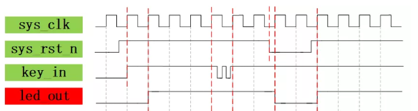

异步复位的D触发器中的“异步”是和工作时钟不同步的意思，也就是说寄存器的复位不关心时钟的上升沿来不来，只要有检测到按键被按下，就立刻执行复位操作。如下图所示，最右边的两根红色的竖线表达了这种效果，sys_rst_n被拉低后led_out立刻变为0，而不是等待syc_clk的上升沿到来的时候led_out才复位，而在复位释放的时候led_out不会立刻变为key_in的值，因为还要等待时钟上升沿到来到时才能检测到key_in的值，此时才将key_in的值赋值给led_out。

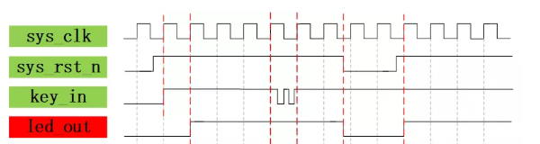

```verilog
module  flip_flop(
    sys_clk,
    sys_rst_n,
    key_in,
    led_out
);

input sys_clk;      //系统时钟50MHz
input sys_rst_n;    //全局复位
input key_in;       //输入按键
output reg led_out; //输出控制led灯
//led_out:led灯输出的结果为key_in按键的输入值

/*=1=***********************************************
always@(posedge sys_clk) //同步复位，复位信号低有效，复位后状态为置0
    if(sys_rst_n ==1'b0)      
        led_out <=1'b0;     
    else
        led_out <= key_in;
/*=2=***********************************************
always@(posedge sys_clk or negedge sys_rst_n)//异步复位，复位信号低有效，复位后状态置0
    if(sys_rst_n ==1'b0)                    
        led_out <=1'b0;
    else
        led_out <= key_in;
/*=3=***********************************************
always@(posedge sys_clk or negedge sys_rst_n)//异步复位，复位信号低有效，复位后状态置1
    if(sys_rst_n ==1'b0)                    
        led_out <=1'b1;
    else
        led_out <= key_in;
/*=4=**********************************************
always@(posedge sys_clk or posedge sys_rst_n)//异步复位，复位信号高有效，复位后状态置0
 if(sys_rst_n ==1'b1)                    
     led_out <=1'b0;
 else
     led_out <= key_in;
/**************************************************/    

endmodule
```

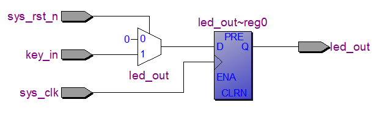

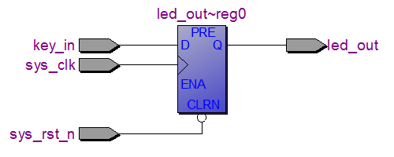

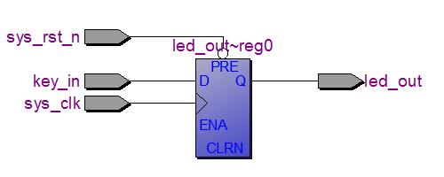

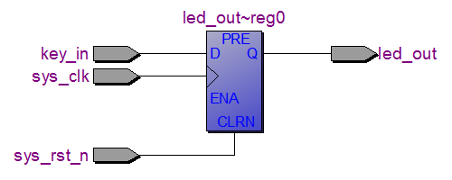

- 复位信号为高有效还是低有效，根据具体的器件所定
  - Altera FPGA的寄存器都有一个异步清零端(CLR)，在异步复位设计中，低电平有效的rst_n复位信号就可以直接连在这个端口上。（如果是高有效的复位，综合时会把它取反后接在这个端口上）
  - Xilinx FPGA根据器参考文件建议为高有效
- 通过上面同步复位和异步复位综合出的D触发器的RTL视图对比，我们可以发现采用同步复位会多出来一个选择器的结构，这里我们可能不禁会有疑问，为什么多了一个选择器？原因就是由Altera的最小逻辑单元LE中的寄存器结构决定的，如下图所示，在Chip Planner视图中我们发现LE中的寄存器有一个连接到寄存器的异步复位信号!ACLR的PAD，也就是说Altera器件中的基本单元就是由异步复位且低有效结构的寄存器组成的，如果不按照这个现有的资源来设计我们就需要额外使用其他的资源，从而造成浪费，所以这就是我们所“默认”Altera器件中往往都是异步复位低有效的原因。

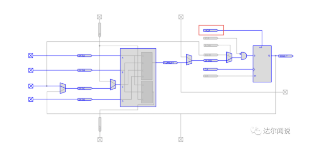


- 全局复位往往都是外接一个按键，在复位时完成这样一个过程，按键按下状态=>按键保持状态=>按键释放状态
- 纯同步复位为保证复位按键按下时与时钟同步在综合时会多综合一个二选一多路器，检测到时钟有效沿且复位按键按下进入复位状态，消耗大量资源。纯同步复位与时钟同步，只要寄存器的时钟不违例，复位按键释放，所有寄存器的从复位状态跳转至工作状态就是一致的。
- 纯异步复位只要复位按键按下，寄存器就会进入复位状态，不论有效时钟沿是否到来，立即复位。纯异步复位会看似与时钟无关，但是此时异步复位信号与时钟信号类似，复位信号释放时存在一个建立时间和保持时间，如果某些寄存器存在复位电路的违例情况，就会产生逻辑错误。
- 所以我们需要结合一下两者的优点在复位时采用异步复位同步释放即可

```verilog
module async_rst_sync(
    clk,
    rst_n,
    a,
    c
);

input clk;
input rst_n;
input a;
output reg c;

reg b;
/*=1=*********************************
always@(posedge clk)//纯同步复位
    if(!rst_n) 
        b <= 1'b0;
    else 
        b <= a;  
always@(posedge clk)
    if(!rst_n) 
        c <= 1'b0;
    else 
        c <= b;       
/*=2=*********************************
always@(posedge clk or negedge rst_n)//纯异步复位
    if(!rst_n) 
        b <= 1'b0;
    else 
        b <= a;  
always@(posedge clk or negedge rst_n)
    if(!rst_n) 
        c <= 1'b0;
    else 
        c <= b;       
/*=3=*********************************
reg rst_s;
reg rst_out;
always@(posedge clk or negedge rst_n)
    if(!rst_n)
        rst_s <= 1'b0;
    else
        rst_s <= 1'b1;  //这里写成1，而不写成rst_n，是因为根据实际综合效果来看，这样做更节省资源，具体原因参考同步复位
always@(posedge clk or negedge rst_n)
    if(!rst_n)
        rst_out <= 1'b0;
    else
        rst_out <= rst_s;//将纯异步的复位信号先打一拍，然后在给异步复位同步释放信号
//可选
//wire rst_o;
//assign rst_o = rst_out;
always@(posedge clk or negedge rst_out)//异步复位同步释放
    if(!rst_out) 
        b <= 1'b0;
    else 
        b <= a;  
always@(posedge clk or negedge rst_out)
    if(!rst_out) 
        c <= 1'b0;
    else 
        c <= b;       
/*************************************/
endmodule

```

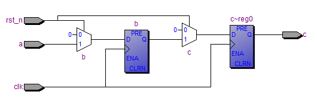

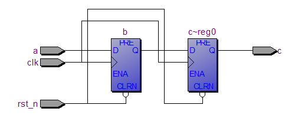

- 从上面可看出，纯同步复位浪费资源，纯异步复位会出现逻辑错误
- 正常情况下，clk的上升沿c更新为b，b更新为a。一旦进入复位，b,c都清零；但是我们不能确定复位信号rst_n会在什么时候结束。如果结束于b_reg0和c_reg0的{launch edge –stup,launch edge+hold}时间只外，那么一切都会正常。但如果恰恰相反，会出现什么情况呢？ rst_n的上升变化出现在了clk上升的建立保持时间上，此时clk检测到的rst_n的状态就会是一个亚稳态（是0是1不确定）。从代码里我们看到如果此时b_reg0和c_reg0认为rst_n为0，那么依然保持复位清零，而如果认为rst_n为1，那么就跳出复位。因为此时的rst_n的不确定性，就可能出现4种情况，即b_reg0和c_reg0都复位或者都跳出复位，再或者一个复位一个跳出复位。那么后者就会造成了系统工作不同步的问题，在这个简单的两级异步复位实例中这种危害表现的并不明显，但是我们试想一个大的工程项目里众多的寄存器出现如此情况又会是如何一番景象呢？

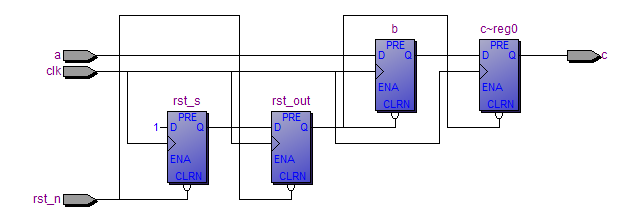

- 加上此复位电路以后，假设第一级D触发器clk上升沿时rst_n正好撤除，则触发器rst_s输出高电平“1”，此时第二级触发器也会更新输出，但是输出值为前一级触发器次clk来之前时的Q1输出状态。显然触发器rst_s的Q端之前为低电平，故第二级触发器rst_out的Q输出保持复位低电平，直到下一个clk来之后，才随着变为高电平。即同步释放。
- 只做一级触发器来同步，效果如何?
  - 第一级触发器的输出，永远存在亚稳态的可能。亚稳态导致系统不会复位初始化到已知状态。
  - 当第一级触发器采样异步输入之后，允许输出出现的亚稳态可以长达一个周期，在这个周期内，亚稳态特性减弱。在第二个时钟沿到来时，第二级同步器采样，之后才把该信号传递到内部逻辑中去。第二级输出是稳定且已被同步了的。如果在第二级采样时保持时间不够，第一级的输出仍然处于很强的亚稳态，将会导致第二级同步器也进入亚稳态，但这种故障出现的概率比较小。
  - 一般情况下，异步信号为了减少亚稳态的出现都是使用两级触发器进行打拍操作，两级同步器总体的故障概率是一级同步器故障概率的平方。在大部分的同步化设计中，两级同步器足以消除所有可能的亚稳态了。
- 什么情况下需要做“异步复位、同步释放”处理？
  - 一般来说，同步系统，都使用异步复位。这是因为同步复位的电路实现，比异步复位的电路实现，要浪费更多电路资源。
  - 未在本模块时钟域做过“异步复位，同步释放”处理的复位信号，提供给本模块做异步复位使用时，都需要做“异步复位，同步释放”处理。常见于系统内两部件不在同一时钟域的情况下。
  - 工程实践中，确实见过由于未做异步复位的同步处理，而出现大概率系统死机现象（复位的作用域是很大的）。

tips

- 时钟有效沿可以是下降沿，也可以是上升沿，一般习惯上为上升沿触发

- 复位信号远离时钟有效沿，Removal time和Recovery time，类似于建立/保持时间，通常对异步复位电路的时序分析称为 恢复时间检查和移除时间检查

  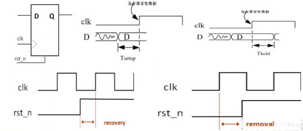

[异步复位同步释放](关于复位.assets/async_rst_sync)