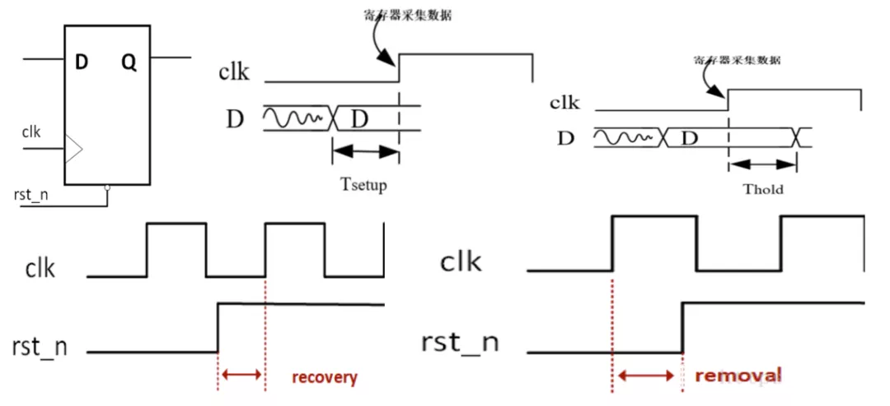

1. 什么是时序分析？
   1. 时序分析本质上就是一种时序检查，目的是检查设计中所有的D触发器是否能够正常工作，
   2. 也就是检查D触发器的同步端口（数据输入端口）的变化是否满足建立时间要求（Setup）和保持时间要求（Hold）；
   3. 检查D触发器的一步端口（异步复位端口）的变化是否满足恢复时间要求（Recovery）和溢出时间要求（Removal）
   4. 
2. 时序分析有哪些类型
   1. 时序分析包括静态时序分析和动态时序分析
   2. **动态时序分析：** 将布局布线生成的布线延迟信息反标注到门级网表中进行仿真，检查是否存在时序违例。此时仿真包括门延迟和布线延迟信息，能够较好的反应芯片的实际工作情况。应为不可能产生完备的测试向量，覆盖门级网表中的每一条路径，因此在动态分析中，无法暴露一些路径上可能存在的时序问题