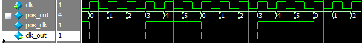
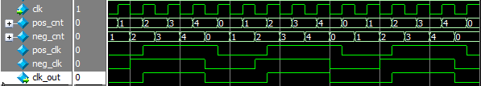

时钟分频

时钟分频主要包括整数分频和小数分频，整数分频有分成偶数分频和奇数分频，整数分频可以实现占空比为50%，小数分频不能实现占空比为50%。并且自己写的时钟分频所衍生的潜在问题在低速系统中不易察觉，而在高速系统中就很容易出现。为什么会这样呢？因为我们通过这种方式分频得到的时钟虽然表面上是对系统时钟进行了分频产生了一个新的低频时钟，但实际上和真正的时钟信号还是有很大区别的。在FPGA中，凡是时钟信号都要连接到全局时钟网络上，全局时钟网络也称为全局时钟树，是FPGA厂商专为时钟路径而特殊设计的，它能够使时钟信号到达每个寄存器的时间都尽可能相同，以保证更低的时钟偏斜（Skew）和抖动（Jitter）。而我们用这种分频的方式产生的clk_out信号并没有连接到全局时钟网络上，clk则是由外部晶振直接通过管脚连接到了FPGA的专用时钟管脚上，自然就会连接到全局时钟网络上，所以在clk时钟工作下的信号要比在clk_out时钟工作下的信号更容易在高速系统中保持稳定。在一些文献中看到过使用逻辑分频产生的信号特别不稳定，所以，我觉得工程中使用pll就好了，如果信号扇出非常小，并且模块也不复杂，也可以使用。另一种方法是，可以使用flag标志信号。产生一个用于标记clk_out的上升沿的信号clk_flag变成了clk_flag的脉冲电平信号，为后级模块实现相同的降频效果，也能让系统更加稳定。





```verilog
//RTL file--------------------------------------
module div_clk #(
    parameter div_num = 6
)(
    clk,
    rst,
    clk_out
);

input clk;
input rst;
output clk_out;

reg [3:0]pos_cnt;
reg [3:0]neg_cnt;
wire pos_clk;
wire neg_clk;

always@(posedge clk)
    if(!rst)
        pos_cnt <= 4'd0;
    else if(pos_cnt == div_num-1'b1)
        pos_cnt <= 4'd0;
    else 
        pos_cnt <= pos_cnt + 1'b1;
assign pos_clk = (pos_cnt < div_num>>1) ? 1'b0 : 1'b1;
        
always@(negedge clk)
    if(!rst)
        neg_cnt <= 4'd0;
    else if(neg_cnt == div_num-1'b1)
        neg_cnt <= 4'd0;
    else 
        neg_cnt <= neg_cnt + 1'b1;
assign neg_clk = (neg_cnt < div_num>>1) ? 1'b0 : 1'b1;

assign clk_out = div_num[0] ? (pos_clk & neg_clk) : pos_clk;
        
endmodule
//end file--------------------------------------

//testbench file--------------------------------------
`timescale 1ns/1ns
`define clk_period 10
module tb_div_clk;

reg clk;
reg rst;
wire clk_out;

div_clk #(
    .div_num(4'd5) 
)div_clk (
    .clk(clk),
    .rst(rst),
    .clk_out(clk_out)
);


initial clk = 1'b0;
always#(`clk_period/2) clk = ~clk;

initial begin
    rst = 1'b0;
    #20 rst = 1'b1;
    #200
    $stop;
end

endmodule 
//end file--------------------------------------
```


时钟二分频电路


```verilog
module div2_clk(
	clk,
    rst,
    clk_out 
);
    
input clk;
input rst;
output reg clk_out;
    
always@(posedge clk or negedge rst)
    if(!rst)
        clk_out <= 1'b0;
    else
        clk_out <= ~clk_out;
        
        
endmodule 
```

[时钟分频](时钟分频.assets/div_clk.v)

[时钟分频testbench文件](时钟分频.assets/tb_div_clk.v)

