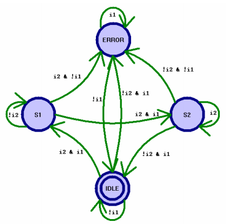
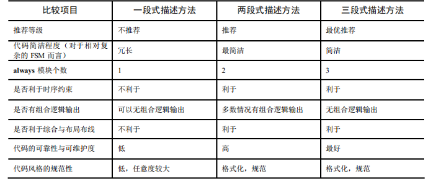

## 状态机

状态机的本质就是对具有逻辑顺序或时序规律时间的一种描述方法，这个论断的最重要的两个词就是逻辑顺序和时序规律，换言之所有具有逻辑顺序和时序规律的事情都适合用状态机描述

- FSM 要安全，稳定性高。
  - 所谓 FSM 安全是指 FSM 不会进入死循环，特别是不会进入非预知的状态，而且由于某些扰动进入非设计状态，也能很快的恢复到正常的状态循环中来。这里面有两层含义，第一：要求该 FSM 的综合实现结果无毛刺等异常扰动；第二：要求状态机要完备，即使收到异常扰动进入非设计状态，也能很快恢复到正常状态。
- FSM 速度快，满足设计的频率要求。
  - 任何 RTL 设计都应该满足设计的频率要求。

- FSM 面积小，满足设计的面积要求。
  - 同理任何 RTL 设计都应该满足设计的面积要求。

- FSM 设计要清晰易懂、易维护。
  - 不规范的 FSM 写法很难让其他人解读，甚至过一段时间后设计者也发现很难维护。


**推荐的状态机描述方法**

状态机描述时关键是要描述清楚前面提到的几个状态机的要素，即如何进行状态转移；每个状态的输出是什么；状态转移是否和输入条件相关等。具体描述时方法各种各样，有的设计者习惯将整个状态机写到 1 个 always 模块里面，在该模块中即描述状态转移，又描述状态的输入和输出，这种写法一般被称为一段式 FSM 描述方法；还有一种写法是用 2 个always 模块，其中一个 always 模块采用同步时序描述状态转移；另一个模块采用组合逻辑判断状态转移条件，描述状态转移规律，这种写法被称为两段式 FSM 描述方法；还有一种写法是在两段式描述方法基础上发展出来的，这种写法使用 3 个 always 模块，一个 always模块采用同步时序描述状态转移；第二个采用组合逻辑判断状态转移条件，描述状态转移规律；第三个 always 模块使用同步时序电路描述每个状态的输出，这种写法称为三段式写法。

一般而言，推荐的 FSM 描述方法是后两种，即两段式和三段式 FSM 描述方法。其原因为：FSM 和其他设计一样，最好使用同步时序方式设计，以提高设计的稳定性，消除毛刺。状态机实现后，一般来说，状态转移部分是同步时序电路而状态的转移条件的判断是组合逻辑。两段式之所以比一段式编码合理，就在于两段式编码将同步时序和组合逻辑分别放到不同的 always 程序块中实现。这样做的好处不仅仅是便于阅读、理解、维护，更重要的是利于综合器优化代码，利于用户添加合适的时序约束条件，利于布局布线器实现设计。而一段式 FSM 描述不利于时序约束、功能更改、调试等，而且不能很好的表示米勒 FSM 的输出，容易写出 Latches，导致逻辑功能错误。

在一般两段式描述中，为了便于描述当前状态的输出，很多设计者习惯将当前状态的输出用组合逻辑实现。但是这种组合逻辑仍然有产生毛刺的可能性，而且不利于约束，不利于综合器和布局布线器实现高性能的设计。因此如果设计运行额外的一个时钟节拍的插入（latency），则要求尽量对状态机的输出用寄存器寄存一拍。但是很多实际情况不允许插入一个寄存节拍，此时则可以通过三段式描述方法进行解决。三段式与两段式相比，关键在于根据状态转移规律，在上一状态根据输入条件判断出当前状态的输出，从而在不插入额外时钟节拍的前提下，实现了寄存器输出。

> Verilog 的 case 结构虽然与 C 等高级语言的 case 结构虽然形式相似，但是本质不同。Verilog 的 case 结构对应并行判断的硬件结构，而且当 case_expression 与任意一个case_item 匹配后，将忽略对其它 case_item 的判断，执行完匹配的 case_item_statement 后直接跳出 case 结构。

> ```verilog 
> always @ (nrst or CS or i1 or i2)//组合逻辑判断下一状态 
>     begin//在always块中所有信号变量必须是寄存器（reg）型的，无论组合逻辑还是时序逻辑
>         NS = 3'bx;//这是组合逻辑，尽管赋值可以使用“=”或者“<=”，但是本人建议在这里使用“=”
>         ERROR_out;
>         case (CS)
>             IDLE: begin ... end    
>             S1: begin ... end
>             S2: begin ... end
>             ERROR: begin ... end
>         endcase
>       end
> ```
>
> 这个使用组合逻辑判断状态转移条件的 always 模块也可以看成格式化的书写结构。其中 always 的敏感列表为当前状态“CS”，复位信号和输入条件（如果是米勒状态机，则必须有输入条件；如果是摩尔状态机，一般敏感表和后续逻辑判定没有输入），请大侠注意电平敏感表必须列完整。本例中这段电平敏感列表为：
>
> 推荐在敏感表下的默认状态为不定状态 X，这样描述的好处有两个：第一在仿真时可以很好的考察所设计的 FSM 的完备性，如果所设计的 FSM 不完备，则会进入任意状态，仿真很容易发现；第二个好处是综合器对不定态 X 的处理是“Don’t Care”，即任何没有定义的状态寄存器向量都会被忽略。这里赋值不定态的效果和使用 casez 或 casex 替代 case 的效果非常相似。在每个 case 模块的内部的结构也非常相似，都是先描述当前状态的组合逻辑输出，然后根据输入条件（米勒 FSM）判定下一个状态。该组合逻辑模块中所有的赋值推荐采用阻塞赋值“=”。
>
> 两段式 FSM 描述方法虽然有很多好处，但是它有一个明显的弱点就是其输出一般使用组合逻辑描述，而组合逻辑易产生毛刺等不稳定因素，并且在 FPGA/CPLD 等逻辑器件中过多的组合逻辑会影响实现的速率（这点与 ASIC 设计不同）。所以在上面我们特别提到了在两段式 FSM 描述方法中，如果时序允许插入一个额外的时钟节拍，则尽量在在后级电路对FSM 的组合逻辑输出用寄存器寄存一个节拍，则可以有效地消除毛刺。但是很多情况下，设计并不允许额外的节拍插入（Latency），此时，解决之道就是采用 3 段式 FSM 描述方法。三段式描述方法与两段式描述方法相比，关键在于使用同步时序逻辑寄存 FSM 的输出。
>
> 通过对比，可以清晰地看到：使用一段式建模 FSM 的寄存器输出的时候，必须要综合考虑现态在何种状态转移条件下会进入哪些次态，然后在每个现态的 case 分支下分别描述每个次态的输出，这显然不符合思维习惯；而三段式建模描述 FSM 的状态机输出时，只需指定 case 敏感表为次态寄存器，然后直接在每个次态的 case 分支中描述该状态的输出即可，根本不用考虑状态转移条件。本例的 FSM 很简单，如果设计的 FSM 相对复杂，三段式的描述优势就会凸显出来。
>
> 另一方面，三段式描述方法与两段式描述相比，虽然代码结构复杂了一些，但是换来的优势是使 FSM 做到了同步寄存器输出，消除了组合逻辑输出的不稳定与毛刺的隐患，而且更利于时序路径分组，一般来说在 FPGA/CPLD 等可编程逻辑器件上的综合与布局布线效果更佳。

完整的状态机应该包含一个默认（default）状态，当转移条件不满足，或者状态发生了突变时，要能保证逻辑不会陷入“死循环”。这是对状态机健壮性的一个重要要求，也就是常说的要具备“自恢复”功能。对应于编码就是对case 和 if…else 语句要特别注意，尽量使用完备的条件判断语句。Verilog 中，使用 case 语句的时候要用 default 建立默认状态。读者可能注意到，在上节举例中的 case 语句中，我们没有写 default 默认状态，其实我们可以将其中一个状态不编码，指定其为 default 默认状态，则任何与所列状态机不匹配的状态都会转到 default 状态，从而增强了 FSM 的健壮性，另外我们也可以添加一个额外的 default 状态，这个一旦进入这个状态就会自动转到 IDLE 状态，从新启动状态机，这样做也增强了状态机的可塑性。

使用三种状态机描述方法描述下面的状态跳转图

- IDLE 状态的输出为：{o1,o2,err} = 3'b000;
- S1 状态的输出为：{o1,o2,err} = 3'b100;
- S2 状态的输出为：{o1,o2,err} = 3'b010;
- ERROR 状态的输出为：{o1,o2,err} = 3'b111。



[一段式状态机](状态机设计.assets/FSM1.v)

[两段式状态机](状态机设计.assets/FSM2.v)

[三段式状态机](状态机设计.assets/FSM3.v)




1. 定义

   - 对具有逻辑顺序和时序规律的时间的一种描述方法，不仅是方法，更是问题的思想

2. 应用思路

   - 从状态变量入手

   - 明确电路的输出的关系，相当于状态的输出

3. 基本要素

   - 状态输出输入

4. 描述方式  

   - 状态转移图

   - 状态转移列表

   - HDL语言描述

5. 状态机的要求

   - 安全、稳定、健壮、不会死循环、受到扰动能复位

## 三种状态机写法的区别

- 同步状态机的原理结构和设计
  1. 下一状态 = F（当前状态，输入信号）
  2. 输出信号 = G（当前状态，输入信号）mealy状态机
  3. mealy状态机：时序逻辑的输出不但取决于状态还取决于输入，大部分都是mealy状态机
  4. moore状态机：时序逻辑电路的输出只取决于当前状态

- 时序逻辑电路与组合逻辑电路的区别
  - 时序电路输出状态不仅取决于当前输入，也取决与当前的电路状态
  - 组合逻辑电路输出只取决于当前输入

状态机描述方式，可分为一段式、两段式以及三段式。

- 一段式，整个状态机写到一个 always 模块里面。 在该模块中既描述状态转移，又描述状态的输入和输出。
- 两段式，用两个 always 模块来描述状态机。 其中一个 always 模块采用同步时序描述状态转移， 另一个模块采用组合逻辑判断状态转移条件，描述状态转移规律及其输出。 
- 三段式，在两个 always 模块描述方法基础上，使用三个 always 模块。 一个 always 模块采用同步时序描述状态转移，一个 always 采用组合逻辑判断状态转移条件，描述状态转移规律，另一个 always 模块描述状态输出(可以用组合电路输出，也可以时序电路输出)。 

三种状态机的问题

- 可以看出两段式有限状态机与一段式有限状态机的区别是将时序部分（状态转移）和组合部分（判断状态转移条件和产生输出）分开，写为两个 always 语句，即为两段式有限状态机。将组合部分中的判断状态转移条件和产生输出再分开写，则为三段式有限状态机。
- 二段式在组合逻辑特别复杂时，注意需在后面加一个触发器以消除组合逻辑对输出产生的毛刺的影响。三段式则没有这个问题， 这是由于第三个 always 会生成触发器。其实现在的器件根本不在乎这一点资源消耗，推荐使用二段式或者三段式以及输出寄存的状态机输出来描述有限状态机。
- 编写状态机还应主要注意的事项是，为了避免不必要的锁存器生成，需要穷举所有状态对应的输出动作，或者使用 default 来定义未定义状态动作；
- 在定义状态时， 推荐使用本地化参数定义 localparam，这样可以在编写时状态更清晰且不容易出错，也方便修改；在复位或者跑飞能回到初始态或者预定态；要有异步或者同步复位来确保状态机上电有个初始态。

状态机——序列检测器

检测10010，出现10010序列输出脉冲


