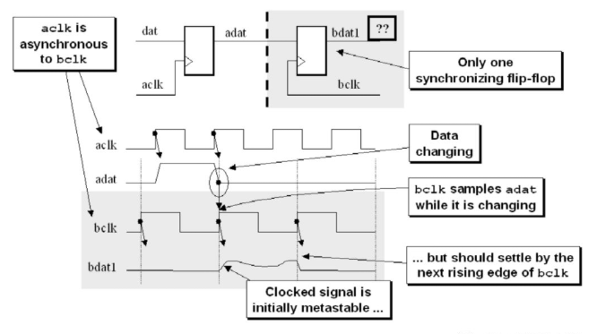
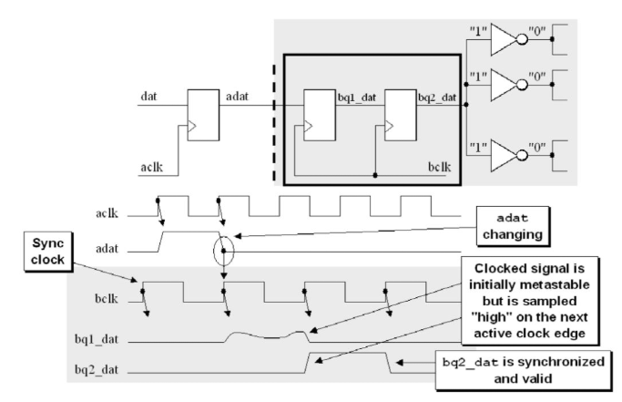
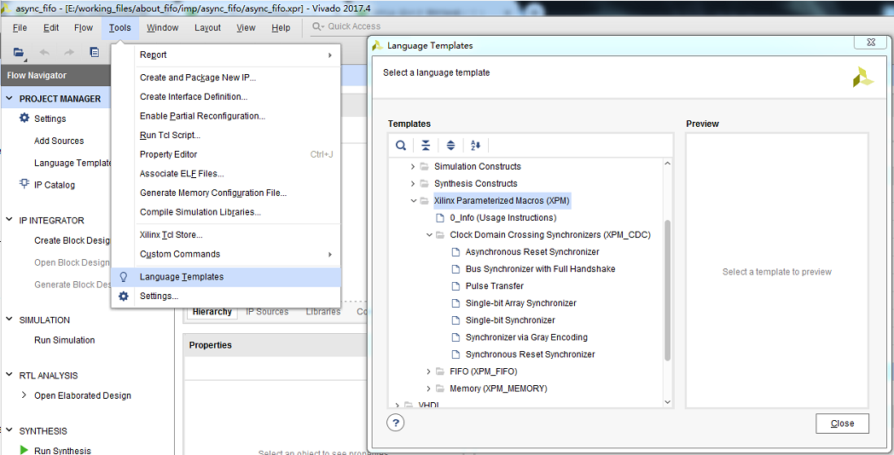
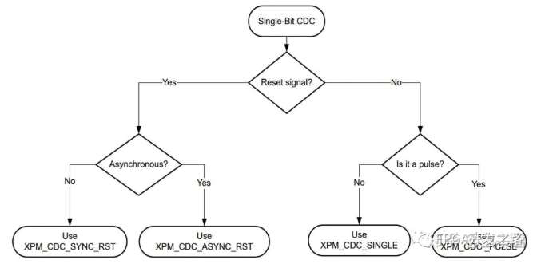
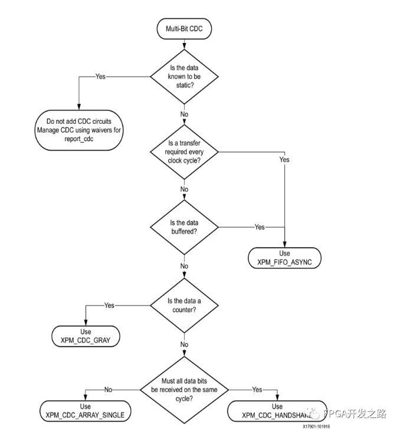
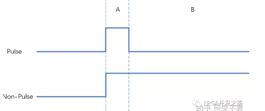
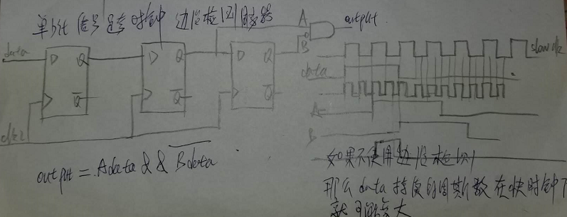

## 跨时钟域传输

### 亚稳态的概念和原理

1. 亚稳态是指处触发器无法在某个规定时间段内达到一个可确认的状态
2. 当一个触发器进入亚稳态时，既无法确定该单元的输出电平，也无法预测何时输出才能稳定在某个正确的电平上
3. 在这个期间，触发器输出一些中间级电平，或者可能处于震荡状态，并且这种无用的输出电平可以演信号通道上的各个触发器级联式的传播下去 

> 亚稳态的消除就是在不同时钟域之间正确传输信号
>
> 我们都知道数字电路中有两个最重要的概念，建立时间和保持时间。通过满足建立时间和保持时间，我们可以确保信号被正确的采样，即1采到便是1，0采到便是0。但是如果不满足建立时间和保持时间，采到的信号会进入一个不稳定的状态，无法确定是1还是0，我们称之为亚稳态。这个亚稳态的信号会在一段时间内处于震荡状态，直到稳定，而稳定后的状态值与被采样值无关，可能是0也可能是1。由于亚稳态的信号会在一段时间内处于震荡状态，后续不同的逻辑可能会将该信号识别为不同的状态值，甚至是后续逻辑也出现亚稳态的情况，导致逻辑的错误和混乱，比如状态机出现错误的跳转从而锁死在某个状态。



### 亚稳态发生的概率

亚稳态发生的概率的大小一般可以用MTBF（Mean Time Between Faliure）来表示。平均故障间隔时间，MTBF形容发生两次亚稳态之间的平均间隔时间，MTBF的值越小表示亚稳态发生的频率越高。从下面的公式中看出亚稳态不可能从根本上消除，但可以通过采取一定的措施使其对电路的影响降低，当时钟频率越高，数据发生变化的频率越高，MTBF越小，即亚稳态发生的频率也越高

- 公式： $MTBF = (e^{t_{MET}/C_2})/(C_1f_{clk}f_{data})$
  - $f_{clk}$  ==>接收时钟域的时钟频率
  - $f_{data}$ ==>数据的变化频率
  - $c_1,c_2$  ==>与器件有关的参数，一般不会发生变化，取决于芯片工艺
  - $t_{MET} $  ==>寄存器从时钟上升沿触发后的时序余量时间
    - 如果要提升$t_{MET}$ ，需要降低$t_{data}$ （$t_{data}$==>两个寄存器之间的逻辑延迟以及走线延迟之和）

### 两级触发器同步器

为避免上述亚稳态问题，使参数MTBF尽可能的大，最常用的同步器是两级触发器，常用于慢时钟域转换到快时钟域，第一级触发器采样后出现亚稳态，第二级触发器在经过一个时钟周期的等待之后采样到一个稳定状态的信号，达到消除不定态的目的。同步器消除不定态，减小亚稳态发生概率（不能完全消除亚稳态的发生）。同步器的使用只是消除了不定态，但是同步器的输出仍然可能是错误的，可能被采样的信号是1，但是同步器输出的确是0。这样的错误是否是电路可以接受的要依据不同的设计来看，这便涉及到另外一个话题，如何使系统对产生的错误不敏感，本文暂不讨论。

两级触发器的优点是结构简单，易于实现，面积消耗小；缺点是增加了两个时钟周期，对时钟性能有消极影响，快时钟域转到慢时钟域时，易造成慢时钟采样丢失，还没来得及采样，数据就变化了

使用几级DFF进行异步信号同步最合适？

- 两级寄存器已经可以将亚稳态出现的概率降的足够低，因此二级就可以了。对于典型的0.25um工艺的asic器件，MTBF = 2.01（day），也就是说每隔两天便可能出现一次亚稳态，同样参数，在使用双寄存器法后，这个时间可以延迟到$10^9$年
- 对于一些高频电路设计，两级触发器所构成的同步器MTBF仍然很小，这时候可以考虑再添加一级触发器，即使用三级触发器。另外，我们也希望当数据被异步时钟采样时数据的变化频率也尽可能小，因此一般数据在跨时钟域之前最好可以用寄存器打一拍，减少数据的变化，从而减小亚稳态发生的概率。

如图在一个信号进入另一个时钟域前，将该信号用两个锁存器连续锁存两次，最后得到的采样结果就可以消除亚稳态问题，一个信号在过渡到另一个时钟域时，如果仅仅在一个触发器将其锁存，那么$b_{clk}$进行采样的结果可能是亚稳态，这也是信号在跨时钟域应该注意的问题




### Xilinx Parameterized Macros（XPMs）

RTL代码方式具有较强的可控性和可测性，但未必能获得最优的综合结果；原语方式看似精确但过于繁琐，因为给用户暴露出过多的端口和属性，而实际用户用到的并不多；IP Core是比较快速且灵活的方式，也能根据性能或资源需求获得期望的综合结果，但如果需要更换Memory的实现方式例如把分布式RAM换成BRAM，就需要重新调用IP生成。相比之下，XPM就很好地继承了这些方式的优点。XPM是Xilinx提供的一种宏（Xilinx Parameterized Macros），从字面上就可以看到这是一种可参数化的方式。关于CDC的设计，Xilinx提供了一套 library，是Xilinx Parameterized Macros（XPMs）的一个子集。而对这些XPMs的使用，Xilinx将其分为单比特和多比特两类，并提供了选择的方法。







### 单比特跨时钟域

1. 复位信号

   - 单比特信号中的复位信号在[关于复位](./关于复位.md)中已经阐述清楚

2. 脉冲信号或电平信号

   - 脉冲（pulse）或电平（level）跨时钟域一般从两个方面考虑问题，即
     - 从**慢时钟域**到**快时钟域**
       - 电平信号的从慢到快只需要考虑亚稳态，所以使用双寄存器法消除不定态
       - 脉冲信号还需要考虑采样到几个脉冲，所以使用边沿检测同步电路法
     - 从**快时钟域**到**慢时钟域**
       - 

   

   - 对于慢到快的电平（非Pulse)信号，在A或B区域内都可以采样。非Pulse信号由于保持稳定的1，最后总会遇到时钟沿被采到。使用两级触发器同步器用来同步一个电平信号到目标时钟域。由于电平信号会保持电平不变，我们不需要担心采不到正确的电平值，所以只需要简单的两级寄存器同步器即可。

     ```verilog 
     always@(posedge clk)
         if(!rst)
             src_in_reg  <= 2'b0;
     	else 
             src_in_reg  <= 	{src_in_reg[0],src_in};
     assign dest_in = src_in_reg[1];
     ```

   - 对于慢到快Pulse信号，时钟沿必须在A区域内才能采样到1，如果是快时钟域到慢时钟域的CDC，那么很可能在A区域内都看不到时钟沿。这导致了两者同步器设计的不同。脉冲同步器先将输入的脉冲信号转化为了一个电平信号，电平信号被同步到目标时钟域后再被转回成脉冲信号输出，从而实现了一个脉冲信号的同步。

### 多比特信号跨时钟域

1. Is the data known to be static ?
   - 
2. Is a transfer required every clock ? / Is the data buffered ? 
3. Is the data a counter 
4. Must all data bits be received on the same cycle


1. 单bit信号跨时钟域如何传输

   1. 边沿检测同步电路（慢到快）

      

      1. 这种方法通常应用在慢速时钟向快速时钟传递过程中，可以检测输入信号的上升沿，也可以检测她的下降沿 
      2. 使用条件
         1. 输入数据的宽度必须必一个接受时钟周期加上一个同步触发器的hold时间要长，最安全的就是两个同步周期宽度
         2. 慢时钟域的脉冲保持到被快时钟的同步器拿到 

   2. 脉冲同步基本功能（快到慢）

      1. 从快时钟域去除一个单时钟宽度脉冲，然后在慢时钟域中建立另一个单时钟宽度的脉冲

   3. 结绳法

      

      1. 信号从快时钟到慢时钟过渡时，慢时钟将可能无法对变化太快的信号实现正确采样
      2. 双锁存器，脉冲，边沿这三种方法对两个时钟之间的关系要求很严格，结绳法使用任何时钟域的过渡
      3. 原理
         1. 将快时钟域信号的脉冲周期延长，等到慢时钟同步采样后再解绳，还原为原来的脉冲宽度 
      4. 结绳法优缺点
         1. 可以实现快时钟想慢时钟过渡的问题，使用范围广
         2. 结绳法实现比较复杂，特别是效率不高，在对设计性能要求较高的场合慎用

   4. 慢到快如何实现

      1. 双锁存器法
      2. 边沿检测同步电路

   5. 快到慢如何实现

      1. 脉冲同步器（有条件的）
      2. 结绳法（较为复杂）
      
   6. 采样中，快到慢，与，慢到快，在考虑问题时有什么区别，为什么不能用慢时钟直接采样快时钟域的信号

      1. 慢到快只要考虑亚稳态问题
      2. 快到慢处了亚稳态问题外，还需要考虑慢时钟的采样速率问题，因为根据采样定理采样频率低于信号最高频率的两倍的时候，是无法完整采样的


​		跨时钟域处理是 FPGA 设计中经常遇到的问题，而如何处理好跨时钟域间的数据，可以说是每个FPGA初学者的必修课。这里主要介绍3 种跨时钟域处理的方法，这3 种方法可以说是FPGA 界最常用也最实用的方法，这三种方法包含了单bit和多bit数据的跨时钟域处理，学会这 3 招之后，对于FPGA 相关的跨时钟域数据处理便可以手到擒来。其中之一就是直接使用异步ram，异步fifo异步ram，异步fifo，处理多 bit 数据的跨时钟域，一般采用异步双口 RAM。当然，在能使用异步双口RAM来处理跨时钟域的场景中，也可以使用异步FIFO来达到同样的目的

我自己常用的两个跨时钟处理方法：1)打两拍；2)格雷码转换；

1. 打两拍（单比特）
   - 打两拍实际的电路图就是双锁存器电平同步，常用于处理单比特电路跨时钟域
   - 应该很多人都会问，为什么是打两拍呢，打一拍、打三拍行不行呢？根据MTBF公式，多了对效果提升不大，反而增加时延
2. 格雷码转换（多比特）
   - 格雷码将多比特转换为单比特，即在连续变化的数据里，可以将需要跨时钟域的数据转换为格雷码，这样每次只变换1bit将问题转到打两拍上
   - 使用各类跨时钟域是，要注意跨时钟域处理有时将时钟设置为set false path，但使用格雷码后进行时钟约束时要注意约束set_max_delay 不要超过两个时钟域中最小的时钟周期


