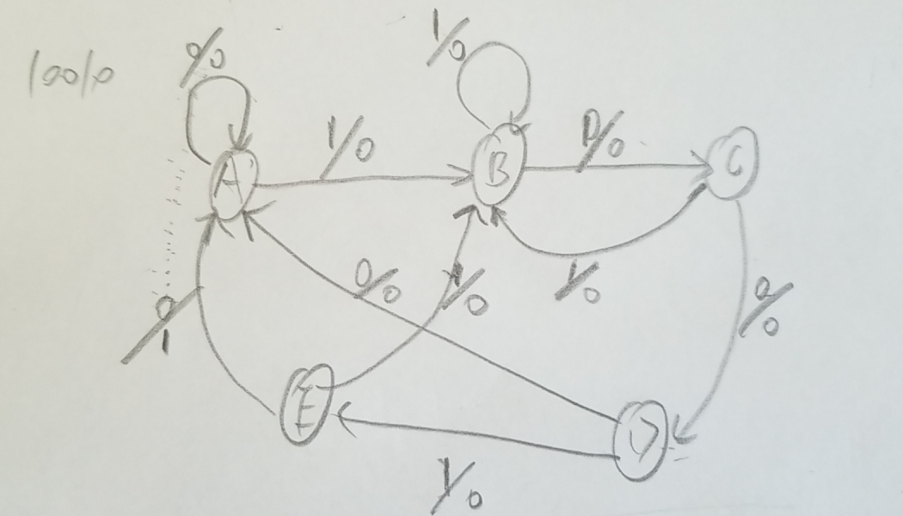
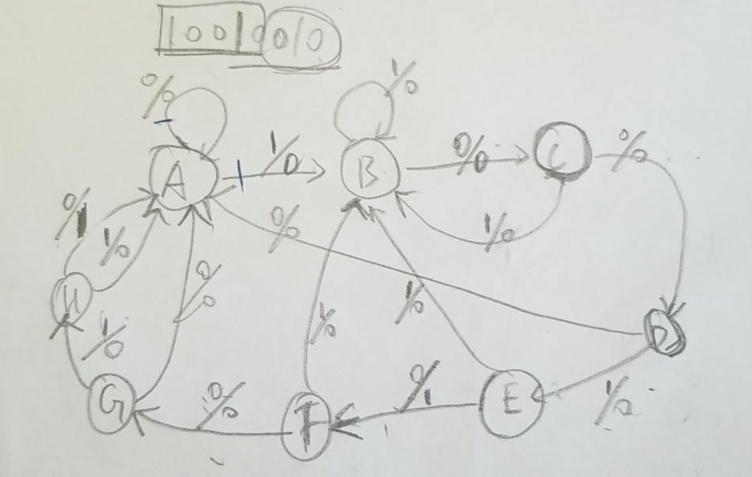
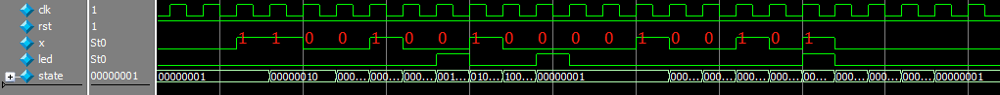
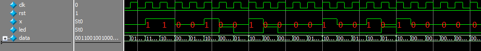
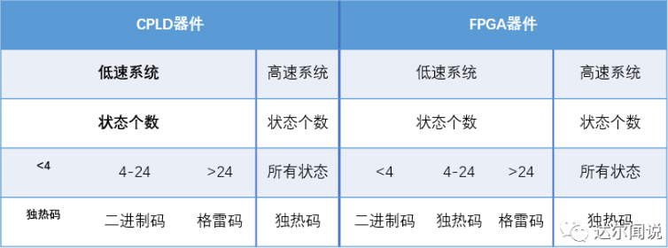
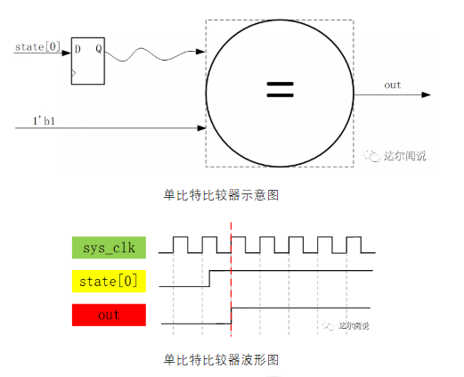
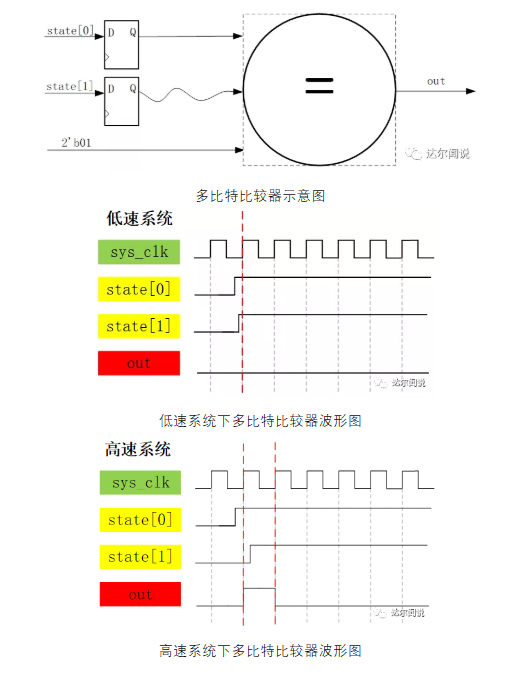

## 实验内容

状态机的写法，看了这个贴子，保证弄懂状态机，其他帖子就不用看了

状态机三种写法的示例，实现一个序列检测机，检测hello

```verilog
//一段式有两种写法
//一段式相较两段式，输出会延时一拍，这不知道是错了还是正常的-_-@
module seq_check_hello(
	clk,
	rst,
	x,
	led
);

input clk;
input rst;
input [7:0]x;

output reg led;

localparam	check_H  = 5'b00001,
				check_e  = 5'b00010,
				check_l1 = 5'b00100,
				check_l2 = 5'b01000,
				check_o  = 5'b10000;

reg [4:0]state;

always@(posedge clk or negedge rst)
	if(!rst)
		begin
			state <= check_H;
			led <= 1'b0;
		end
	else 
		case(state)
			check_H : begin
				led <= 1'b0;
				if(x == "H")
					state <= check_e;
				else
					state <= check_H;
			end
			
			check_e : begin
				led <= 1'b0;
				if(x == "e")
					state <= check_l1;
				else if(x == "H")
					state <= check_e;
				else 
					state <= check_H;
			end
			
			check_l1: begin
				led <= 1'b0;
				if(x == "l")
					state <= check_l2;
				else if(x == "H")
					state <= check_e;
				else
					state <= check_H;
			end
			
			check_l2: begin
				led <= 1'b0;
				if(x == "l")
					state <= check_o;
				else if(x == "H")
					state <= check_e;
				else
					state <= check_H;
			end
			
			check_o : begin
				if(x == "o")
					begin
						state <= check_H;
						led <= 1'b1;
					end
				else if(x == "H")
					begin
						state <= check_e;
						led <= 1'b0;
					end
				else 
					begin
						state <= check_H;
						led <= 1'b0;
					end
			end
			
			default: begin
				state <= state;
				led <= 1'b0;
			end
		endcase 

endmodule 
```

```verilog
//两段式
module seq_check_hello2(
	clk,
	rst,
	x,
	led
);

input clk;
input rst;
input [7:0]x;

output reg led;

localparam	check_H  = 5'b00001,
				check_e  = 5'b00010,
				check_l1 = 5'b00100,
				check_l2 = 5'b01000,
				check_o  = 5'b10000;

reg [4:0]state;
always@(posedge clk or negedge rst)
	if(!rst)
		state <= check_H;
	else 
		case(state)
			check_H : begin
				if(x == "H")
					state <= check_e;
				else
					state <= check_H;
			end
			
			check_e : begin
				if(x == "e")
					state <= check_l1;
				else if(x == "H")
					state <= check_e;
				else 
					state <= check_H;
			end
			
			check_l1: begin
				if(x == "l")
					state <= check_l2;
				else if(x == "H")
					state <= check_e;
				else
					state <= check_H;
			end
			
			check_l2: begin
				if(x == "l")
					state <= check_o;
				else if(x == "H")
					state <= check_e;
				else
					state <= check_H;
			end
			
			check_o : begin
				if(x == "o")
					state <= check_H;
				else if(x == "H")
					state <= check_e;
				else 
					state <= check_H;
			end
			
			default: state <= state;
		endcase 

//状态机两段式写法，将状态跳转与输出分开来写
//可以看得出来这是一个mealy型的状态机（不仅与当前状态有关，也与当前输入有关）
//这里的第二段采用了时序来写
/*
always@(posedge clk or negedge rst)
	if(!rst)
		led <= 1'b0;
	else if(state == check_o && x == "o")
		led <= 1'b1;
	else 
		led <= 1'b0;
*/
	
//当然也可以使用组合电路来写
always@(*)
	if(state == check_o && x == "o")
		led = 1'b1;
	else
		led = 1'b0;
		
endmodule 
```

```verilog
//三段式
module seq_check_hello3(
	clk,
	rst,
	x,
	led
);

input clk;
input rst;
input [7:0]x;

output reg led;

localparam	check_H  = 5'b00001,
				check_e  = 5'b00010,
				check_l1 = 5'b00100,
				check_l2 = 5'b01000,
				check_o  = 5'b10000;

reg [4:0]cstate;//current_state
reg [4:0]nstate;//next_state
//状态机三段式写法，在二段式的基础上，将当前状态与下一状态分开
always@(posedge clk or negedge rst)
	if(!rst)
		cstate <= check_H;
	else 
		cstate <= nstate;	

always@(cstate or x or rst)
	begin
		if(!rst)
			nstate = check_H;
		else begin
			case(cstate)
				check_H :begin
					if(x == "H")
						nstate = check_e;
					else 
						nstate = check_H;
				end
				check_e :begin
					if(x == "e")
						nstate = check_l1;
					else if(x == "H")
						nstate = check_e;
					else 
						nstate = check_H;
				end
				check_l1:begin
					if(x == "l")
						nstate = check_l2;
					else if(x == "H")
						nstate = check_e;
					else 
						nstate = check_H;
				end
				check_l2:begin
					if(x == "l")
						nstate = check_o;
					else if(x == "H")
						nstate = check_e;
					else 
						nstate = check_H;
				end
				check_o :begin
					if(x == "H")
						nstate = check_e;
					else 
						nstate = check_H;
				end
				default: nstate = nstate;
			endcase
		end
	end


always@(cstate or x or rst)
	if(!rst)
		led <= 1'b0;
	else if(cstate == check_o && x == "o")
		led <= 1'b1;
	else 
		led <= 1'b0;

endmodule 

```


#### 10010 序列检测所遇到的问题 

1. 一般状态机的状态转移，与输出是可以通过实际需要提炼出来，需要特别**注意**一种状态机——序列检测机，尤其是数字序列，比如检测10010，不知道大家怎么检测这个序列，我刚开始按照下图写的状态机，发现有问题 

   

   后来仔细观察发现有一个序列没有考虑到——10010010，在这个序列中有两个10010，而用上一个状态机只能检测出一个，所以换了下面的状态转移

   

   这样就解决了问题

   经仿真后，波形如下图所示

   

2. 但是此时的输出总是有一拍的延迟，这个问题怎么解决呢如果需要解决的话

   1. 还是状态转移图的问题，很明显，上图所示，输出就是会在下一拍输出，但是将状态机拆成两段式，输出是一段，状态跳转是一段，将输出写为组合逻辑，输出就会没有那一拍的延迟

      

#### 状态机的一些内容归纳整理

1. **好的状态机标准**，好的状态机的标准很多，最重要的几个方面如下：

   - 第一，状态机要安全，是指FSM不会进入死循环，特别是不会进入非预知的状态，而且由于某些扰动进入非设计状态，也能很快的恢复到正常的状态循环中来。这里面有两层含义：其一要求该FSM的综合实现结果无毛刺等异常扰动；其二要求FSM要完备，即使受到异常扰动进入非设计状态，也能很快恢复到正常状态。
   - 第二，状态机的设计要满足设计的面积和速度的要求。
   - 第三，状态机的设计要清晰易懂、易维护。

2. **状态机描述方法**，状态机描述时关键是要描述清楚几个状态机的要素，即如何进行状态转移，每个状态的输出是什么，状态转移的条件等。时序电路的状态是一个状态变量集合，这些状态变量在任意时刻的值都包含了为确定电路的未来行为而必需考虑的所有历史信息。一般来说，**状态转移部分是同步时序电路**而**状态的转移条件的判断是组合逻辑**。

   1. 具体描述时方法各种各样，最常见的有三种描述方式：
      1. 一段式：整个状态机写到一个always模块里面，在该模块中既描述状态转移，又描述状态的输入和输出；
      2. 二段式：用两个always模块来描述状态机，其中一个always模块采用同步时序描述状态转移；另一个模块采用组合逻辑判断状态转移条件，描述状态转移规律以及输出；FSM将时序部分（状态转移部分）和组合部分（判断状态转移条件和产生输出）分开，写为两个always语句，即为两段式有限状态机。
      3. 三段式：在两个always模块描述方法基础上，将组合部分中的判断状态转移条件和产生输入再分开写，使用三个always模块，一个always模块采用同步时序描述状态转移，一个always采用组合逻辑判断状态转移条件，描述状态转移规律，另一个always模块描述状态输出(可以用组合电路输出，也可以时序电路输出)。
   2. **一般而言，推荐的FSM 描述方法是后两种。**
      1. 这是因为：FSM和其他设计一样，最好使用**同步时序方式设计**，以提高设计的稳定性，消除毛刺。二段式在组合逻辑特别复杂时适用，但要注意需在后面加一个触发器以消除组合逻辑对输出产生的毛刺。三段式没有这个问题，由于第三个always会生成触发器。
      2. 第二种描述方法同第一种描述方法相比，将同步时序和组合逻辑分别放到不同的always模块中实现，这样做的好处不仅仅是便于阅读、理解、维护，更重要的是利于综合器优化代码，但是在第二种方式的描述中，描述当前状态的输出用组合逻辑实现，组合逻辑很容易产生毛刺，而且不利于约束，不利于综合器和布局布线器实现高性能的设计。第三种描述方式与第二种相比，关键在于根据状态转移规律，在上一状态根据输入条件判断出当前状态的输出，从而在不插入额外时钟节拍的前提下，实现了寄存器输出。
      3. 对于复杂的状态机建议分为三个always段完成。三段式建模描述FSM的状态机输出时，只需指定case敏感表为次态寄存器，然后直接在每个次态的case分支中描述该状态的输出即可，不用考虑状态转移条件。三段式描述方法虽然代码结构复杂了一些，但是换来的优势是：使FSM做到了同步寄存器输出，消除了组合逻辑输出的不稳定与毛刺的隐患，而且更利于时序路径分组，一般来说在FPGA/CPLD等可编程逻辑器件上的综合与布局布线效果更佳。

3. **状态编码原则**

   1. 二进制（binary）和格雷码（gray-code）适用于触发器资源较少，组合电路资源丰富的情况（CPLD），对于FPGA，适用one-hot code。这样不但充分利用FPGA丰富的触发器资源，还因为只需比较一个bit，速度快，组合电路简单。其中一般规律如下图所示

      

   2. **原因：**

      1. 首先独热码因为每个状态只有1bit是不同的，所以在执行状态跳转时，综合器会识别出这是一个比较器，而因为只有1比特为1，这就相当于把之前多比特的比较器变为了1比特的比较器，**大大节省了组合逻辑资源**；
      2. 但是付出的代价就是状态变量的位宽需要的比较多，而我们FPGA中组合逻辑资源相对较少，所以比较宝贵，而寄存器资源较多，所以很完美。
      3. 而二进制编码的情况和独热码刚好相反，他因为使用了较少的状态变量，使之在减少了寄存器状态的同时无法进行比较器部分的优化，所以使用的寄存器资源较少，而使用的组合逻辑资源较多；我们还知道CPLD就是一个组合逻辑资源多而寄存器逻辑资源少的器件。
      4. 对于FPGA器件，使用独热码进行编码。就因为这个比较部分的优化，还使得使用独热码编码的状态机可以在高速系统上运行，其原因是多比特的比较器每个比特到达比较器的时间可能会因为布局布线的走线长短而导致路径延时的不同，这样在高速系统下，就会导致采集到不稳定的状态，导致比较后的结果产生一个时钟的毛刺，使输出不稳定，而单比特的比较器就不用考虑这种问题。
      5. 用独热码编码虽然好处多多，但是如果状态数非常多的话即使是FPGA也吃不消独热码对寄存器的消耗，所以当状态数特别多的时候可以使用格雷码对状态进行编码。格雷码虽然也是和二进制编码一样使用的寄存器资源少，组合逻辑资源多，但是其相邻状态转换时只有一个状态发生翻转，这样不仅能消除状态转换时由多条信号线的传输延迟所造成的毛刺，又可以降低功耗，所以要优于二进制编码的方式，相当于是独热码和二进制编码的折中。







#### tips

1. FSM输出可以适用task

2. FSM中的case最好加上default，默认态可以设为初始态

3. 第二段的always(组合部分，赋值用=)里面判断条件一定要包含所有情况！可以用else保证包含完全。

4. 第二段always中**，组合逻辑电平要维持超过一个clock，仿真时注意。****

5. ```verilog
   //识别独热码, a = width'bxxxxxxx;
   genvar i;
   generate 
       for(i=0; i<width; i=i+1)
           begin :high
               if(i == 0)
                   assign mask_high[i] = a[i];
               else 
                   assign mask_high[i] = a[i] ^ mask_high[i-1];
           end
   endgenerate 
   assign is_onehot = (&(mask_high | ~a)) & (|a) ;
   assign is_onehot = mask_high[width - 1] & (&(mask_high[width - 2:0] | ~a[width - 2:0]));
   assign is_mass = ~&(mask_high | ~a);
   ```