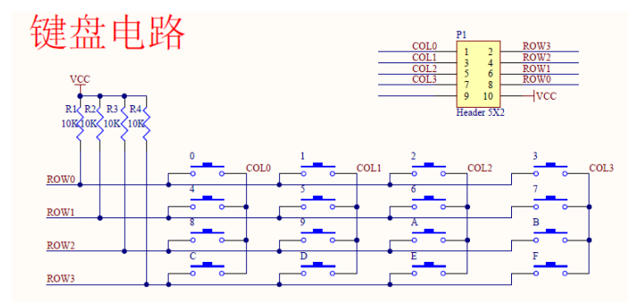
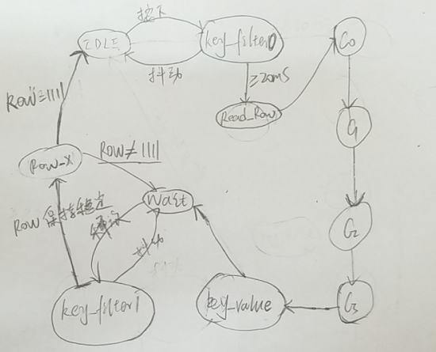
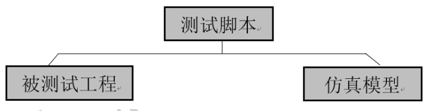

1. 从物理层抽象出来状态机，以按键消抖为例
   1. 按键在未被按下时状态为高电平，按下后为低电平，按下与释放按键都会存在一段时间的抖动期，这个抖动的存在对电路的设计时极其不好的，可能会让电路处于未知状态，所以设计电路中需要用到按键的，一定要设计他的消抖电路，设计的消抖电路要能滤除抖动，并且能输出按键的状态以及按键被按下的时刻，所以设计的模块输入为按键，输出为按键状态以及按键被消除抖动后按键被按下的标志，一般情况下我们认为抖动时间不超过20ms，超过20ms我们即认为按键被按下或被释放
   2. 
   3. 上图是按键在被按下与被释放使电路的状态，根据上图抽象出他的状态转移图
   4. 
   5. 在写一个电路之前，我们不仅要知道他大概的实际电路，也要能够想象出该电路的时序图如下图所示
   6. 
   7. 仿真后实际的波形展示
   8. 
   
2. 关于矩阵按键

   1. 通过原理图我们可以看出，可以通过八个引脚得到一个4X4的矩阵键盘，将行（row）连接上拉电阻，在列（col）连接到地，这样在没有按键按下时行（row）维持在高电平，有按键按下时，某一行的电平为0

   2. 

   3. 如何实现矩阵电路的检测呢，或者说如何知道按下的是哪一个按键呢，注意是一个键？

      1. 这里要引入一个扫描的概念

      2. 将行设置为输入，列设置为输出，建立一个状态机

      3. 如果行的输入不都为1，那么启动扫描，即将列值输出设置为 

         ```col <= 4'b0111; col <= {col[2:0], col[3]}```

      4. 即将从来循环左移，列值每变化一次，将输入的行值寄存下来

      5. 检测行值，记录行值的变化，注意不是此时的行值，是变化

      6. 也就是说，要记住被消抖后的行值，此时的行值，此时的列值

      7. 行列确定后，就可以确定是哪一个键被按下

      8. 对于两个键也是可以被检测出来的，如果检测多个同时被按下，只不过寄存器要多一些

      9. 本人不为这句话负责：最多能同时检测多少个按键呢？我感觉是十六个，没有理论验证过，有兴趣的可以验证一下，但是复杂度会上升不少

      10. 这里只说只能检测一个按键的状态机，如果检测器发现有两个键被按下，则为检测失败

      11. 但也有检测失败的时候，比如恰好在检测第二行时发生抖动，检测失败则状态机进入等待释放状态，检测下一次

   4. 下图为矩阵按键的状态跳转图
   
   5. 
   
3. 仿真模型

   4. 

   2. ```verilog 
      //file name tb_key_4x4;
      `timescale 1ns/1ns
      `define clk_period 20
      
      module tb_key_4x4();
      
      reg clk;
      reg rst;
      wire [3:0]key_row;
      wire [3:0]key_col;
      wire key_flag;
      wire [3:0]key_value;
      
      key_4x4 key_4x4(
          .clk(clk),
          .rst(rst),
          .key_row(key_row),
          .key_col(key_col),
          .key_flag(key_flag),
          .key_value(key_value)
      );
      
      
      key_model key_mode_inst(key_col,key_row);
          
      initial clk = 1'b1;
      always#(`clk_period/2) clk = ~clk;
      
      initial begin
          rst = 1'b0;
          #200
          rst = 1'b1;
      end
          
      endmodule 
      //end file 
      ```

   3. ```verilog 
      //file name key_model;
      module key_model(
          key_col,
          key_row
      );
      
      input [3:0]key_col;
      output reg [3:0]key_row;
      
      reg [3:0]key_row_r;
      reg key_row_sel;
      reg [1:0]now_col, now_row;
      
      initial begin
          now_col = 0;
          now_row = 0;
          key_row_sel = 0;
      end
      
      
      initial begin
          key_row = 4'b1111;
          #50_000_000;
          press_key(0,3);
          press_key(1,2);
          press_key(2,1);
          press_key(3,0);
      end
      
      
      reg [15:0] shake_time = 0;
      task press_key;
          input [1:0]col,row;//注：不用在任务函数外进行定义
          begin
              key_row_sel = 0;
              key_row_r = 4'b1111;
              key_row_r[row] = 0;
              now_row = row;
              repeat(20)begin
                  shake_time = {$random}%65536;
                  #shake_time;
                  key_row_r[row] = ~key_row_r[row];
              end
              key_row_sel = 1;
              now_col = col;
              #50_000_000;
              key_row_sel = 0;
              key_row_r = 4'b1111;
             repeat(20)begin
                  shake_time = {$random}%65536;
                  #shake_time;
                  key_row_r[row] = ~key_row_r[row]; 
              end
              key_row_r = 4'b1111;
              #50_000_000;
          end
      endtask
      
      always@(*)
          if(key_row_sel)
              case(now_row)
                  2'd0: key_row = {1'b1,1'b1,1'b1,key_col[now_col]};
                  2'd1: key_row = {1'b1,1'b1,key_col[now_col],1'b1};
                  2'd2: key_row = {1'b1,key_col[now_col],1'b1,1'b1};
                  2'd3: key_row = {key_col[now_col],1'b1,1'b1,1'b1};
              endcase 
          else 
              key_row = key_row_r;
      
      endmodule 
      //end file 
      ```

task的写法

```verilog 
reg key_in;
reg [15:0]shake_time;
task key_press;
	begin
		key_in = 1'b1;
		repeat(20)begin
			shake_time = {$random}%65536;
			#shake_time;
			key_in = ~key_in;
		end
		key_in = 1'b0;
		#50_000_000;
	end
endtask
task key_release;
	begin
		key_in = 1'b0;
		repeat(20)begin
			shake_time = {$random}%65536;
			#shake_time;
			key_in = ~key_in;
		end
		key_in = 1'b1;
		#50_000_000;
	end
endtask

//矩阵按键仿真
//写这个是因为task的有输入的
task press_key
    input [1:0]row,col;
    begin
       key_row_sel 
    end
endtask

```

