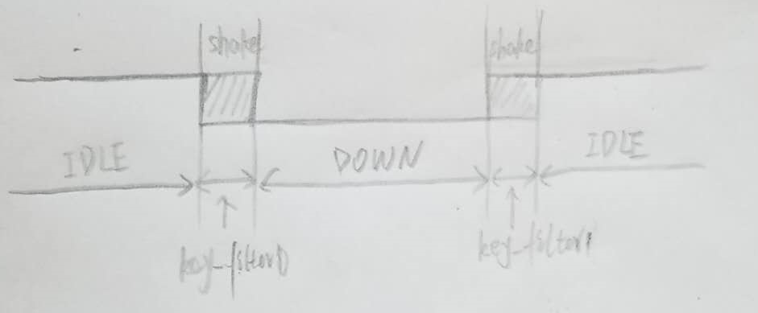
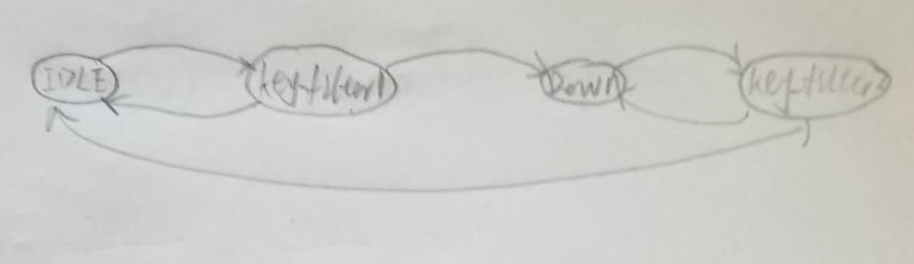
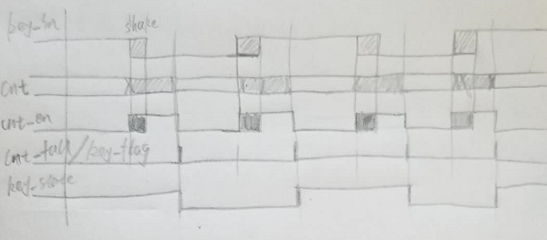
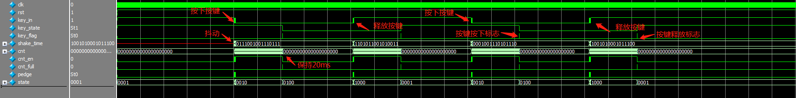

1. 从物理层抽象出来状态机，以按键消抖为例
   1. 按键在未被按下时状态为高电平，按下后为低电平，按下与释放按键都会存在一段时间的抖动期，这个抖动的存在对电路的设计时极其不好的，可能会让电路处于未知状态，所以设计电路中需要用到按键的，一定要设计他的消抖电路，设计的消抖电路要能滤除抖动，并且能输出按键的状态以及按键被按下的时刻，所以设计的模块输入为按键，输出为按键状态以及按键被消除抖动后按键被按下的标志，一般情况下我们认为抖动时间不超过20ms，超过20ms我们即认为按键被按下或被释放
   2. 
   3. 上图是按键在被按下与被释放使电路的状态，根据上图抽象出他的状态转移图
   4. 
   5. 在写一个电路之前，我们不仅要知道他大概的实际电路，也要能够想象出该电路的时序图如下图所示
   6. 
   7. 仿真后实际的波形展示
   8. 
2. 关于矩阵按键
   1. 矩阵按键原理

task的写法

```verilog 
reg key_in;
reg [15:0]shake_time;
task key_press;
	begin
		key_in = 1'b1;
		repeat(20)begin
			shake_time = {$random}%65536;
			#shake_time;
			key_in = ~key_in;
		end
		key_in = 1'b0;
		#50_000_000;
	end
endtask
task key_release;
	begin
		key_in = 1'b0;
		repeat(20)begin
			shake_time = {$random}%65536;
			#shake_time;
			key_in = ~key_in;
		end
		key_in = 1'b1;
		#50_000_000;
	end
endtask

//矩阵按键仿真
//写这个是因为task的有输入的
task press_key
    input [1:0]row,col;
    begin
       key_row_sel 
    end
endtask

```

