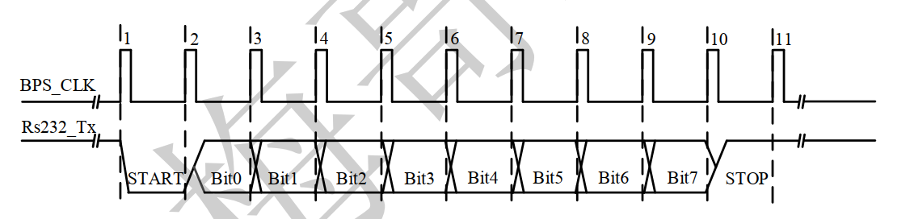
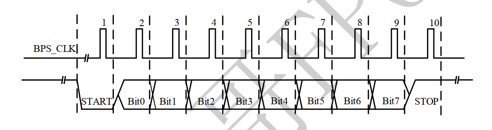
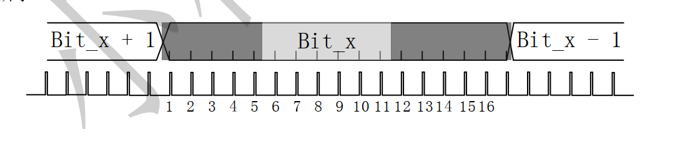

1. uart
   1. 通用异步收发传输器（Universal Asynchronous Receiver/Transmitter， UART）是一种异步收发传输器，其在数据发送时将并行数据转换成串行数据来传输， 在数据接收时将接收到的串行数据转换成并行数据， 可以实现全双工传输和接收。
   2. UART是串行异步通信的总称，包括了 RS232、 RS449、 RS423、RS422 和 RS485 等接口标准规范和总线标准规范 ，这些标准规定了通信口的电气特性、传输速率、 连接特性和接口的机械特性等内容。
   3. RS-232是美国电子工业联盟（EIA）制定的串行数据通信的接口标准，原始编号全称是 EIA-RS-232（简称 232， RS232），被广泛用于计算机串行接口外设连接。
   4. UART 通信在使用前需要做多项设置，最常见的设置包括数据位数、波特率大小、奇偶校验类型和停止位数。  
      1. 数据位（Data bits）：该参数定义单个 UART 数据传输在开始到停止期间发送的数据位数。 可选择为： 5、 6、 7 或者 8（默认）。  
      2. 波特率（Baud）：是指从一设备发到另一设备的波特率，即每秒钟可以通信的数据比特个数。 典型的波特率有 300, 1200, 2400, 9600, 19200, 115200 等。一般通信两端设备都要设为相同的波特率，但有些设备也可设置为自动检测波特率。  
      3. 奇偶校验类型（Parity Type）：是用来验证数据的正确性。  如果用户选择数据长度为 8 位，则因为没有多余的比特可被用来作为奇偶校验位，因此就叫做“无奇偶校验（Non） ”。  
      4. 停止位（Stop bits）： 在每个字节的数据位发送完成之后，发送停止位，来标志着一次数据传输完成，同时用来帮助接受信号方硬件重同步。 可选择为： 1（默认）、 1.5 或者 2 位。
      5. 在 RS-232 标准中， 最常用的配置是 8N1(即八个数据位、 无奇偶校验、 一个停止位) 。
   5. uart发送与接收8N1的数据
   6. 
   7. 
   8. 在接受一个字节时，上图为采样一次，由于比特率的计算问题可能会采样不准，所以我们可以将1bit分成16份，将中间六个的采样叠加，如下图所示
   9. 
   10. 这里和按键检测一样，也是一个单比特的异步时钟信号，所以先打两拍将信号稳定，再检测其下降沿。
   11. 检测到下降沿之后，对开始位采样，如果采样值大于设置的阈值，则认为这是一个干扰信号，放弃检测
   12. 其次在这个实验中进行了回环测试，即使用调用ISSP的IP核，通过这个IP核设置采样信号与发送信号，通过计算机的串口助手进行调试
   13. 对于按键的话这里有个问题，key_state信号反映的是稳定的按键状态，key_flag反映的是按键状态变化的标志，所以要仔细考虑这两个信号的时序关系，尽量做到知其然知其所以然。
   14. 