ram的使用

rom的使用

fifo的使用

signal tap II 的使用	

in-system memory content editor的使用

1. RAM的使用

   1. 嵌入式存储器结构由一列列 M9K 存储器模块组成，通过对这些 M9K 存储器模块进行配置，可以实现各种存储器功能，例如： RAM、移位寄存器、 ROM 以及 FIFO 缓冲器。

   2. 使用quartus的定制ip核定制一个深度为256，宽度为8位的双端口（读写）RAM存储器，并对存储器进行仿真

   3. ```verilog 
      //仿真代码
      `timescale 1ns/1ns
      `define clk_period 20
      
      module tb_ram_2port();
      
      reg clk;
      reg [7:0]data;
      reg [7:0]raddr;
      reg [7:0]waddr;
      reg wren;
      
      wire [7:0]q;
      
      ram_2port	ram_2port (
      	.clock ( clk ),
      	.data ( data),
      	.rdaddress ( raddr ),
      	.wraddress ( waddr ),
      	.wren ( wren ),
      	.q ( q )
      	);
      
      initial clk = 1'b1;
      always#(`clk_period/2) clk = ~clk;
      
      integer i=0;
      
      initial begin
      	data = 0;
      	raddr = 255;//这是一个点
      	waddr = 0;
      	wren = 0;
      	#(`clk_period*10+1);//关键在这个+1上
      	for(i=0; i<=5; i=i+1)begin
      		wren = 1'b0;
      		waddr = i;
      		data = {$random}%256;
      		#(`clk_period);
      	end
      	for(i=6; i<=15; i=i+1)begin
      		wren = 1'b1;
      		waddr = i;
      		data = {$random}%256;
      		#(`clk_period);
      	end
      	wren = 1'b0;
      	#200;
      	for(i=0; i<=15; i=i+1)begin
      		raddr = i;
      		#(`clk_period);
      	end
      	#200;
      	$stop;
      end
      endmodule 
      
      ```

   4. 

   5. 从上图可以看出，在wren为低电平时，数据是写不进去的，并且读写地址可以随机的指定

   6. 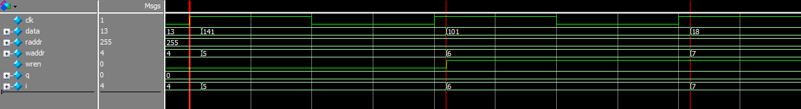

   7. 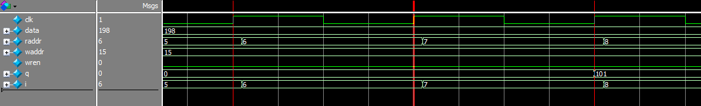

   8. 上图可以看出读地址改变后在时钟上升沿被采样，数据在采样后的下一拍时钟输出

   9. 对比6中的图片，wren = 0，数据是141，地址是5，在7中的图片可以看到，读取地址为5的数据读出数据为0，因为数据并没有被写入，ram中保存着初始值0

   10. 读地址与时钟沿错开了一点，写地址也同样向后错开一点，这是应为在仿真时```#(`clk_period*10+1);``` 这个+1模拟的是实际情况，或者这么说，信号在传播是总是有延迟，不可能恰好在时钟沿时数据变换采样到新数据，所以需要+1

2. ROM的使用

   1. 使用quartus实例化字符宽度为8，深度为256的单端口一个ROM，指定mif文件的位置并进行仿真，仿真脚本如下所示

   2. ```verilog 
      `timescale 1ns/1ns
      `define clk_period 20
      
      module tb_rom_1port();
      
      reg [7:0]addr;
      reg clk;
      wire [7:0]q;
      
      rom_1port	rom_1port_inst (
      	.address ( addr ),
      	.clock ( clk ),
      	.q ( q )
      	);
      
      initial clk = 1'b1;
      always#(`clk_period/2) clk = ~clk;
      
      integer i = 0;
      integer j = 0;
      initial begin
      	addr = z;
      	#2001;
      	for(i=0; i<=10; i=i+1)begin
      		for(j=0; j<=255; j=j+1)begin
      			addr = j;
      			#`clk_period;
      		end
      	end
      	#2000;
      	$stop;
      end
      endmodule 
      ```

   3. 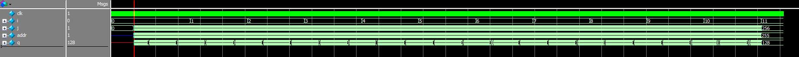

   4. 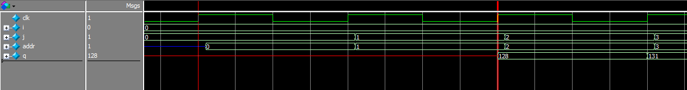

   5. 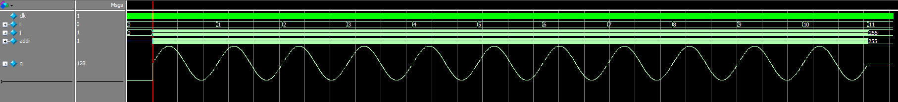

   6. 使用上面的脚本对定制的rom仿真后波形如下所示，图3是输出q为字符格式，图5输出为波形的格式（modelsim的功能之一，将数字转换为波形），从图4中可以看出数据的输出同ram一样，地址在时钟上升沿被采样，在下一拍时钟被输出

   7. 这里要说的并不仅仅是仿真，我们写一个简单的顶层文件，使用signaltap II以及in-system memory content editor，顶层文件如下

   8. ```verilog
      module rom_top(	clk,	rst,	q);
      input clk;
      input rst;
      output [7:0]q;
      reg [7:0]addr;
      rom_1port	rom_1port (
      	.address ( addr ),
      	.clock ( clk ),
      	.q ( q )
      	);
      always@(posedge clk or negedge rst)
      	if(!rst)
      		addr <= 8'd0;
      	else 
      		addr <= addr + 1'd1;
      endmodule 
      ```

   9. 建立顶层文件后，进行仿真与编译并且新建一个stp文件，

      1. stp文件是在可视化界面中设置一个脚本
      2. 将时钟，采样的深度，需要观察的信号都设置好后保存
      3. 在工程中进行制定引脚等信息，重新进行编译
      4. 完成后打开之前保存好的stp文件‘
      5. 连接仿真器，将编译好的文件烧写进去，
      6. 选中实例信息，运行后就得到了如下所示

   10. 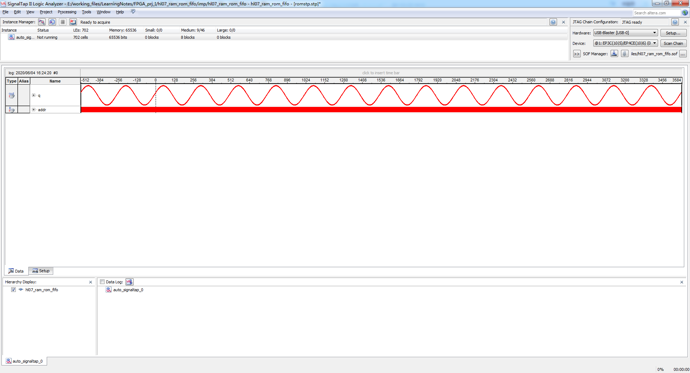

   11. 操作成功后如图所示

   12. 通过设置我们观察了rom输出随着地址的变化

   13. 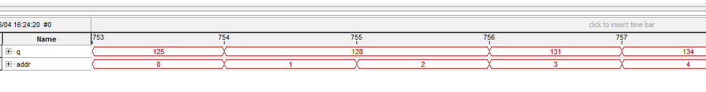

   14. 通过我们在signaltap  II中观察到的信号可以看到基本与我们仿真中的相同

   15. 在Tools中打开in-system memory content editor，基本界面如下

   16. 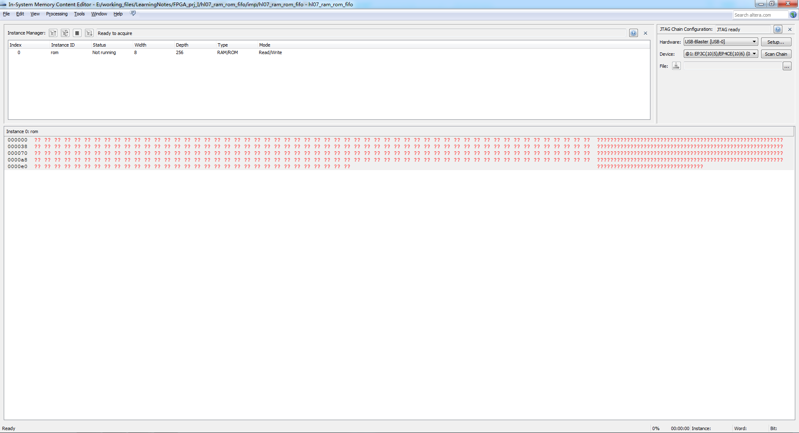

   17. 全是问号的原因是因为打开后并没有采集信号，接下来我们对rom进行采集

   18. 同时我们通过这个工具可以导入另一个已经准备好的mif文件，导入后使用signaltap II进行观察

   19. 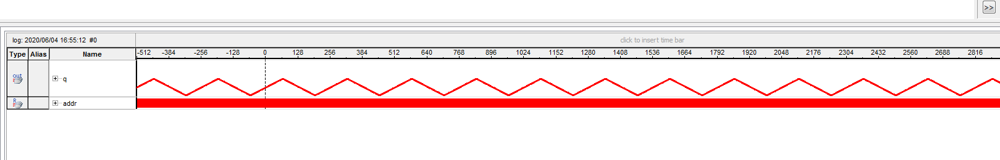

   20. 可以看到将之前的正弦波替换成了三角波

3. tcl脚本的使用

   1. 新建一个tcl脚本文件，将本例中的引脚通过tcl脚本进行设置

   2. ```tcl
      set_location_assignment PIN_E1 -to clk
      set_location_assignment PIN_M1 -to rst
      set_location_assignment PIN_M11 -to q[7]
      set_location_assignment PIN_M10 -to q[7]
      set_location_assignment PIN_N9 -to q[7]
      set_location_assignment PIN_M9 -to q[7]
      set_location_assignment PIN_L9 -to q[7]
      set_location_assignment PIN_L8 -to q[7]
      set_location_assignment PIN_M8 -to q[7]
      set_location_assignment PIN_P8 -to q[7]
      ```

   3. 可以看到，通过tcl脚本确实方便很多

4. FIFO的使用

   1. FIFO（First In First Out），即先进先出。 FPGA 或者 ASIC 中使用到的 FIFO 一般指的是对数据的存储具有先进先出特性的一个缓存器，常被用于数据的缓存或者高速异步数据的交互。它与普通存储器的区别是没有外部读写地址线，这样使用起来相对简单，但缺点就是只能顺序写入数据，顺序的读出数据，其数据地址由内部读写指针自动加 1 完成，不能像普通存储器那样可以由地址线决定读取或写入某个指定的地址。

   2. FIFO 从大的情况来分，有两类结构：

      1. 单时钟 FIFO（SCFIFO）
      2. 双时钟 FIFO(DCFIFO)，其中双时钟FIFO又可以分为 
         1. 普通双时钟（DCFIFO）
         2. 混合宽度双时钟FIFO(DCFIFO_MIXED_WIDTHS)
      3. 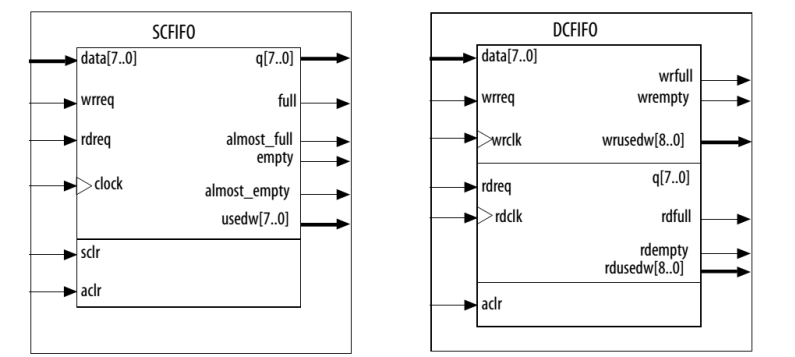

   3. FIFO 常见参数 

      1. FIFO 的宽度：即 FIFO 一次读写操作的数据位；
      2. FIFO 的深度：指的是 FIFO 可以存储多少个 N 位的数据（如果宽度为 N）。
      3. 满标志： FIFO 已满或将要满时由 FIFO 的状态电路送出的一个信号，以阻止 FIFO的写操作继续向 FIFO 中写数据而造成溢出。
      4. 空标志： FIFO 已空或将要空时由 FIFO 的状态电路送出的一个信号，以阻止 FIFO的读操作继续从 FIFO 中读出数据而造成无效数据的读出。读时钟：读操作所遵循的时钟，在每个时钟沿来临时读数据。
      5. 读写时钟：读写操作所遵循的时钟，在每个时钟沿来临时写数据。

   4. 实现 FIFO 的方法

      1. 第一种为用户根据需求自己编写 FIFO 逻辑，当对于 FIFO 的功能有特殊需求时，可以使用此种方式实现
         1. 自己编写fifo逻辑时需要
            1. 考虑数据量，即使用片上逻辑资源实现还是使用片上的存储资源实现
               1. 逻辑资源实现——使用寄存器，小容量的fifo
               2. 存储资源实现——例化rom IP核，大容量的fifo
            2. 考虑数据的采样速率、存储速率、读取速率与读写时钟速率的匹配
            3. 考虑fifo的深度，这个还是比较重要，既要不浪费资源，又能完成数据写入与读出的任务，而且深度是无论自己写还是调用IP核都需要考虑的一个问题
         2. 1. 3. 
      2. 第二种方式为使用第三方提供的开源 IP 核，此种 IP 核以源码的形式提供，能够快速的应用到用户系统中，当用户对 FIFO 功能有特殊需求时，可以在此源码的基础上进行修改，以适应自己的系统需求。
      3. 第三种方式为使用EDA软件提供的免费 FIFO IP 核，此种方式下， EDA软件为用户提供了友好的图形化界面方便用户对 FIFO 的各种参数和结构进行配置，生成的FIFO IP 核针对不同公司不同系列的器件
      
   5. 单时钟fifo
   
      1. 单时钟 FIFO 具有一个独立的时钟端口 Clock，因此所有输入信号的读取都是在 Clock 的上升沿进行的，所有输出信号的变化也是在 Clock 信号的上升沿的控制下进行的，即单时钟 FIFO 的所有输入输出信号都是同步于 Clock 信号的。
   
      2. 单时钟 FIFO 常用于片内数据交互。例如：在 FPGA 的控制下从外部传感器读取到的一连串传感器数据，首先被写入 FIFO 中，然后再以 UART 串口波特率将数据依次发送出去。  
   
      3. 在qurtus例化单时钟FIFO IP核并进行仿真
   
         1. ```verilog
         `timescale 1ns/1ns
            `define clk_period 20
         
            module tb_sc_fifo();
         
            reg clk;
         reg [15:0]data;
            reg rdreq;
         reg sclr;
            reg wrreq;
            
            wire almost_empty;
            wire almost_full;
            wire empty;
            wire full;
            wire [15:0]q;
            wire [7:0]usedw;
            
            sc_fifo	sc_fifo_inst (
            	.clock ( clk ),
            	.data ( data ),
            	.rdreq ( rdreq ),
            	.sclr ( sclr ),
            	.wrreq ( wrreq ),
            	.almost_empty ( almost_empty ),
            	.almost_full ( almost_full ),
            	.empty ( empty ),
            	.full ( full ),
            	.q ( q ),
            	.usedw ( usedw )
            );
            
            initial clk = 1'b1;
            always#(`clk_period/2) clk = ~clk;
            
            integer i = 0;
            integer delay = 0;
            
            initial begin
            	data = 0;
            	rdreq = 0;
            	wrreq = 0;
            	sclr = 0;
            	#2001;
                //A,B,C,D四段程序每次仿真只打开一段
            	/*----A---sclr holds 10ns
            	for(i=0;i<=50;i=i+1)begin
            		wrreq = 1'b1;
            		data = {$random}%65536;
            		#`clk_period;
            	end
            	wrreq = 1'b0;
            	sclr = 1'b1;
            	#10;//(`clk_period);
            	sclr = 1'b0;
                */
                
                /*----B---sclr holds 20ns
            	for(i=0;i<=50;i=i+1)begin
            		wrreq = 1'b1;
      		data = {$random}%65536;
            		#`clk_period;
            	end
            	wrreq = 1'b0;
            	sclr = 1'b1;
            	#(`clk_period);
            	sclr = 1'b0;
                */
                
                /*----B--- no sclr
            	for(i=0;i<=50;i=i+1)begin
            		wrreq = 1'b1;
            		data = {$random}%65536;
            		#`clk_period;
            	end
            	wrreq = 1'b0;
                */
                
            	/*---D---test write and read
            	#1000;
            	for(i=0;i<10;i=i+1)begin
            		wrreq = 1'b1;
            		data = i+1;
            		#`clk_period;
            		wrreq = 1'b0;
            		#`clk_period;
            		delay = {$random}%8;
            		#(`clk_period*delay);
            	end
            	#500;
            	for(i=0;i<5;i=i+1)begin
            		rdreq = 1'b1;
            		#`clk_period;
            		rdreq = 1'b0;
            		#`clk_period;
            		delay = {$random}%8;
            		#(`clk_period*delay);
            	end
                */
            	#1000;
            	for(i=0;i<=255;i=i+1)begin
            		wrreq = 1'b1;
            		data = {$random}%65536;
            		#`clk_period;
            	end
            	wrreq = 1'b0;
            	#2000;
            	for(i=0;i<=255;i=i+1)begin
            		rdreq = 1'b1;
            		#`clk_period;
            	end
            	rdreq = 1'b0;
            	#2000;
            	$stop;
            end
            endmodule 
            ```
            
         2. A段仿真时序
         
         3. 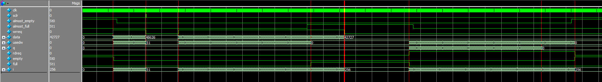
         
         4. B段仿真
         
         5. 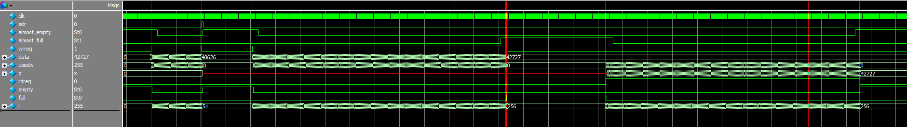
         
         6. 3图的sclr信号维持时间没有超过一个时钟周期，没有被时钟上升沿采样，这样的操作会刷新fifo（flush the fifo），但是由于是同步清零的信号，没有被时钟采样，所以会产生问题，刚开始我也很疑惑，sclr信号有效且不被时钟沿采样会造成的后果是虽然刷新了fifo，但是只是将数据用0替代，并且将usedw变成零，而且被清零的部分不能存入新的数据。5图的sclr信号维持了1个周期，可以看出还是有很多不一样的，会使q的输出变成未知态，fifo的状态正常
         
         7. C段仿真
         
         8. 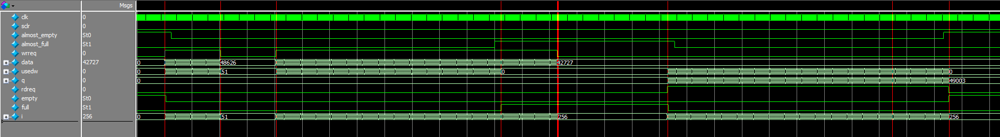
         
         9. 使用C段仿真可以看出这个scfifo在数据溢出后就不再能写入了，会把后来的数据丢掉，
         
         10. D段仿真
         
         11. 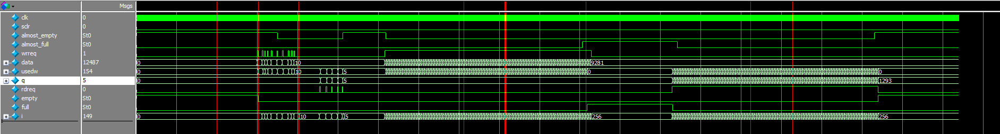
         
         12. 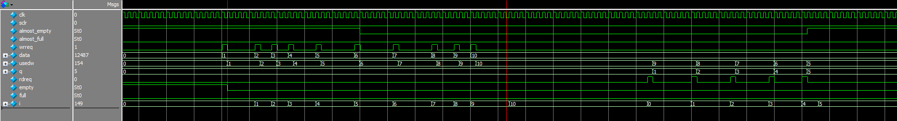
         
         13. 通过D段的仿真可以看出数据与usedw的关系，以及空满标志，almost full/almost empty 标志的变化
         
         14. 通过上面的仿真可以总结下图总结了四种方式fifo对应usedw上的数据
         
         15. 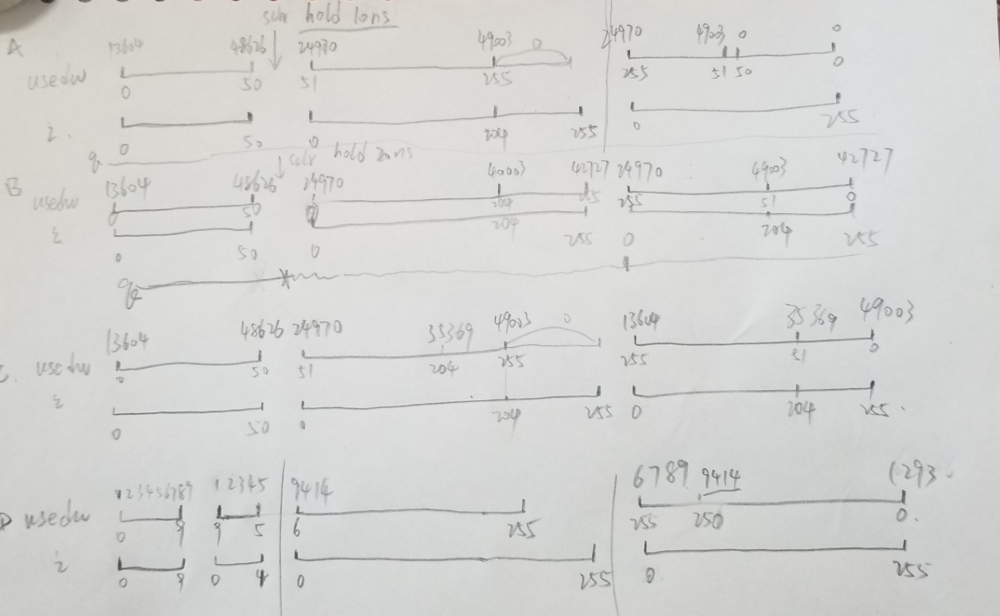
   
   7. 双时钟fifo
   
      1. 双时钟 FIFO 结构中，写端口和读端口分别有独立的时钟，所有与写相关的信号都是同步于写时钟 wrclk 的，所有与读相关的信号都是同步于读时钟 rdclk 的。在双时钟 FIFO 的符号图中，位于上部分的为与写相关的所有信号，位于中间部分的为与读相关的所有信号，位于下部的为异步清零信号
   
      2. 双时钟 FIFO 的一个典型应用就是异步数据的收发， 所谓异步数据是指数据的发送端和接收端分别使用不同的时钟域。 使用双时钟 FIFO 能够将不同时钟域中的数据同步到所需的时钟域系统中。例如：在一个高速数据采集系统中，实现将高速 ADC 采集的数据通过千兆以太网发送到 PC 机。
   
      3. 在quartus中例化双时钟FIFO IP核并进行实现
   
         1. ```verilog
         //顶层文件
            `timescale 1ns/1ns
         `define rdclk_period 10
            `define wrclk_period 20
         
            module tb_dc_fifo();
         
            reg [15:0]data;
         reg rdclk;
            reg rdreq;
            reg wrclk;
            reg wrreq;
            
            wire [7:0]q;
            wire rdempty;
            wire [8:0]rdusedw;
            wire wrfull;
            wire [7:0]wrusedw;
            
            dc_fifo	dc_fifo_inst (
            	.data ( data ),
            	.rdclk ( rdclk ),
            	.rdreq ( rdreq ),
            	.wrclk ( wrclk ),
            	.wrreq ( wrreq ),
            	.q ( q ),
            	.rdempty ( rdempty ),
            	.rdusedw ( rdusedw ),
            	.wrfull ( wrfull ),
            	.wrusedw ( wrusedw )
            	);
            
            initial rdclk = 1'b1;
            always#(`rdclk_period/2) rdclk = ~rdclk;	
            
            initial wrclk = 1'b1;
            always#(`wrclk_period/2) wrclk = ~wrclk;
            
            integer i=0;
            reg [7:0]data_h;
            reg [7:0]data_l;
            initial begin
            	data = 0;
            	data_h = 0;
            	data_l = 0;
            	rdreq = 0;
            	wrreq = 0;
            	#201
            	for(i=0;i<=255;i=i+1)begin
            		data_h = {$random}%256;
            		data_l = {$random}%256;
            		data = {data_h,data_l};
            		wrreq = 1'b1;
            		#`wrclk_period;
            	end
            	wrreq = 1'b0;
            	#2000
            	for(i=0;i<=511;i=i+1)begin
            		rdreq = 1'b1;
            		#`rdclk_period;
            	end	
            	rdreq = 1'b0;
            	#200;
            	$stop;
            end
            endmodule 
            ```
   
         2. 

- tips
  - LE 紧密且有效的提供了高级功能的逻辑使用。 LE 基本包含以下几个部分： 
    1. 4 输入查找表 LUT
    2. D 触发器（可以对每个 LE 配置可编程的寄存器为 D、 T、 JK 或 SR 触发器操作）
    3. 组合逻辑。
  - 例化FIFOIP核的一些细节
    - 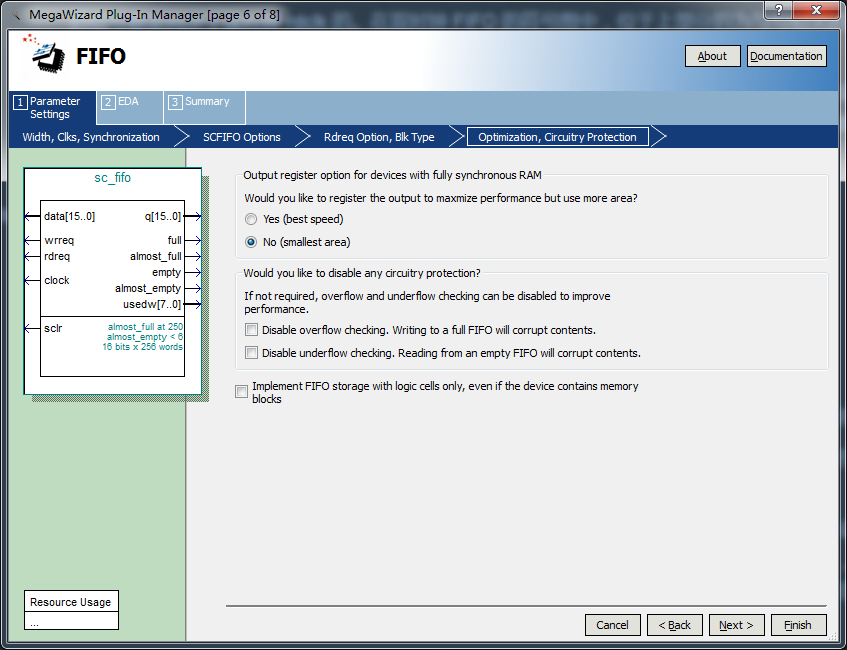
    - 两种设置的区别，normal synchronous FIFO mode 与 show-ahead synchronous FIFO mode区别
      - 选则第一种普通方式则 rdreq 信号作为实际意义上的读请求信号，当该信号有效时 FIFO 中的控制逻辑从存储器中读取一个数据输出到 q 端。 
      - 如果选中 Show-ahead 方式，则 rdreq 实际作为了读应答信号，即 rdreq 还没有有效时， q 端口上已经输出了一个有效的数据， rdreq 信号有效的时候则相当于通知 FIFO 内部的控制逻辑 q 端口上的数据已经被读取，则 FIFO 内部的逻辑会从 RAM 中再取出一个新的数据，在下一个时钟周期输出到 q 端口上。该模式在实际中应用也非常的普遍，因为 q 端口上的数据 与 rdreq 同时有效，没有读潜伏期。
    - would you like to disable any circuity protection ?

