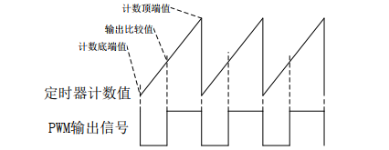

系统任务以及常用的预编译处理

系统任务

1. `$momitor`
2. `$time, $realtime`
3. `$stop, $finish`
4. `$readmemb, $readmemh`
5. `$random`

常用的预编译处理

- verilog HDL 也和 C 语言一样提供了编译预处理的功能，“编译预处理”

1. ````define```， 宏定义 
2.  ````include```，文件包含
3. ````timescale```，时间尺度 
4. ````ifdef、`else、`endif``` 条件编译命令

PWM波形脉冲宽度调制

- 通过调整PWM波形的占空比就可以调整被控制电路中的平均电流
  - 当信号的周期一定，信号高电平时间所占信号周期的百分比不同，即为不同占空比的PWM波，当使用这样的波形去驱动MOS管的导通是，由于一个周期内不同占空比的PWM信号其高电平持续时间长度不同，因此使MOS管的导通时间也不一样，从而使得电路中的平均电路也不一样
- PWM信号的周期也是可以调整的
  - 不同的器件对于驱动信号的频率要求不一样，有些器件支持几KHz到几十KHz，但比如MOS管作为开关器件，其开关频率则可以高达几百KHz，

PWM发生器模块设计

- 

- PWM波的频率计算公式为
  - $f_{pwm} = f_{clk}/(cnt_{max} + 1)$
  - 确定PWM波形的频率，使用上面公式就可计算出计数器的最大值
- PWM波的占空比计算
  - 输出波形的占空比通过确定一个0到cnt_max值来确定 cnt_turn
  - $PW = cnt_{turn}/cnt_{max}$
  - ```assgin o_pwm = (cnt_max > cnt_turn) ? 1'b1 : 1'b0;```

通过上面就能产生一个PWM波

- 呼吸灯（LED）
- 八音盒（BEEP）


